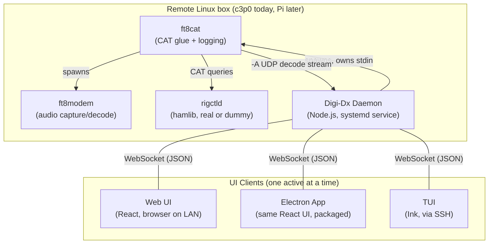

# Digi-Dx: Daemon + Multi-UI Architecture — Design Document

**Status:** Draft v1
**Purpose:** This document defines the architecture for the next phase of Digi-Dx — a
persistent daemon that wraps the `ft8cat`/`ft8modem` FT8 stack, and three thin UI
clients (web, Electron, TUI) that connect to it. It is intended as the source of truth
for generating detailed per-component design/implementation plans in Claude Code.

**Phase 1 note:** Phase 1 will implement only the daemon. The resolved daemon-only
implementation plan is maintained in [`phase-1-daemon-plan.md`](phase-1-daemon-plan.md).
The UI clients, Docker packaging, systemd packaging, and WSJT-X/GridTracker
compatibility are deferred to later phases.

---

## 1. Overview & Goals

Digi-Dx originated as a tool to rank FT8 contacts by expected value (distance ×
probability of contact) and has evolved into a broader ambition: a full replacement
operating environment for FT8, built around a headless, remotely-operable stack rather
than WSJT-X's GUI.

The engine layer is now `ft8modem` + `ft8cat` (KK5JY), running headless on a remote
Linux box (currently `c3p0`, a Kenwood TS-570S via SignaLink USB; eventually possibly a
Raspberry Pi). This replaces the earlier plan of wrapping full WSJT-X — no Qt/GUI
overhead, and the audio/CAT/logging pipeline has already been validated manually
end-to-end (see Appendix A).

**Goal of this phase:** build a clean API boundary (the daemon) around that engine, and
three interchangeable UI clients on top of it — web, Electron desktop, and a
terminal UI for SSH sessions — without any UI needing to know the quirks of the
underlying command-line tools.

**Explicit non-goals for this phase:**
- Multi-user / multi-operator concurrent control (single operator, single active UI
  at a time — see §2.3)
- Contest-mode auto-sequencing logic (may come later, out of scope here)
- Replacing the FT8 decoder itself (still relying on `jt9` via wsjtx-utils)
- Cloud sync / remote database (mentioned as a long-term idea historically, not part
  of this design)

---

## 2. System Architecture

### 2.1 Component Diagram



### 2.2 Deployment Targets

| Target | What it is | Notes |
|---|---|---|
| Daemon | Docker container (daemon + full engine stack: `ft8cat`, `ft8modem`, `jt9`/`ft8code`/`ft4code`, `rigctld`) on the remote Linux box, run via `docker compose` or a systemd unit that manages the container | Always running, independent of any UI. Session (engine) lifecycle is independent of container uptime — see §2.3 and §4 |
| Web UI | React app, static-served (e.g. via Express) on the same LAN | Accessed via browser from any device on the LAN |
| Electron | Same React app, packaged as a desktop app via `electron-builder` | Runs on the operator's laptop, connects to the daemon over the network — it is a remote client, not a local engine host |
| TUI | Ink (React-for-terminal) app | Run via SSH directly on the remote box, or run locally and connect out to the daemon over the network — either is architecturally valid since it's just another WebSocket client |

### 2.3 Session Model

Two independent lifecycles:

- **Daemon lifecycle**: always-on. Starts at boot via systemd. Never stops unless the
  service itself is stopped/restarted (e.g. for updates).
- **Session lifecycle**: whether `ft8cat`/`ft8modem` is currently spawned and actively
  decoding. Can be started/stopped independently of the daemon's own uptime (e.g. after
  a reboot, no session exists until something starts one).

**Only one UI is ever active at a time** (by design — this is a single-operator tool).
This removes the need for conflict resolution or multi-writer semantics in the daemon.
It does **not** remove the need for `start_session`/`stop_session` as explicit API
calls — see §3.3 for why session policy stays in the client, not the daemon.

---

## 3. Daemon API Contract

### 3.1 Transport

Single WebSocket connection per client. JSON messages, tagged by `type`. No separate
REST layer — even one-shot queries (e.g. `get_status`) go over the same socket as a
request/response pair, so each client only ever manages one connection.

### 3.2 Server → Client Events

```jsonc
// A decode from the FT8 waterfall
{ "type": "decode", "ts": 1782994695, "snr": -4, "dt": 0.3, "af": 1294, "mode": "FT8", "message": "JA2KVB K2L R-15" }

// Echo of a transmitted message (confirms it was actually sent)
{ "type": "tx", "ts": 1782994710, "af": 2262, "mode": "FT8", "message": "ZS1ABC N1MPM FN33" }

// Current daemon/session state — sent on connect, and after any state change
{
  "type": "status",
  "sessionActive": true,
  "mode": "FT8",
  "device": "USB Audio CODEC (USB Audio)",
  "catConnected": true,
  "freq": 14074000,
  "ptt": false,
  "callsign": "N1MPM",
  "grid": "FN33"
}

// Human-readable daemon diagnostics — NOT raw ft8cat TRACE/DEBUG passthrough
{ "type": "log", "level": "info", "message": "Session started on device 141" }

// Structured errors with stable codes, for the UI to branch on
{ "type": "error", "code": "SOUND_DEVICE_UNAVAILABLE", "message": "..." }
```

Known error codes to support at minimum: `SOUND_DEVICE_UNAVAILABLE`, `CAT_FAILED`,
`PROCESS_CRASHED`, `SESSION_ALREADY_ACTIVE` (should not normally surface given
idempotency — see §3.3 — but reserved), `INVALID_COMMAND`.

### 3.3 Client → Server Commands

```jsonc
{ "type": "transmit", "af": 2262, "message": "ZS1ABC N1MPM FN33" }

{ "type": "start_session", "mode": "FT8", "device": 141, "callsign": "N1MPM", "grid": "FN33" }
// All fields optional except type — see config persistence below

{ "type": "stop_session" }

{ "type": "get_status" }
```

**Session start/stop policy lives in the client, not the daemon.** Different UIs
reasonably want different policies — the TUI (something you SSH into specifically to
operate) might auto-start on connect, while a hypothetical read-only status widget
should not silently grab the sound card just by loading. The daemon exposes the
primitives; each client decides when to call them.

**`start_session` must be idempotent.** If a session is already running, calling
`start_session` again (with no args, or with args) does not spawn a second `ft8cat`
(which would contend for the sound device) — it returns current status as if the call
succeeded. This means clients can call `start_session` unconditionally without a
`get_status` check first.

**The daemon persists last-used session config to disk** (mode, device, callsign,
grid). `start_session` can be called with zero fields and reuse whatever was last
configured; any fields provided override just those. This means a UI never needs to
hardcode the callsign/grid anywhere — the daemon already knows.

### 3.4 What the Daemon Absorbs (Never Surfaces to Any UI)

- Translating `{ type: "transmit", af, message }` into the literal stdin write
  (`"<af> <message>\n"`) that `ft8cat` expects.
- Parsing the `-A <udp_port>` decode stream into clean `decode` events. No UI ever
  touches `ALL.TXT` or raw console output.
- Managing whatever CAT connection is in play, including the discovery that a dummy
  `rigctld` (`rigctld -m 1`) may be needed to keep `ft8cat`'s internal `fa_last` state
  populated even when not using a real radio connection (see Appendix A) — the UI only
  ever sees `catConnected: true/false`.
- Process lifecycle: restarting `ft8cat` if it dies unexpectedly, reporting this as an
  `error` (`PROCESS_CRASHED`) rather than going silent.
- Flag/argument quirks of `ft8cat` and `ft8modem` generally (e.g. `-m` is *not* a
  callsign flag on `ft8cat` — it sets max audio frequency for split mode; callsign is
  never passed to `ft8cat` at all, it's embedded directly in transmit message text).

---

## 4. Component Spec: Daemon

**Runtime:** Node.js, as a systemd-managed service.

**Responsibilities:**
- Own a single child process representing the active `ft8cat` (which itself spawns
  `ft8modem`), via `child_process.spawn`, holding its `stdin` for the life of the
  session.
- Open a UDP listener (`dgram`) matching whatever port is passed to `ft8cat -A`, parse
  incoming decode/tx data into the `decode`/`tx` event schema in §3.2.
- Run a WebSocket server (`ws`), broadcasting events to whichever client is currently
  connected, and handling the command set in §3.3.
- Persist last-used session config (mode, device, callsign, grid) to a local file
  (e.g. JSON) between restarts.
- Handle process crash detection (child process `exit`/`error` events) and surface
  as `PROCESS_CRASHED`, without automatically respawning without being asked — TBD:
  confirm whether auto-respawn-on-crash is desired, or whether the daemon should just
  report the crash and require an explicit `start_session` to recover (leaning toward
  the latter, to avoid silently flapping if there's a persistent hardware issue).

**Deployment / Packaging:**

The daemon is packaged together with the full engine stack (`ft8cat`, `ft8modem`,
`jt9`/`ft8code`/`ft4code`, `rigctld`) as a single Docker image — not split across
containers, since the daemon's process-ownership model (`child_process.spawn` holding
`ft8cat`'s stdin directly) requires them to share a process tree.

- **Multi-stage build.** A `build` stage carries the full toolchain needed to compile
  `rtaudio` (>= 6.0.1, usually newer than apt's packaged version) and `ft8modem` from
  source; a slim `runtime` stage copies over only the compiled binaries, plus
  `jt9`/`ft8code`/`ft4code` (matched to the target architecture — see multi-arch note
  below) and `rigctld`.
- **Container startup does not start a session.** Consistent with §2.3/§3.3: the
  container's entrypoint starts the daemon process only. `ft8cat`/`ft8modem` are not
  spawned until a client sends `start_session` — the container coming up and a session
  being active remain two independent events, same as on bare metal.
- **Audio device passthrough** required at `docker run` time (or in compose/systemd
  unit config): `--device /dev/snd:/dev/snd`, plus the container's internal user needs
  to belong to a group with access to those device nodes — functionally the same
  `audio`-group requirement discovered on bare metal (Appendix A), just configured in
  the image's user setup rather than via `usermod` on the host.
- **CAT/serial device passthrough**, same pattern: map the specific
  `/dev/serial/by-id/...` path (not `/dev/ttyUSB0`) into the container, since that
  path stays stable across replugs/restarts — this matters more inside a container
  that may restart independently of the host.
- **Multi-arch build** via `docker buildx`, targeting at minimum `linux/amd64` (c3p0
  today) and `linux/arm64` (Raspberry Pi, per the deployment targets in §2.2). This
  resolves architecture at build time instead of at manual install time, sidestepping
  the exact class of mistake described in Appendix A (wsjtx-utils shipping
  per-architecture binaries that have to be identified and picked by hand).

**Open implementation questions for Claude Code to resolve during detailed design:**
- Exact on-disk config file location/format (and how it's persisted across container
  restarts — likely a mounted volume rather than baked into the image).
- Whether `stop_session` should send a clean shutdown signal to `ft8cat` (and if so,
  what that looks like — does it have a documented graceful-exit mechanism, or is
  `SIGTERM` sufficient?).
- Logging strategy for the daemon's own operational logs (separate from the `log`
  event type sent to clients) — e.g. file-based logging for post-hoc debugging, and
  whether that log should live on a mounted volume for persistence outside the
  container.
- Base image choice (e.g. Debian-slim vs. Ubuntu) and exact Dockerfile stage
  boundaries.

---

## 5. Component Spec: Web UI

**Stack:** React (from the existing Claude Design mockup), served as static files
(e.g. via Express) from the remote box or any LAN-reachable host, connecting to the
daemon's WebSocket endpoint.

**Responsibilities:**
- Render the operating UI (waterfall/decode feed, QSO state, transmit controls)
  driven entirely by `status`/`decode`/`tx`/`log`/`error` events from the daemon.
- On load: connect, call `get_status`; if no active session, apply this UI's policy
  for whether to prompt the operator or auto-start (TBD — likely prompt, since a
  browser tab loading shouldn't silently grab the sound card the way an SSH TUI
  session reasonably can).
- Send `transmit` commands based on operator interaction with decoded messages
  (reply-to-CQ flow, manual message entry, etc. — mirrors the manual sequence
  documented in Appendix A).

**Shared with Electron:** this component *is* the same codebase used inside the
Electron shell (§6) — see that section for how the split works.

---

## 6. Component Spec: Electron Shell

**Stack:** Same React app as §5, packaged via `electron-builder`.

**What's different from the Web UI:**
- Runs as a desktop app on the operator's laptop rather than in a browser tab.
- Since the radio/engine is remote, this is a **thin client** — it connects to the
  daemon over the network exactly like the web UI does. It does not bundle or run
  `ft8cat`/`ft8modem` locally.
- Packaging/build target differs (Electron main process + renderer, vs. static
  hosting), but the renderer process loads the same component tree.

**Open question for Claude Code:** whether to maintain genuinely one shared package
with two build targets (web build vs. Electron build from the same source tree), or
two packages that both depend on a shared UI component library. Leaning toward the
former for simplicity at this stage, but worth confirming based on how the Claude
Design export is structured.

---

## 7. Component Spec: TUI

**Stack:** [Ink](https://github.com/vadimdemedes/ink) (React reconciler targeting the
terminal instead of the DOM, using Yoga for flexbox layout).

**Why Ink:** it lets the TUI share the same component/state/hooks *mental model* as
the React web/Electron UI, even though the actual rendering primitives are different
(terminal boxes, not DOM elements) — not a code-sharing win at the component level,
but a significant one at the architecture/logic level (same WebSocket client logic,
same state management patterns).

**Responsibilities:**
- Same event/command contract as the other clients (§3).
- Keyboard-driven UX only — no mouse. Needs an explicit design pass for how
  reply-to-CQ, message composition, and session start/stop map to key bindings.
- Likely auto-starts a session on connect, since an SSH session to this specific box
  is a deliberate "I'm here to operate" signal — differs from Web UI's likely
  prompt-first policy (see §5). Confirm this policy choice during detailed design.

**Open questions for Claude Code:**
- Exact keybinding scheme.
- How much of the decode feed history to keep in memory / display (terminal scrollback
  behaves differently than a browser DOM list).

---

## 8. Known Unknowns / Open Questions

These were surfaced during manual testing and are **not yet resolved** — flagging them
explicitly so they're addressed deliberately during implementation rather than
assumed:

1. **Slot-timing behavior of `ft8cat`/`ft8modem`**: it's unconfirmed whether a
   `transmit` command sent mid-FT8-slot is queued/held by the modem until the next
   valid 15-second boundary, or sent immediately regardless of alignment. This needs
   to be tested empirically before the daemon can safely expose `transmit` as a
   fire-and-forget command — if it isn't handled internally, the daemon may need to
   implement its own slot-alignment queue.
2. **Graceful session stop**: no confirmed mechanism yet for cleanly telling `ft8cat`
   to exit vs. just sending `SIGTERM`.
3. **Crash recovery policy**: auto-respawn vs. require explicit restart after a
   `PROCESS_CRASHED` event (leaning toward requiring explicit restart, per §4).
4. **`ft8qso` helper script**: KK5JY's package reportedly includes an `ft8qso` script
   for automated QSO sequencing. Its exact syntax has not been verified against
   official docs (only informally referenced) — worth investigating as a potential
   replacement for daemon-side sequencing logic, but do not assume its behavior
   without checking `ft8qso -h` directly first.

---

## Appendix A: Findings From Manual Testing Session

These were discovered the hard way during a manual end-to-end test of the
`ft8modem`/`ft8cat`/`ft8con` stack on `c3p0`, and are recorded here so they aren't
rediscovered during daemon implementation.

- **`aplay -l` reporting "no soundcards found" despite `lsusb`/`dmesg`/`/proc/asound/cards`
  all showing the device correctly** was a stale group-membership issue — the user
  needed to be in the `audio` group, and a fresh login (or `newgrp audio`) is required
  for that to take effect. This also applies to **tmux**: a tmux *server* process
  retains the group membership it had when it was first started, not when a client
  reattaches. A new tmux *session* under an already-running server does not get
  refreshed permissions — only `tmux kill-server` followed by a fresh SSH login and
  new server start does.
- **The `wsjtx-utils` tarball bundles binaries for multiple architectures**
  (`armv6`, `armv7`, `aarch64`, `x86`, `i686`) in separate subfolders. Picking the
  wrong one produces a misleading `sh: 1: jt9: Exec format error` rather than an
  obvious "wrong architecture" message. Always verify with `file <binary>` before
  installing, and confirm the target's actual architecture with `uname -m`.
- **`ft8modem` requires `libsndfile1-dev`** (provides `sndfile.h`) — not included in
  the original dependency list; build fails with `fatal error: sndfile.h: No such
  file or directory` without it.
- **`ft8cat -m` is not a callsign flag.** It sets maximum audio frequency for split
  mode (`-s`). There is no callsign-setting flag on `ft8cat` — callsigns are embedded
  directly in the message text sent to `ft8modem` via stdin (e.g.
  `"2262 ZS1ABC N1MPM FN33"`).
- **`ft8cat -F` (fixed frequency, disables CAT) has an undocumented side effect: it
  silently disables ALL.TXT logging of decodes.** The logging code path for decoded
  messages is gated behind `if fa_last:`, and `fa_last` is only ever set inside the
  CAT polling code that responds to a VFO-A frequency query — a code path that never
  runs in `-F` mode. Decodes still print to the console, but never reach `-a`'s output
  file. **Workaround:** run a dummy `rigctld` (`rigctld -m 1 &`) instead of using `-F`,
  even with no real radio connected — this gives `ft8cat` a successful CAT response
  loop, populates `fa_last`, and restores logging, all without real hardware.
- **`ft8con` is read-only.** It watches `ALL.TXT` (or a UDP stream) for display
  purposes only. It has no mechanism to send commands back into `ft8modem` — all
  transmit commands must go directly to whichever process owns `ft8modem`'s stdin
  (i.e., `ft8cat`, or the daemon in this design).
- **Manual CQ-answer sequence** (useful as a reference for the daemon's `transmit`
  translation logic and for TUI/Web UI flow design):
  1. Operator sends: `<af> <their_call> <my_call> <my_grid>`
  2. Other station replies with a signal report; operator sends:
     `<af> <their_call> <my_call> R<report>`
  3. Other station sends `RR73`; operator closes with:
     `<af> <their_call> <my_call> 73`
