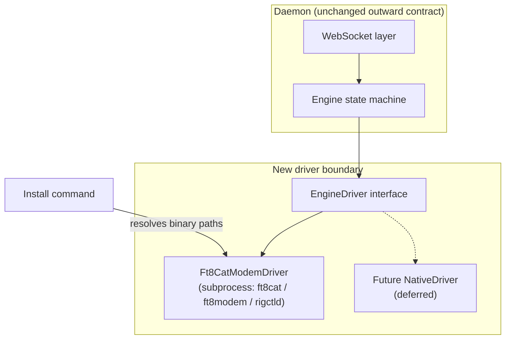
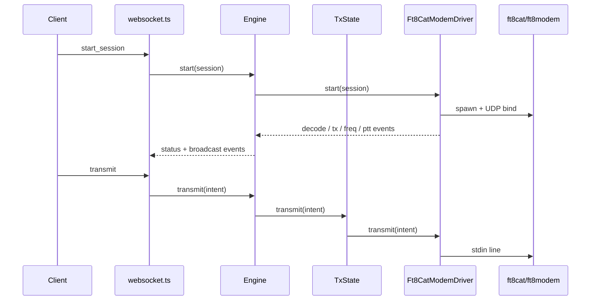
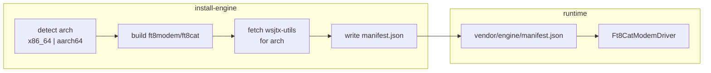

# Engine Backend - Plan

## Goal Capsule

- **Objective:** Deliver the Engine backend track so brother/dad can self-install Digi-Dx on their own Linux box, operate FT8 out of the box once their radio is wired, and future engine swaps stay possible through a stable driver boundary.
- **Product authority:** `STRATEGY.md` Engine backend track — turnkey now, swappable later.
- **Stop conditions:** Do not start install-script work until U1–U3 (driver seam + fake-driver tests) are complete and `npm test` passes. Do not claim install success without a manual smoke walk on at least one supported arch (x86_64 first, then Pi when available).
- **Product Contract preservation:** unchanged — planning resolves former open blockers below under Planning Contract assumptions and KTDs.

## Product Contract

### Summary

Extract an `EngineDriver` seam with a subprocess `Ft8CatModemDriver` adapter first, then ship a turnkey install on top of that boundary.
Target experience: git clone → one install command provisioning the full FT8 engine stack → second launch command with UI selected by flag → UI handles first-run station config.
When audio and CAT are wired correctly, users decode, transmit, and complete QSOs without further engine setup.

### Problem Frame

Digi-Dx's north-star users — brother and dad — need to run FT8 on their own Linux boxes without the author hand-holding every dependency.
Today the daemon spawns `ft8cat`, `ft8modem`, and `rigctld` directly from a monolithic engine module, and operators must install those binaries themselves.
That blocks the out-of-box first QSO metric in `STRATEGY.md` and makes every future engine swap touch the state machine.
The Engine backend track exists to own provisioning below the daemon↔client contract so onboarding and swappability both become tractable.

### Key Decisions

- **EngineDriver seam before install script.** Structural extraction (W4) ships first; the install command targets a clean binary-resolution hook on the driver rather than wiring paths through today's monolithic engine.
- **Subprocess adapter now, in-process engine later.** Keep `ft8cat`/`ft8modem` as a subprocess driver; defer native/in-process engine and crash-isolation trade-offs until that work begins.
- **Out-of-box QSO is the goal; radio wiring is the boundary.** Install delivers a complete, operable engine stack; whether decodes and QSOs happen depends on each operator's audio device, CAT, and rig configuration, which install tooling cannot verify.
- **Native Linux install, not Docker.** Brother/dad install on their own machine via clone plus commands, not container pull.
- **Multi-arch from the start.** Support Raspberry Pi 4/5 (64-bit aarch64) and x86_64 Linux dev machines; assume Pi 4/5 64-bit OS unless hardware dictates otherwise.

### Requirements

**Engine driver seam**

- R1. The daemon engine state machine depends on an `EngineDriver` interface and no longer embeds `ft8cat`/`ft8modem` spawn logic, stdin grammar, stdout parsing, or UDP decode parsing.
- R2. A subprocess `Ft8CatModemDriver` implements `EngineDriver` by wrapping today's behavior: process spawn, `-A -u` UDP decode path, `TX:`/`FA:` stdout lines, dummy `rigctld` when needed, and audio device discovery via the engine binary.
- R3. Slot-switch transmit sequencing stays at the Engine level; the driver owns `<af><E|O> <message>` and `STOP` grammar behind `transmit` and `cancelTransmit`.
- R4. The outward daemon WebSocket contract, status snapshots, and broadcast events are unchanged — clients see no behavioral difference after the extraction.
- R5. Unit tests can exercise the Engine with a fake driver, proving the state machine needs no engine-specific knowledge.

**Turnkey install**

- R6. A single install command, run after `git clone`, provisions all engine binaries and dependencies required for the daemon to start a session on supported platforms.
- R7. Install detects host architecture (aarch64 and x86_64) and resolves engine binary paths the driver consumes — no manual `ft8modem`/`ft8cat` install and no hand-edited PATH wiring for the default case.
- R8. A second launch command starts the daemon with UI selection via flag (e.g., TUI vs web).
- R9. After install and launch, a user with correctly wired audio and CAT can start a session, see decodes, transmit, and complete a QSO without additional engine setup steps.

**First-run configuration**

- R10. Station-specific configuration (callsign, grid, audio device, CAT port) is handled through the UI on first connect, not as a prerequisite edit before first launch.

### Key Flows

- F1. Fresh install on supported Linux
  - **Trigger:** Operator clones the repo on a fresh Raspberry Pi 4/5 (64-bit) or x86_64 Linux machine.
  - **Actors:** Operator (brother/dad or author on dev PC).
  - **Steps:** Clone repo → run install command → run launch command with UI flag → UI prompts for station config on first connect → operator starts session.
  - **Outcome:** Daemon active, UI connected, engine stack present; decodes and QSOs work when radio/audio wiring is correct.
  - **Covered by:** R6, R7, R8, R9, R10.

- F2. Engine driver lifecycle (unchanged operator experience)
  - **Trigger:** Client sends `start_session`.
  - **Actors:** Client, Engine, Ft8CatModemDriver.
  - **Steps:** Engine delegates to driver → driver spawns subprocess stack → decodes and TX events flow through driver events → Engine fans out to WebSocket unchanged.
  - **Outcome:** Operator experience matches today's daemon behavior.
  - **Covered by:** R1, R2, R3, R4.

### Acceptance Examples

- AE1. Successful Pi install with working radio
  - **Covers:** R6, R7, R9, R10.
  - **Given:** Fresh Raspberry Pi 4/5 with 64-bit OS, audio interface connected, CAT configured per UI first-run prompts.
  - **When:** Operator runs install, launches with UI flag, completes first-run config, and starts a session during an active band.
  - **Then:** Decodes appear in the UI and the operator can transmit and complete a QSO.

- AE2. Install succeeds but radio not yet wired
  - **Covers:** R6, R7, R9.
  - **Given:** Fresh install on supported Linux; audio device or CAT not yet configured correctly.
  - **When:** Operator runs install and launch commands.
  - **Then:** Daemon starts, UI connects, and engine binaries are present; absence of decodes is a station-config issue, not an incomplete install.

- AE3. x86 dev machine parity
  - **Covers:** R7, R8.
  - **Given:** Author's x86_64 Linux development PC.
  - **When:** Same install and launch flow as Pi target.
  - **Then:** Engine stack provisions and daemon starts without platform-specific manual steps beyond what the install command handles.

- AE4. Fake-driver Engine test
  - **Covers:** R5.
  - **Given:** A test fake implementing `EngineDriver`.
  - **When:** Engine start/stop/transmit/cancel lifecycle runs against the fake.
  - **Then:** State transitions and outward events match expected behavior with no subprocess spawned.

### Success Criteria

- Brother/dad can clone, install, launch, and operate on their own Linux box with minimal author hand-holding.
- Install plus correct radio wiring yields decode, transmit, and QSO capability without further engine provisioning.
- `EngineDriver` extraction lands with fake-driver test coverage before install script work begins.
- Outward daemon protocol behavior is unchanged — existing clients require no contract changes.

### Scope Boundaries

**Deferred for later**

- In-process native engine (`NativeDriver`) and crash-isolation choice between subprocess and in-process.
- Docker-based install or packaging.
- 32-bit Raspberry Pi / armv7 support.
- Auto-respawn of crashed engine processes.
- Validating every possible radio/audio/CAT hardware combination.

**Outside this product's identity**

- QSO automation logic — remains client-side per project architecture.
- Multi-operator concurrent control.
- Replacing the FT8 decoder algorithm itself (still relies on existing engine binaries).

**Deferred to Follow-Up Work**

- W1/W2 rebuild-plan items (`core/` protocol unification, `OperatorController` extraction) — parallel tracks, not prerequisites for engine backend.
- Prebuilt binary release pipeline (GitHub releases / CI matrix builds) — optional fast path after compile-on-device install works.
- W5 security hardening and W6 daemon correctness fixes from `docs/rebuild-plan.md`.

### Dependencies / Assumptions

- `docs/rebuild-plan.md` §3.1 `EngineDriver` interface stub is the starting point for the seam design.
- Default engine remains KK5JY `ft8cat` + `ft8modem` with `wsjtx-utils` decode binaries until a native driver exists.
- Brother/dad target hardware is Raspberry Pi 4/5 with 64-bit OS; exact models not yet confirmed.
- Fresh end-to-end install has not been attempted — assumed friction points may differ from reality.
- Operators have a Linux environment capable of running Node 20 and building or receiving engine binaries.

### Sources / Research

- `STRATEGY.md` — Engine backend track definition and out-of-box first QSO metric.
- `docs/rebuild-plan.md` — W4 sequencing rationale, `EngineDriver` interface stub, migration notes.
- `docs/digi-dx-design-doc.md` — engine stack composition, multi-arch build notes, wsjtx-utils tarball layout.
- `src/daemon/engine.ts` — current monolithic subprocess implementation to extract.
- `test/engine-parser.test.ts`, `test/websocket.test.ts` — existing parser coverage and `FakeEngine` websocket pattern.

---

## Planning Contract

### Sequencing

Two phases, strict order:

1. **Driver seam (U1–U3)** — extract interface and subprocess adapter, refactor `Engine`, add fake-driver tests. Gate for phase 2.
2. **Turnkey install (U4–U7)** — binary resolution, install script, unified launch, UI first-run setup.

### Key Technical Decisions

- **KTD1 — Interface shape from rebuild plan.** Implement `EngineDriver` per `docs/rebuild-plan.md` §3.1: evented decode/tx/freq/ptt/crash; lifecycle methods `start`, `stop`, `transmit`, `cancelTransmit`, `listAudioDevices`. Driver event payloads map to existing `DecodeEvent` / `TxEvent` at the Engine boundary.
- **KTD2 — TxState stays in Engine; grammar moves to driver.** Refactor `TxState` to call `driver.transmit(intent)` and `driver.cancelTransmit()` instead of writing stdin lines. Slot-switch waiting logic remains in `TxState`.
- **KTD3 — Parser and subprocess code live in the driver module.** Move `parseInternalUdpLine`, spawn/teardown, UDP bind, stdout parsing, and dummy-`rigctld` handling from `engine.ts` into `ft8-cat-modem-driver.ts`. Keep `parseInternalUdpLine` exported from a stable module path so `test/engine-parser.test.ts` imports change minimally.
- **KTD4 — Binary layout under `vendor/engine/`.** Install populates `vendor/engine/<arch>/bin/` (gitignored) with `ft8cat`, `ft8modem`, `rigctld`, and wsjtx-utils decode binaries (`jt9`, `ft8code`, `ft4code`). A manifest file `vendor/engine/manifest.json` records arch, versions, and paths. Env overrides (`DIGI_DX_FT8CAT_PATH`, etc.) remain and take precedence over vendor paths.
- **KTD5 — Compile-on-device for v1 install.** The install script builds `ft8modem`/`ft8cat` from source (as documented in `docs/digi-dx-design-doc.md`) and fetches wsjtx-utils binaries for the detected arch. Prebuilt tarball fast path is deferred to follow-up work once compile path is validated on x86_64 and aarch64.
- **KTD6 — npm script surface.** `npm run install-engine` runs the install script. `npm run digi -- --ui tui|web` starts daemon + selected UI (replaces remembering separate `dev`/`tui`/`web` commands for operators).
- **KTD7 — First-run uses config completeness.** Both UIs detect incomplete session config via existing `loadConfig` completeness (`config.ts` `missing`/`complete` fields) and block session start until the operator saves callsign, grid, device, and CAT settings through the UI.

### High-Level Technical Design

### Assumptions

- Operators run install on Debian/Ubuntu-derived Linux with `apt` for build dependencies (gcc, cmake, libasound2-dev, etc.).
- wsjtx-utils redistribution for bundled decode binaries is acceptable for private/ham use; document source and license in install output.
- Node/npm dependencies (`npm install`) are separate from engine install — document both steps in README.
- Manual install smoke on real hardware is the acceptance gate for R9 until automated integration tests against real audio exist.

### Open Questions

**Deferred to implementation**

- Exact wsjtx-utils tarball URL/version pin — resolve when writing `install-engine.sh`.
- Whether `ft8cat` source build is bundled in v1 install or only `ft8modem` with `ft8cat` fetched separately — follow upstream KK5JY repo layout discovered during U5.

---

## Implementation Units

### U1. EngineDriver interface and binary path types

**Goal:** Define the driver contract and shared path-resolution types without changing runtime behavior.

**Requirements:** R1 (partial), R2 (partial)

**Dependencies:** none

**Files:**
- Create `src/daemon/engine-driver.ts`
- Create `src/daemon/engine-binary-paths.ts`

**Approach:** Port interface and event types from `docs/rebuild-plan.md` §3.1. Add `EngineBinaryPaths` (ft8cat, ft8modem, rigctld) and `resolveEngineBinaryPaths()` that reads env overrides, then `vendor/engine/manifest.json`, then PATH defaults. Export driver event-to-protocol mappers as pure functions for unit testing.

**Patterns to follow:** EventEmitter usage in `src/daemon/engine.ts`; env override pattern already in `Engine` constructor.

**Test scenarios:**
- `resolveEngineBinaryPaths` prefers env override over manifest over default command name.
- `resolveEngineBinaryPaths` throws or returns clear error when manifest arch mismatches host.
- Driver event mapper converts a sample `DriverDecode` to `DecodeEvent` matching `test/engine-parser.test.ts` fixtures.

**Verification:** Types compile under `npm run build`; new unit tests pass.

---

### U2. Ft8CatModemDriver extraction

**Goal:** Move all subprocess engine knowledge out of `engine.ts` into the driver adapter.

**Requirements:** R1, R2, R3 (driver side)

**Dependencies:** U1

**Files:**
- Create `src/daemon/ft8-cat-modem-driver.ts`
- Create `src/daemon/ft8-udp-parse.ts` (move `parseInternalUdpLine` here)
- Modify `src/daemon/audio-devices.ts` (accept explicit ft8modem path; keep `parseFt8modemHelp` tests)
- Modify `test/engine-parser.test.ts` (import from `ft8-udp-parse.js`)

**Approach:** Lift spawn args, stdin writes for transmit/stop, stdout `TX:`/`FA:` handling, UDP listener, dummy `rigctld`, and device verification from `engine.ts`. Driver `start()` owns CAT readiness identical to today's `prepareCat`. Driver `transmit`/`cancelTransmit` encode `<af><E|O> msg` and `STOP`. `listAudioDevices()` delegates to existing `listAudioDevices()` with resolved ft8modem path.

**Execution note:** Move `parseInternalUdpLine` first with tests green, then extract subprocess logic — reduces diff risk.

**Patterns to follow:** Current `engine.ts` spawn/teardown (`detached`, process-group signals, `stopTimeoutMs`).

**Test scenarios:**
- Driver unit test with mocked child process: `start` emits no crash; stdout `TX: 1` emits `ptt: true`.
- UDP fixture line produces `decode` event matching existing parser test vectors.
- `transmit` writes expected stdin line for even/odd slot intents.
- `stop` sends SIGTERM to process group and clears handles.
- Dummy-rig path: when `cat.mode === "none"`, driver spawns rigctld on configured port.

**Verification:** Parser tests pass unchanged behavior; new driver tests pass; no WebSocket behavior change yet.

---

### U3. Engine refactor and fake-driver tests

**Goal:** Engine depends on injected `EngineDriver`; prove state machine is engine-agnostic.

**Requirements:** R1, R3, R4, R5

**Dependencies:** U2

**Files:**
- Modify `src/daemon/engine.ts`
- Modify `src/daemon/tx-state.ts` (replace `writeLine` with driver transmit hooks)
- Modify `src/index.ts` (inject `Ft8CatModemDriver`)
- Modify `src/daemon/websocket.ts` (optional: delegate `listAudioDevices` through engine)
- Create `test/engine-driver.test.ts`
- Modify `test/websocket.test.ts` if `Engine` constructor signature changes

**Approach:** Engine constructor accepts `EngineDriver`. On `start`, delegate to driver and subscribe to driver events, mapping to existing `BroadcastEvent` and snapshot fields (`freq`, `ptt`, `catConnected`). Refactor `TxState` to accept async transmit/cancel functions. On driver `crash`, emit `PROCESS_CRASHED` as today. Add `FakeEngineDriver` in tests (no subprocess) covering start/stop/transmit/cancel and synthetic decode events.

**Execution note:** Covers AE4 — implement fake-driver lifecycle test before merging.

**Patterns to follow:** `FakeEngine` in `test/websocket.test.ts` for websocket isolation; rebuild-plan migration notes §3.1.

**Test scenarios:**
- Covers AE4. Engine + fake driver: start → active state; inject decode event → `event` emitted; transmit → driver `transmit` called; stop → inactive.
- Driver crash event → Engine emits `PROCESS_CRASHED` and returns to inactive.
- Slot-switch: transmit on even then odd cancels prior slot via driver `cancelTransmit` path.
- Existing `test/websocket.test.ts` suite passes without modification to protocol expectations.

**Verification:** Full `npm test` green; `npm run build` green; manual `npm run dev` + client connect still works on author's machine with system binaries.

---

### U4. Engine binary manifest and path wiring

**Goal:** Wire installed binaries into `Ft8CatModemDriver` through manifest resolution.

**Requirements:** R7 (partial)

**Dependencies:** U3

**Files:**
- Modify `src/daemon/engine-binary-paths.ts`
- Modify `src/index.ts`
- Create `vendor/engine/.gitkeep` and gitignore entries for `vendor/engine/*/`

**Approach:** After install, `vendor/engine/manifest.json` lists absolute or repo-relative bin paths per tool. `resolveEngineBinaryPaths()` loads manifest when present. `index.ts` passes resolved paths into `Ft8CatModemDriver` options. Document manifest schema in install script comments.

**Test scenarios:**
- Manifest present with all bins → resolver returns those paths.
- Missing manifest → falls back to env/PATH (dev machine compatibility).
- Corrupt manifest JSON → actionable error at daemon startup.

**Verification:** Unit tests for resolver; daemon starts using manifest paths when file exists.

---

### U5. Install script (`install-engine`)

**Goal:** Single command provisions engine stack for x86_64 and aarch64 Linux.

**Requirements:** R6, R7, R9 (partial)

**Dependencies:** U4

**Files:**
- Create `scripts/install-engine.sh`
- Create `scripts/engine-versions.env` (pinned upstream refs)
- Modify `package.json` (`install-engine` script)
- Modify `.gitignore`
- Modify `README.md` or `docs/install.md` (operator steps: clone → npm install → install-engine)

**Approach:** Bash script detects `uname -m`, installs apt build deps, clones/builds ft8modem (and ft8cat if separate), downloads wsjtx-utils arch-specific decode binaries into `vendor/engine/<arch>/bin/`, copies or links `rigctld` from `libhamlib-utils` or builds minimal rigctld, writes `manifest.json`, verifies each binary runs `-h` or `--version`. Idempotent: re-run safe. Fail fast with readable errors.

**Execution note:** Prefer install/runtime smoke verification over unit coverage for this unit.

**Test scenarios:**
- Covers AE3 (partial). On x86_64 dev machine: run install → manifest exists → each binary executable.
- Unsupported arch (e.g., armv7) exits with clear message.
- Re-run install does not corrupt existing manifest.

**Verification:** Author runs install on x86_64; `npm run digi -- --ui web` starts daemon using vendor binaries without manual PATH setup.

---

### U6. Unified launch command

**Goal:** Second operator command starts daemon + UI via flag.

**Requirements:** R8

**Dependencies:** U3 (daemon stable)

**Files:**
- Create `scripts/digi-dx.ts` (or shell wrapper)
- Modify `package.json` (`digi` script)

**Approach:** Parse `--ui tui|web` (default `web` or `tui` — pick `web` for remote Pi headless + browser from laptop). Spawn daemon child (tsx `src/index.ts` with `DIGI_DX_CONFIG_PATH=./data/config.json`), then spawn UI process. Forward SIGINT/SIGTERM to both. Print listening URLs.

**Test scenarios:**
- `--ui web` starts without crash when engine binaries present.
- `--ui tui` starts without crash in CI-less smoke (manual).
- Unknown `--ui` value prints usage and exits non-zero.

**Verification:** Manual smoke: launch command brings up daemon and UI; client connects.

---

### U7. UI first-run station setup

**Goal:** Incomplete config prompts operator through UI before first session.

**Requirements:** R10, R9 (config path)

**Dependencies:** U6

**Files:**
- Modify `ui/tui.ts` (gate session start on config completeness)
- Modify `ui/web/server.ts` and `ui/web/public/app.js` (setup panel when config incomplete)
- Modify `src/daemon/config.ts` only if completeness checks need extension

**Approach:** On connect, client loads config via existing `get_config` / config message. If `complete === false`, show setup form (callsign, grid, audio device picker from `list_audio_devices`, CAT mode/port). Save via existing config save path. Only enable Start Session when complete. TUI already has a save form — unify gating so session start is blocked until complete.

**Patterns to follow:** TUI save form around lines handling callsign/grid/device; `ConfigLoadResult.missing` from `config.ts`.

**Test scenarios:**
- Covers AE2 (partial). Incomplete config → UI shows setup; session start disabled.
- Complete config saved → session start enabled.
- Web UI setup saves config and persists across reconnect.

**Verification:** Manual walkthrough on fresh `data/config.json`; aligns with AE1 when radio wired.

---

## Verification Contract

| Gate | Command | Applies to |
|---|---|---|
| Unit tests | `npm test` | U1–U4, U3 parser/driver |
| Daemon build | `npm run build` | U1–U4 |
| UI typecheck | `npm run typecheck` | U6–U7 |
| Install smoke | `npm run install-engine` on clean x86_64 Linux | U5 |
| Launch smoke | `npm run digi -- --ui web` after install | U6 |
| End-to-end QSO smoke | Manual: install → launch → configure → session → decode + TX on wired radio | U5–U7, AE1 |

---

## Definition of Done

**Global**

- U1–U3 merged with fake-driver tests and full `npm test` / `npm run build` green.
- U4–U6 merged; author validated install + launch on x86_64 without preinstalled ft8cat/ft8modem on PATH.
- U7 merged; fresh config triggers UI setup before session start in both TUI and web.
- Outward WebSocket protocol unchanged — no client contract updates required.
- Operator docs list clone → `npm install` → `npm run install-engine` → `npm run digi -- --ui <tui|web>` flow.

**Per-unit**

- **U1:** Interface + path resolver tested; no runtime behavior change.
- **U2:** Subprocess logic lives only in driver module; parser tests pass.
- **U3:** AE4 satisfied; websocket tests pass; manual dev session works.
- **U4:** Manifest wiring tested; vendor dir gitignored.
- **U5:** Install produces working binaries + manifest on x86_64; aarch64 code path present (Pi validation when hardware available).
- **U6:** Launch command documented and smoke-tested.
- **U7:** R10 satisfied for both UIs.

**Explicitly not required for this plan's DoD**

- Pi hardware validation (track as follow-up smoke once brother/dad hardware confirmed).
- Prebuilt release tarballs or CI binary matrix.
- Docker packaging.

---

## Risk Analysis & Mitigation

| Risk | Mitigation |
|---|---|
| Pi compile takes too long or fails on aarch64 | Document apt deps; test aarch64 in install script logic early; defer prebuilt fast path if compile blocks brother/dad |
| wsjtx-utils licensing/redistribution | Ship decode binaries as fetched artifacts with license note; do not commit binaries to git |
| Driver extraction regressions | Keep parser tests; fake-driver tests; run existing websocket tests unchanged |
| UI first-run incomplete on web only | U7 requires both TUI and web before DoD |
| Install idempotency breaks dev machines | Env overrides and missing-manifest PATH fallback preserve author workflow |

---

## Documentation Plan

- Add `docs/install.md` (or README section): prerequisites, install-engine, launch, first-run setup, troubleshooting (audio group, CAT port).
- Note radio wiring boundary: install proves engine stack; decodes require correct audio/CAT.
