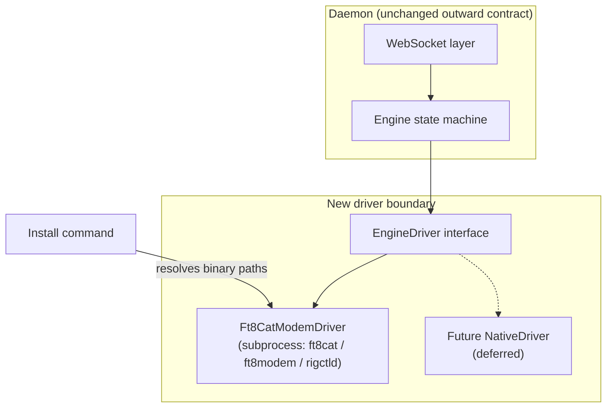

# Engine Backend - Plan

## Goal Capsule

- **Objective:** Deliver the Engine backend track so brother/dad can self-install Digi-Dx on their own Linux box, operate FT8 out of the box once their radio is wired, and future engine swaps stay possible through a stable driver boundary.
- **Product authority:** `STRATEGY.md` Engine backend track — turnkey now, swappable later.
- **Open blockers:** Prebuilt vs compile-on-device strategy for multi-arch binaries; fresh-install friction is unvalidated until walked on real hardware.

## Product Contract

### Summary

Extract an `EngineDriver` seam with a subprocess `Ft8CatModemDriver` adapter first, then ship a turnkey install on top of that boundary.
Target experience: git clone → one install command provisioning the full FT8 engine stack → second launch command with UI selected by flag → UI handles first-run station config.
When audio and CAT are wired correctly, users decode, transmit, and complete QSOs without further engine setup.

### Problem Frame

Digi-Dx's north-star users — brother and dad — need to run FT8 on their own Linux boxes without the author hand-holding every dependency.
Today the daemon spawns `ft8cat`, `ft8modem`, and `rigctld` directly from a monolithic engine module, and operators must install those binaries themselves.
That blocks the out-of-box first QSO metric in `STRATEGY.md` and makes every future engine swap touch the state machine.
The Engine backend track exists to own provisioning below the daemon↔client contract so onboarding and swappability both become tractable.

### Key Decisions

- **EngineDriver seam before install script.** Structural extraction (W4) ships first; the install command targets a clean binary-resolution hook on the driver rather than wiring paths through today's monolithic engine.
- **Subprocess adapter now, in-process engine later.** Keep `ft8cat`/`ft8modem` as a subprocess driver; defer native/in-process engine and crash-isolation trade-offs until that work begins.
- **Out-of-box QSO is the goal; radio wiring is the boundary.** Install delivers a complete, operable engine stack; whether decodes and QSOs happen depends on each operator's audio device, CAT, and rig configuration, which install tooling cannot verify.
- **Native Linux install, not Docker.** Brother/dad install on their own machine via clone plus commands, not container pull.
- **Multi-arch from the start.** Support Raspberry Pi 4/5 (64-bit aarch64) and x86_64 Linux dev machines; assume Pi 4/5 64-bit OS unless hardware dictates otherwise.

### Requirements

**Engine driver seam**

- R1. The daemon engine state machine depends on an `EngineDriver` interface and no longer embeds `ft8cat`/`ft8modem` spawn logic, stdin grammar, stdout parsing, or UDP decode parsing.
- R2. A subprocess `Ft8CatModemDriver` implements `EngineDriver` by wrapping today's behavior: process spawn, `-A -u` UDP decode path, `TX:`/`FA:` stdout lines, dummy `rigctld` when needed, and audio device discovery via the engine binary.
- R3. Slot-switch transmit sequencing stays at the Engine level; the driver owns `<af><E|O> <message>` and `STOP` grammar behind `transmit` and `cancelTransmit`.
- R4. The outward daemon WebSocket contract, status snapshots, and broadcast events are unchanged — clients see no behavioral difference after the extraction.
- R5. Unit tests can exercise the Engine with a fake driver, proving the state machine needs no engine-specific knowledge.

**Turnkey install**

- R6. A single install command, run after `git clone`, provisions all engine binaries and dependencies required for the daemon to start a session on supported platforms.
- R7. Install detects host architecture (aarch64 and x86_64) and resolves engine binary paths the driver consumes — no manual `ft8modem`/`ft8cat` install and no hand-edited PATH wiring for the default case.
- R8. A second launch command starts the daemon with UI selection via flag (e.g., TUI vs web).
- R9. After install and launch, a user with correctly wired audio and CAT can start a session, see decodes, transmit, and complete a QSO without additional engine setup steps.

**First-run configuration**

- R10. Station-specific configuration (callsign, grid, audio device, CAT port) is handled through the UI on first connect, not as a prerequisite edit before first launch.

### Key Flows

- F1. Fresh install on supported Linux
  - **Trigger:** Operator clones the repo on a fresh Raspberry Pi 4/5 (64-bit) or x86_64 Linux machine.
  - **Actors:** Operator (brother/dad or author on dev PC).
  - **Steps:** Clone repo → run install command → run launch command with UI flag → UI prompts for station config on first connect → operator starts session.
  - **Outcome:** Daemon active, UI connected, engine stack present; decodes and QSOs work when radio/audio wiring is correct.
  - **Covered by:** R6, R7, R8, R9, R10.

- F2. Engine driver lifecycle (unchanged operator experience)
  - **Trigger:** Client sends `start_session`.
  - **Actors:** Client, Engine, Ft8CatModemDriver.
  - **Steps:** Engine delegates to driver → driver spawns subprocess stack → decodes and TX events flow through driver events → Engine fans out to WebSocket unchanged.
  - **Outcome:** Operator experience matches today's daemon behavior.
  - **Covered by:** R1, R2, R3, R4.

### Acceptance Examples

- AE1. Successful Pi install with working radio
  - **Covers:** R6, R7, R9, R10.
  - **Given:** Fresh Raspberry Pi 4/5 with 64-bit OS, audio interface connected, CAT configured per UI first-run prompts.
  - **When:** Operator runs install, launches with UI flag, completes first-run config, and starts a session during an active band.
  - **Then:** Decodes appear in the UI and the operator can transmit and complete a QSO.

- AE2. Install succeeds but radio not yet wired
  - **Covers:** R6, R7, R9.
  - **Given:** Fresh install on supported Linux; audio device or CAT not yet configured correctly.
  - **When:** Operator runs install and launch commands.
  - **Then:** Daemon starts, UI connects, and engine binaries are present; absence of decodes is a station-config issue, not an incomplete install.

- AE3. x86 dev machine parity
  - **Covers:** R7, R8.
  - **Given:** Author's x86_64 Linux development PC.
  - **When:** Same install and launch flow as Pi target.
  - **Then:** Engine stack provisions and daemon starts without platform-specific manual steps beyond what the install command handles.

- AE4. Fake-driver Engine test
  - **Covers:** R5.
  - **Given:** A test fake implementing `EngineDriver`.
  - **When:** Engine start/stop/transmit/cancel lifecycle runs against the fake.
  - **Then:** State transitions and outward events match expected behavior with no subprocess spawned.

### Success Criteria

- Brother/dad can clone, install, launch, and operate on their own Linux box with minimal author hand-holding.
- Install plus correct radio wiring yields decode, transmit, and QSO capability without further engine provisioning.
- `EngineDriver` extraction lands with fake-driver test coverage before install script work begins.
- Outward daemon protocol behavior is unchanged — existing clients require no contract changes.

### Scope Boundaries

**Deferred for later**

- In-process native engine (`NativeDriver`) and crash-isolation choice between subprocess and in-process.
- Docker-based install or packaging.
- 32-bit Raspberry Pi / armv7 support.
- Auto-respawn of crashed engine processes.
- Validating every possible radio/audio/CAT hardware combination.

**Outside this product's identity**

- QSO automation logic — remains client-side per project architecture.
- Multi-operator concurrent control.
- Replacing the FT8 decoder algorithm itself (still relies on existing engine binaries).

### Dependencies / Assumptions

- `docs/rebuild-plan.md` §3.1 `EngineDriver` interface stub is the starting point for the seam design.
- Default engine remains KK5JY `ft8cat` + `ft8modem` with `wsjtx-utils` decode binaries until a native driver exists.
- Brother/dad target hardware is Raspberry Pi 4/5 with 64-bit OS; exact models not yet confirmed.
- Fresh end-to-end install has not been attempted — assumed friction points may differ from reality.
- Operators have a Linux environment capable of running Node 20 and building or receiving engine binaries.

### Outstanding Questions

**Deferred to Planning**

- Prebuilt per-arch binary bundles vs compile-on-device during install — trade-off between Pi install time and release-pipeline maintenance.
- Where install script lives and how it integrates with existing npm scripts.
- Binary licensing and redistribution constraints for `wsjtx-utils` / `jt9` bundles.
- Whether install should pin engine binary versions or track latest compatible releases.

### Sources / Research

- `STRATEGY.md` — Engine backend track definition and out-of-box first QSO metric.
- `docs/rebuild-plan.md` — W4 sequencing rationale, `EngineDriver` interface stub, migration notes.
- `docs/digi-dx-design-doc.md` — multi-stage Docker build notes (informative for binary bundling strategy, even though Docker install is out of scope).
- `src/daemon/engine.ts` — current monolithic subprocess implementation to extract.
- Grounding dossier: `/tmp/compound-engineering/ce-brainstorm/engine-backend/grounding.md`
