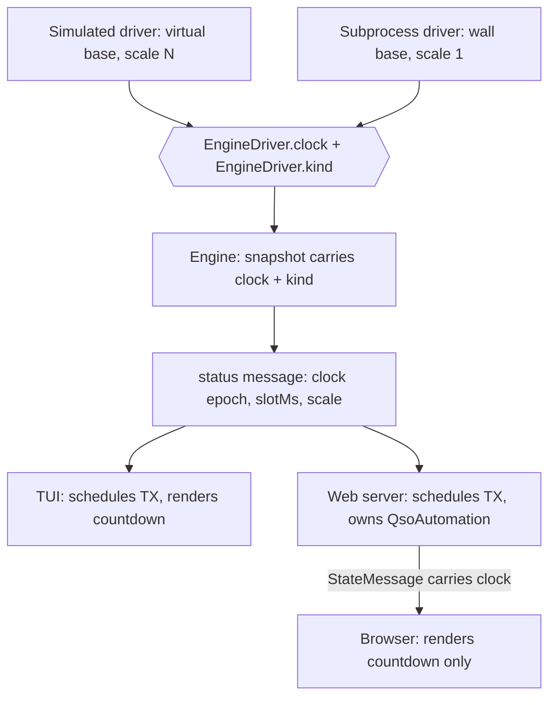

# Simulated Engine and Demo Mode - Plan

## Goal Capsule

- **Objective:** Make digi-dx developable by a cloud agent with no radio, by adding a simulated FT8 engine behind the existing driver seam — and ship that simulator to users as a demo mode.
- **Authority:** Product Contract governs behavior. Planning Contract governs implementation. Where they conflict, the Product Contract wins and the conflict is surfaced, not resolved silently.
- **Product Contract preservation:** Product Contract unchanged. This run added the Planning Contract, Implementation Units, Verification Contract, and Definition of Done.
- **Execution profile:** Three phases in dependency order — the timing contract, the simulator, then the agent verification path. The timing contract lands first because the simulator is not time-truthful without it.
- **Stop conditions:** Stop and surface if the slot clock cannot be published without breaking the existing 72 tests, or if the work requires a clock touchpoint outside the allow-list in KTD3.
- **Tail ownership:** Implementer runs the Verification Contract gates. Real-hardware regression (a live QSO on the rig) is the operator's, at the radio box, before this ships to any user.

---

## Product Contract

### Summary

A simulated FT8 band runs behind the existing engine seam, selectable at runtime, populated by stations that answer you. It doubles as a shipped demo mode so a new user can tell working software from a misconfigured radio. On top of it sits a headless verification path — a complete simulated QSO plus screenshots of the web client — that lets a cloud agent prove its own work well enough to review and merge from a phone.

### Problem Frame

The operator's development time is increasingly spent away from the radio box, and the goal is to queue work at the laptop and orchestrate it from a phone. A cloud agent cannot reach the home LAN and certainly cannot key a rig, so every queued item today sorts into one of two buckets: runnable without hardware, or blocked until the operator is physically at the radio.

The first bucket is already large. The suite runs green with no radio, and the QSO engine, protocol, view-model, and logging are pure and covered. The second bucket is everything whose correctness only appears when the pieces run together — the engine state machine, TX slot timing, the daemon↔client handshake, and the whole web client, where passing tests do not mean the thing works. That bucket is where the interesting work is, and it is currently unreachable from a phone.

Separately, the two users the product is actually for — the author's brother and father — must get from install to first QSO with no hand-holding. Their first hour will be spent on audio device IDs, CAT ports, and rig wiring, with no way to tell a misconfigured radio from broken software.

### Key Decisions

**The simulator is a product feature, not a test fixture.** The same simulated engine that lets an agent verify its work is what a new user runs before their radio is wired, and what the operator asks a confused user to run when triaging over the phone. This raises the quality bar from *checkable* to *plausible*. What demo mode buys the product is faster *diagnosis*, not a faster first contact: it does not shorten time-to-first-real-QSO, because the simulator deliberately touches none of the audio, CAT, or engine-process configuration that a new user actually gets stuck on. It tells them which side of the seam their problem is on.

**Simulated stations are reactive, not scripted.** Each station runs the FT8 QSO protocol from the far side. Emergent sequences — two stations answering at once, a station that answers someone else, a QSO abandoned halfway — are where client-side bugs hide, and a fixture only ever tests sequences someone thought of. A declarative roster plus a seed makes a station's decisions reproducible.

**The simulator does not share the client's QSO engine.** Sharing code would make the simulator agree with the client's bugs, and a passing test would prove only that both sides are wrong in the same way. Independence alone is not enough, though: a cloud agent that cannot reach a radio has the simulator as its only reality, and could turn a failing run green by editing the simulator instead of the code. The simulator's own sequencing is therefore pinned by conformance tests it cannot quietly move.

**The daemon publishes the slot clock; clients derive everything from it.** Time-scaling the simulator so an agent is not waiting out 90-second QSOs means every slot-dependent behavior must follow the same clock. Clients today do two things with time, not one: they *render* countdowns, and they *schedule* automated transmits — and the daemon is QSO-unaware, so the scheduling lives client-side. If the daemon ran slots at 20x while a client still fired transmits on real 15-second boundaries, no simulated QSO would ever complete. The daemon therefore publishes a slot epoch, a slot duration, and an explicit time-scale factor, and clients interpolate locally against that triple. This is not the same as "clients hold no clock" — they must tick locally to render a smooth countdown — it is that they no longer hold an *authoritative* one. The existing additive clock-skew correction in the web client is an offset correction and is wrong under any scale factor other than 1; it is replaced, not extended.

**Timing authority lands first, in this same effort.** The protocol change is not split into prior work and it is not deferred behind a real-time simulator. Building the simulator on the settled contract keeps it time-truthful from its first run and avoids a throwaway real-time verification phase. The cost is a larger first increment, and protocol churn that happens before a second client has exercised the contract.

**Hardware-verified code is defined by reachability, not by backlog category.** Any change that touches driver construction, `SessionConfig`, transmit encoding, or the daemon↔driver wiring needs hardware verification even when the queued item is not "engine-backend work" — introducing runtime driver selection is itself such a change. The uncovered surface is narrower than "the driver": stdout PTT parsing, transmit-line encoding, and UDP line parsing are already unit-covered against a mocked spawn. What no agent-visible path exercises is the live process boundary — spawning a real binary, binding a real socket, and process-group teardown.

### Actors

- A1. Operator — queues work from the laptop, orchestrates and reviews from a phone, cannot reach the radio box while doing so.
- A2. Cloud agent — executes a queued item in a container with no radio, no audio device, and no engine binaries, and must produce its own evidence of correctness.
- A3. New user — installs digi-dx and wants to know the software works before debugging their radio.
- A4. Simulated station — a synthetic far-side FT8 operator that calls, answers, reports, and gives up.

### Requirements

**Simulated engine**

- R1. A simulated engine driver satisfies the existing engine contract and is selected at runtime without code changes.
- R2. Simulated stations follow the FT8 QSO protocol from the far side: they call CQ, answer callers, send reports, send RR73, and abandon a QSO that stalls.
- R3. Simulated station behavior is implemented independently of the client's QSO engine.
- R4. Given the same seed and the same sequence of received messages, a simulated station makes the same decisions. Bit-exact replay of a whole run is not required.
- R5. The simulated band presents callsigns that are structurally valid but drawn from patterns that cannot be assigned to a real licensee, with plausible grids and signal reports.
- R6. The simulated engine never opens an audio device, spawns an engine process, or connects to CAT.
- R7. The simulator's FT8 sequencing is pinned by its own conformance tests, written against the protocol rather than against the client, so the simulator cannot be quietly adjusted to make a failing verification run pass.

**Timing**

- R8. The daemon publishes the slot clock — a slot epoch, a slot duration, and a time-scale factor — to clients.
- R9. Clients derive every slot-dependent behavior from the published slot clock, including countdown rendering, TX-window display, and automated transmit scheduling. Clients may interpolate locally between updates; they may not hold an authoritative clock of their own.
- R10. The engine's time source is injectable, and the simulated engine can run the slot cycle faster than real time.
- R11. Under time scaling, daemon state, client countdowns, automated transmit timing, and logged QSO timestamps stay consistent with each other.
- R12. The protocol documentation is updated in the same effort, and the slot-clock addition is recorded as a breaking contract revision so a client author can tell which contract they are building against.

**Agent verification**

- R13. One command boots the daemon on the simulated engine, drives a QSO to completion, asserts a QSO was logged, and exits non-zero on failure.
- R14. One command drives the web client against the simulated engine in a headless browser and captures screenshots of a populated decode list and a completed QSO.
- R15. Both commands complete in a container with no radio, no audio device, and no engine binaries present.
- R16. Verification output is legible to a reviewer on a phone: pass or fail is unambiguous, and the captured screenshots show what the client actually rendered.
- R17. When a change touches the simulator's sequencing, the evidence a reviewer sees on a phone says so, so a green run is never read as independent confirmation.

**Demo mode**

- R18. A user can run digi-dx with no radio connected and reach a completed QSO before configuring audio devices or CAT.
- R19. The first-run setup surface offers demo mode as an explicit entry point when station configuration is incomplete, so demo mode is reached by default discovery rather than by a flag a new user would never type.
- R20. Demo mode is documented as a supported mode, not a test-only flag.
- R21. Every client labels demo mode unmistakably, so simulated activity cannot be mistaken for a live band.
- R22. Simulated QSOs never enter the operator's real QSO log or ADIF exports.

**Remote environment**

- R23. A fresh clone reaches a green build and passing verification in a cloud container via a single documented setup step.
- R24. The repository's agent instructions accurately describe the current module layout, the verification commands, and which work cannot be verified without hardware — stated as the reachability boundary in Key Decisions, not as a backlog category.

### Key Flows

- F1. Cloud agent completes a queued item
  - **Trigger:** Operator dispatches a queued item from a phone.
  - **Actors:** A1, A2
  - **Steps:** Agent works in a container with no hardware; runs the suite; boots the daemon on the simulated engine; drives a QSO to completion; captures web client screenshots; opens a PR carrying the transcript and screenshots.
  - **Outcome:** Operator reviews on a phone and merges without reproducing locally.
  - **Covered by:** R13, R14, R15, R16, R17, R23

- F2. New user's first run
  - **Trigger:** A3 installs digi-dx with no radio wired.
  - **Actors:** A3, A4
  - **Steps:** First-run setup offers demo mode because station config is incomplete; user enters it; sees decodes appear; completes a QSO against a simulated station; then configures their real audio device and CAT.
  - **Outcome:** User knows the software works before troubleshooting hardware, and the client never let them believe the QSO was real.
  - **Covered by:** R18, R19, R20, R21, R22

- F3. Remote triage
  - **Trigger:** A3 reports "it isn't working" to A1 by phone.
  - **Actors:** A1, A3
  - **Steps:** Operator asks the user to run demo mode; user reports whether decodes appear.
  - **Outcome:** The client, daemon, and QSO automation are cleared or implicated. A passing demo narrows the fault to below the engine seam — rig wiring, audio, CAT, or the engine subprocess — but does not distinguish among them.
  - **Covered by:** R6, R18, R21

### Acceptance Examples

- AE1. Time scaling does not desynchronize the client
  - **Covers R8, R9, R11.**
  - **Given** the simulated engine is running its slot cycle faster than real time,
  - **When** the web client displays a countdown to the next TX window,
  - **Then** the countdown advances smoothly at the scaled rate, matches the daemon's published slot clock, and a screenshot taken at that moment is a truthful record of what the client showed.

- AE2. A simulated QSO stays out of the real log
  - **Covers R22.**
  - **Given** the operator has an existing QSO log and ADIF history,
  - **When** a QSO completes in demo mode,
  - **Then** the operator's real log and ADIF exports are unchanged.

- AE3. Two stations answer the same CQ
  - **Covers R2, R4.**
  - **Given** a roster and seed that cause two simulated stations to answer one CQ in the same slot,
  - **When** the client's QSO automation proceeds,
  - **Then** it completes a QSO with one station without corrupting state for the other, and the verification asserts on the outcome — a QSO of the expected shape was logged — rather than on an exact slot-by-slot interleaving.

- AE4. Verification fails loudly
  - **Covers R13, R16.**
  - **Given** a change that breaks the TX path,
  - **When** the verification command runs in a container,
  - **Then** no QSO is logged, the command exits non-zero, and the reason is legible without opening a terminal.

### Success Criteria

- A queued item needs the radio box only when it touches driver construction, `SessionConfig`, transmit encoding, or the daemon↔driver wiring. Everything else is completable by a cloud agent.
- A PR opened by a cloud agent carries enough evidence to merge from a phone without local reproduction.
- A new user who cannot decode can determine within minutes, unaided, whether the fault is theirs or ours.
- Every change the simulator forces on the engine contract is recorded — starting with the injectable time source, which the current `start(session)` signature cannot express. The seam is validated only against a hardware-free consumer; a clean run says nothing about whether it generalizes to a second real decoder.

### Scope Boundaries

**Deferred for later**

- A fake engine binary that exercises the live process boundary — spawning a real binary, binding a real socket, process-group teardown.
- A hardware self-check (enumerate audio devices, probe the CAT port, start the engine process and report its output). This is what would let F3 separate rig misconfiguration from an engine-layer software fault; demo mode alone cannot.
- Recording real sessions to a tape and replaying them through the seam. Valuable for fidelity, useless for TX-path testing, and it does not gate phone orchestration.
- Running the real engine stack against virtual audio devices.

**Outside this effort**

- Headless verification of the TUI. The terminal UI framework cannot run headlessly, so TUI work stays in the local bucket. This makes the existing convention — keep the terminal layer thin, keep logic in the shared engine — load-bearing rather than stylistic.
- Remote-operating the real radio over a private network. Orthogonal, and largely free already since the daemon listens on all interfaces with token auth.

**Accepted risk**

- A green PR proves the application, not the live process boundary. No agent-visible path spawns a real engine binary, binds a real socket, or exercises process-group teardown, and a passing run must never be read as coverage of those.

### Dependencies / Assumptions

- Cloud agents run from the GitHub remote and have no route to the home network; the simulator is the only way for them to exercise runtime behavior.
- The web client is the agent-verifiable client. This concentrates verification value in it and further demotes the TUI for remote work.
- R19 modifies the config-completeness gate shipped in the engine-backend effort, which currently blocks starting a session until callsign, grid, audio device, and CAT are set.
- The container gains a headless browser dependency.
- Simulated station behavior is a second, independent implementation of FT8 QSO sequencing, maintained alongside the client engine indefinitely. This duplication is deliberate; the costs are the ongoing maintenance surface and that a simulator bug can present as an application bug.

### Outstanding Questions

**Deferred to implementation**

- The station roster file format and the exact shape of the seed.
- The headless browser tooling and the container base image.
- The screenshot viewport, chosen so that satisfying R14 satisfies R16 by construction.

---

## Planning Contract

### Key Technical Decisions

**KTD1. A virtual time base, not a faster wall clock.** The simulator does not speed up `Date.now()`. It defines a virtual time base and every slot computation runs against it. This works because FT8 parity is already a pure function of a unix timestamp (`Math.floor(ts / 15) % 2`, `core/qso.ts:578`), so scaling the input scales the whole system coherently. Decode and TX timestamps the simulator emits are in the same virtual base, so `slotFromTimestamp(decode.ts)` keeps agreeing with the countdown.

The clock is a **four-field record**, not three: a virtual epoch, the wall instant that epoch was anchored, the slot duration, and the scale. Two anchors are required — a virtual reading is meaningless without the real-world moment it was taken, the way a stopwatch reading is meaningless without knowing when it started. Publishing only the virtual epoch forces a consumer to re-anchor on its own wall clock, which drives simulated timestamps toward 1970 and breaks R11.

**KTD2. The real driver runs at scale 1, so the live path is unchanged — but "unchanged" is an arithmetic claim, not a clock-availability one.** The subprocess driver publishes a wall-anchored, scale-1 clock, which makes virtual time identical to wall time and collapses every clock-derived call to today's behavior. That is the safety property that lets us touch timing code we cannot verify against hardware from a container.

It does not extend to two things, and both are handled explicitly. First, a client that has not yet received a clock now has *no* clock where today it always had `Date.now()` — U3 defines that state rather than falling back. Second, the browser's existing clock-skew correction is **absorbed into the clock, not deleted**. That correction exists because the browser runs on a different machine than the daemon; it is not redundant with the slot clock. An additive offset is wrong under scaling, but the fix is to feed the offset in at the wall-time layer *before* the scale multiplier, not to drop it. Deleting it would ship a wrong countdown to any operator whose laptop clock drifts — on the live path, where no container test can see it.

**KTD3. The clock touchpoints are an allow-list, and the stop condition is greppable.** The Success Criteria demand that any contract change the simulator forces be written down rather than papered over. "The time contract" is not a countable thing — a guardrail phrased that way either fires spuriously on the plan's own units or gets ignored, and once ignored it protects nothing. So the guardrail is an explicit allow-list of symbols, and a mechanical rule.

Authorized clock touchpoints:

| Symbol | Why it needs the clock |
|---|---|
| `EngineDriver.clock` | The driver owns the time base; only it knows whether time is scaled. |
| `EngineDriver.kind` | `"ft8cat" \| "simulated"`. Not a time member, but the daemon must publish it so clients can label demo mode and isolate the log. |
| `Engine`'s snapshot and `statusFromSnapshot` | The single snapshot-to-wire path; the clock rides it. |
| `DaemonStatus.clock` | The wire field itself. |
| `TxStateOptions.now` | Existing injectable seam (`src/daemon/tx-state.ts:25`), today defaulting to wall time. |
| `QsoAutomation`'s injected timestamp source | So a logged QSO's duration is in the same base as the decodes that produced it. |
| `Engine`'s driver map and `start_session`'s demo flag | Per-session driver selection (KTD6b). |

**Stop condition, stated so it can be checked:** any file outside `core/slot-clock.ts` that reads `Date.now()` for a slot decision, or any new clock parameter on a symbol not in the table above, means stop and surface. That is greppable. "A fifth change to the time contract" is not.

**KTD4. The slot clock rides on the existing `status` message.** `DaemonStatus` gains a `clock` field — the four-field record from KTD1 — rather than introducing a new message type. Every client already handles `status` (`core/daemon-client.ts` narrows it, both Node clients subscribe), so no client gains a new subscription, and the clock arrives with the same message that already carries session state. Adding a message type would mean touching the transport, the client narrowing, and every consumer for no benefit.

**KTD4b. All slot arithmetic lives in `core/slot-clock.ts` — for the Node clients. The browser gets no arithmetic at all.** The riskiest single operation in this effort is converting a virtual delay into a wall-clock `setTimeout` delay. It is duplicated across both Node clients, and the TUI is the one client no automated gate can execute — `tsc` cannot catch a missing division by the scale, because both sides are `number`. So the clock exposes the whole computation and both Node clients reduce to a single call each. The TUI's untestable surface becomes one call site, and U1's exhaustive tests cover the arithmetic for both.

**The browser cannot hold a `SlotClock`, and must not hand-roll one.** `ui/web/public/app.js` is a plain script (`<script src="/app.js">`, not a module), there is no bundler in `package.json`, and `tsconfig.ui.json` and Vitest do not reach it — so it can neither import `core/slot-clock.ts` nor be covered by any gate. It today hand-duplicates the slot math (`slotFromTimestamp` at `app.js:1037`, three call sites). Porting the scale math into it would put the single most error-prone arithmetic in the effort into the one file that neither `npm test` nor `npm run typecheck` can see.

So the web server — which *does* import the clock — derives the values and publishes them: the current parity, and the **wall-clock instant** the next slot boundary falls on (already scale-corrected). The browser interpolates a countdown to that instant against its own corrected wall clock, with no scale factor and no 15-second constant anywhere in it. `app.js`'s `slotFromTimestamp` and its three call sites are deleted; per-decode parity is published alongside each decode.

The lead constants inside the Node timers are **virtual quantities and scale with everything else**: the automation timer fires two seconds before the slot (`ui/web/server.ts:362`) and the survey waits a slot *past* it plus a decode lag (`ui/web/server.ts:407`). Left unscaled they land a full virtual slot out. The offset parameter is therefore signed — the survey passes a negative one — and the slot length comes from `slotMs`, never the literal 15.

**The wall-delay floor is a construction-time constraint, not a silent clamp.** Scaled naively, delays collapse toward zero wall time, so a floor is needed to cover the daemon round trip. But at 20x a slot is only 750 ms of wall time, and a floor "big enough for a round trip" is the same order of magnitude — a silent clamp would push a transmit past its boundary into the *wrong parity slot*, invisibly, in exactly the gate that is supposed to be trustworthy. So `SlotClock` rejects any `{ slotMs, scale }` combination where the floor could exceed the usable slot window, and fails at construction naming the maximum usable scale. A flaky smoke is worse than a slow one.

**KTD5. Demo mode is real-time; only verification scales.** A time-scaled band looks wrong to an operator — decodes would strobe. Demo mode therefore runs at scale 1 by default and is indistinguishable from a live band in rhythm. The scale factor is raised only by the verification commands. This keeps the simulator honest as a product surface and fast as a test fixture without compromising either.

**KTD6. Demo QSOs are isolated by destination, not by a flag.** A flagged log entry can still be exported to ADIF by a code path that forgets to check the flag. Instead, demo mode writes to a separate log path and the ADIF exporter is never pointed at it. Isolation by construction, not by discipline.

**KTD6b. The driver is selected per session, not per process.** An environment variable read at daemon boot cannot serve R19. `src/index.ts` constructs one driver for the process lifetime and hands it to an `Engine` that holds it as `readonly`, and `scripts/digi-dx.ts` spawns the daemon and the UI as sibling processes — so a user who launched digi-dx normally is on the real driver, permanently. The demo button in the setup surface would be dead the moment it shipped, for exactly the radio-less user it exists for.

So the daemon constructs both drivers and selects between them **at `start_session`**, on an explicit demo flag the setup surface sends. The environment variable survives as the headless path the smoke uses. This is a fifth clock/driver touchpoint and is recorded in KTD3's allow-list rather than smuggled in.

**The demo session must never touch the real config file.** `handleStartSession` persists any supplied session (`saveConfig`, `src/daemon/websocket.ts:210`). If the synthesized demo config took that path, it would land on disk as a *complete, valid* config — and the next real-driver start would key the rig on a fabricated callsign, a fake audio device, and a dummy CAT block, with the `CONFIG_REQUIRED` gate now permanently satisfied. The demo config is constructed in memory, passed straight to `engine.start()`, and never written.

**KTD7. The smoke harness drives the web server's automation path, and the simulated band calls us first.** `ui/web/server.ts` is already a Node daemon client that owns the `QsoAutomation` — it is the thing under test. A purpose-built headless client would be a second implementation of the client role and could pass while the real client fails.

But the automation never *initiates* a contact: `QsoAutomation.handleDecode` (`core/qso.ts:189-199`) returns nothing for a message that is not directed at our callsign, because answering a CQ is a human decision made in the UI. A smoke that waits for the automation to answer a simulated CQ would watch CQs scroll by and time out with zero QSOs, forever.

Two consequences. The simulated roster must include a station that **calls the operator directly by callsign**, which engages the automation with no human in the loop and is an ordinary FT8 situation rather than a test hack. And the web server gains a documented headless-start path, so the smoke can bring it into a running session without hand-rolling the browser's control messages — which would be the second client implementation this decision exists to avoid.

The gap this leaves is real and named: the human path — an operator clicking *reply* on a CQ — is not covered by the smoke. U9's real-browser run is what covers it.

**KTD8. The simulator is pinned by protocol conformance tests.** The simulator's station state machine gets its own test suite asserting expected FT8 message sequences (CQ → call → report → R-report → RR73 → 73, plus the stall path), written against the protocol rather than against `core/qso.ts`. An agent that "fixes" a failing verification run by loosening the simulator breaks these tests instead.

### High-Level Technical Design

Where the slot clock originates and who consumes it. The daemon is the only publisher; every other surface derives.



The two Node clients are where the real breakage lives: both schedule transmits from `secondsUntilNextSlot(slot)` → `setTimeout` (`ui/web/server.ts:361-363`, `ui/tui.ts:982-984`). Under a scaled clock a virtual delay must become a wall-clock delay, or the transmit lands in the wrong slot and no QSO ever completes. That conversion — including the lead constants and the wall-time floor — lives in `core/slot-clock.ts` and nowhere else (KTD4b), so neither client can get it subtly wrong in isolation. The browser is a pure renderer and only needs the clock to tick its countdown at the right rate, corrected for its own wall-clock offset from the daemon host (KTD2).

The verification path, end to end:

```mermaid
sequenceDiagram
  participant Smoke as smoke script
  participant D as daemon (sim driver)
  participant W as web server (QsoAutomation)
  participant B as headless browser
  Smoke->>D: boot, engine=sim, scale=N, seed
  Smoke->>W: boot headless-start, point at daemon
  D-->>W: status (clock: epoch, anchor, slotMs, scale)
  D-->>W: decode: sim station calls US by callsign
  Note over W: directed call engages automation<br/>with no human in the loop
  W->>D: transmit grid (scheduled via slot-clock)
  D-->>W: decode: report from sim station
  W->>D: transmit R-report
  D-->>W: decode: RR73
  W->>D: transmit 73
  W->>W: QSO complete -> append to demo log
  Smoke->>B: screenshot decode list + completed QSO
  Smoke->>Smoke: assert demo log gained a QSO; exit 0/1
```

A simulated station calling *CQ* would be ignored — the automation only answers a message directed at us (KTD7). The roster guarantees at least one station that calls us.

### Assumptions

- The simulated band emits decodes only on slot boundaries in virtual time, matching how the real engine reports them.
- The usable scale is bounded by the wall-delay floor, not chosen freely: the floor and the maximum scale are one constraint, and `SlotClock` enforces it at construction (KTD4b). A scale that leaves too little wall-time headroom in a slot fails loudly rather than producing a flaky smoke.
- `data/qso-log.jsonl` remains the operator's real log; the demo log is a sibling path. Nothing else reads the log directory by glob.
- Demo mode's *log view* still reads the operator's real history — `readQsoLog()` defaults to the real log at four call sites, so worked-call dedupe and the log panel are not purely synthetic in demo mode. This does not contaminate the real log (writes are isolated by destination) and is accepted.

---

## Implementation Units

| U-ID | Title | Key files | Depends on |
|---|---|---|---|
| U1 | Slot clock primitive | `core/slot-clock.ts` | — |
| U2 | Daemon publishes the slot clock and engine kind | `core/protocol.ts`, `src/daemon/engine-driver.ts`, `src/daemon/engine.ts`, `src/daemon/tx-state.ts`, `src/daemon/ft8-cat-modem-driver.ts` | U1 |
| U3 | Node clients schedule and render on the published clock | `ui/tui.ts`, `ui/web/server.ts`, `core/qso.ts` | U2 |
| U4 | Browser renders on the published clock | `ui/web/protocol.ts`, `ui/web/view-model.ts`, `ui/web/public/app.js` | U3 |
| U5 | Simulated engine driver and station conformance | `src/daemon/simulated-driver.ts`, `src/daemon/sim-station.ts` | U2 |
| U6 | Per-session driver selection and demo-mode safety | `src/index.ts`, `src/daemon/engine.ts`, `src/daemon/websocket.ts`, `scripts/digi-dx.ts`, `ui/qso-log.ts`, `ui/web/server.ts`, `ui/tui.ts`, `ui/web/public/app.js` | U5 |
| U7 | Demo sessions start without station config | `src/daemon/websocket.ts`, `src/daemon/config.ts`, `ui/web/server.ts`, `ui/web/public/app.js` | U6 |
| U8 | Headless QSO smoke command | `scripts/smoke.ts`, `ui/web/server.ts` | U3, U5, U7 |
| U9 | Web verification and screenshots | `scripts/smoke-ui.ts` | U4, U8 |
| U10 | Container, CI, and documentation | `.devcontainer/`, `.github/workflows/`, `docs/protocol.md`, `AGENTS.md` | U8, U9 |

### U1. Slot clock primitive

- **Goal:** A pure, testable slot clock that owns the virtual time base and every slot computation.
- **Requirements:** R10 (R8 is published by U2; this unit only defines the type)
- **Dependencies:** none
- **Files:** `core/slot-clock.ts`, `test/slot-clock.test.ts`
- **Approach:** A `SlotClock` built from the four-field record `{ epochMs, anchorWallMs, slotMs, scale }` (KTD1), where `anchorWallMs` is the wall instant at which virtual time equalled `epochMs`. Virtual time is `epochMs + (wallNow - anchorWallMs) * scale`. Slot parity keeps today's semantics (`Math.floor(ts / slotSeconds) % 2`), so a wall-anchored scale-1 clock is behaviorally identical to what `core/qso.ts` does now. A real clock and a virtual clock are the same type with different parameters — there is no separate mock.

  **Units are pinned, because a seconds/milliseconds mix-up here is invisible and fatal.** The functions this generalizes disagree today: `slotFromTimestamp(ts)` takes unix *seconds* (and decode timestamps are seconds), while `secondsUntilNextSlot(slot, nowMs)` takes *milliseconds* and returns seconds. Fix the ambiguity in the type: `now()` returns virtual milliseconds; `slotAt(tsSeconds)` takes unix seconds to match `slotFromTimestamp` and `DriverDecode.ts`; `secondsUntilSlot(slot)` returns virtual seconds. A parity function fed milliseconds flips every 15,000 seconds instead of every 15 — a simulator that simply never answers, with nothing on screen to explain why.

  The clock also owns the **whole** delay computation for the Node clients (KTD4b) — `wallDelayUntilSlot(slot, offsetVirtualSeconds)`, where the offset is **signed**: the automation timer passes a positive lead (fire 2 virtual seconds early), the survey passes a negative one (wait a slot *past* the boundary plus a decode lag). The slot length in that computation comes from `slotMs`, never a literal 15. A companion `virtualDeadlineAfter(delayVirtualSeconds)` returns a virtual instant, which is what the survey's rendered countdown needs — `surveyEndSec` is a deadline, not a delay, and `wallDelayUntilSlot` cannot express it.

  The **floor is enforced at construction, not applied silently at call time**. A clamped delay would push a transmit past its boundary into the wrong parity slot, invisibly. `SlotClock` rejects a `{ slotMs, scale }` whose usable slot window is too small for the floor and throws at startup naming the maximum usable scale.

  The browser gets none of this. It cannot import this module (KTD4b), so the web server derives wall-domain values for it.
- **Patterns to follow:** `core/qso.ts` slot helpers (`slotFromTimestamp`, `secondsUntilNextSlot`, `oppositeSlot`) — this unit generalizes them rather than replacing their semantics.
- **Execution note:** Implement test-first. The whole plan rests on this arithmetic, and it is the one piece that is cheap to prove exhaustively. It is also the only coverage the TUI's scheduling gets.
- **Test scenarios:**
  - A wall-anchored scale-1 clock returns the same parity as today's `slotFromTimestamp` for a spread of timestamps, including negative dt and slot boundaries.
  - `secondsUntilSlot` on a scale-1 clock matches today's `secondsUntilNextSlot` for a full 30-second sweep at one-second steps.
  - At scale 20, a virtual delay of 15 seconds converts to a 750 ms wall delay.
  - Parity at a virtual timestamp is independent of scale — only the rate at which virtual time advances changes.
  - Advancing wall time by one second at scale 20 advances virtual time by 20 seconds.
  - Virtual timestamps stay in the present day at any scale — the anchor prevents a drift toward 1970.
  - `wallDelayUntilSlot` applies the offset as a virtual quantity: the 2-second pre-slot lead is 2 virtual seconds at scale 1 and at scale 20.
  - A negative offset resolves correctly — the survey's "one slot past the boundary, plus a decode lag" lands where it should at both scales, with the slot length taken from `slotMs`.
  - A floored wall delay still resolves inside the requested slot. A `{ slotMs, scale }` that would make that impossible fails loudly at clock construction, naming the maximum usable scale, rather than silently returning a clamped delay.
  - A slot boundary at exactly the transition instant resolves deterministically, not by float rounding.
- **Verification:** `npm test` covers the new suite; no existing test changes.

### U2. Daemon publishes the slot clock and engine kind

- **Goal:** The daemon becomes the authority on slot timing and tells clients which engine is running.
- **Requirements:** R8, R10, R12 (partial), R21 (enables), R22 (enables)
- **Dependencies:** U1
- **Files:** `core/protocol.ts`, `src/daemon/protocol.ts`, `src/daemon/engine-driver.ts`, `src/daemon/engine.ts`, `src/daemon/tx-state.ts`, `src/daemon/ft8-cat-modem-driver.ts`, `src/daemon/websocket.ts`, `test/engine-driver.test.ts`, `test/tx-state.test.ts`, `test/websocket.test.ts`, `test/ft8-cat-modem-driver.test.ts`
- **Approach:** Add a `clock` field to `DaemonStatus` carrying the four-field record (KTD4 — no new message type). `EngineDriver` gains the clock capability and the `kind` discriminator authorized by KTD3. `Ft8CatModemDriver` returns a wall-anchored, scale-1 clock and `kind: "ft8cat"`, so the live path is unchanged (KTD2). `Engine`'s snapshot carries both, and `statusFromSnapshot` publishes them.

  `TxState` moves onto the driver's clock in this unit, not later. Left alone, the daemon would emit two incompatible time bases on the same wire the moment the scale changed.

  **Mind the unit.** `TxStateOptions.now` returns unix *seconds* (`src/daemon/tx-state.ts:25` defaults to `Math.floor(Date.now() / 1000)`) because `tx_update.ts` matches `DecodeEvent.ts`, while `SlotClock.now()` returns virtual *milliseconds*. The wiring is `now: () => Math.floor(clock.now() / 1000)`. The obvious `now: () => clock.now()` multiplies every `tx_update` timestamp by a thousand, on the wire, silently — the exact seconds/milliseconds trap U1 warns about, sitting in the one pre-existing seconds-valued seam.
- **Patterns to follow:** `statusFromSnapshot` in `src/daemon/engine.ts` is already the single place a snapshot becomes a wire status — extend it, do not add a second path. `core/protocol.ts` is the single source of truth for wire shapes; `src/daemon/protocol.ts` re-exports. `TxStateOptions.now` is an existing seam — use it rather than adding a parallel one.
- **Test scenarios:**
  - A status message from an engine on the real driver carries scale 1 and a wall-anchored epoch and anchor.
  - A status message from an engine on a scaled driver carries that driver's scale, epoch, and anchor.
  - `statusFromSnapshot` includes `kind` for both driver types.
  - Under a scaled clock, a `tx_update` timestamp is in the same time base as the decodes around it, not in wall time — and within one slot of the surrounding decode timestamps, which catches a seconds/milliseconds error.
  - The existing `Ft8CatModemDriver` and `TxState` suites still pass with a scale-1 clock injected.
  - A client that ignores the `clock` field still parses the status message (additive change, no consumer breakage).
- **Verification:** `npm test` and `npm run build` both green; the 72 existing tests still pass.

### U3. Node clients schedule and render on the published clock

- **Goal:** The TUI and web server stop reading wall time and derive every slot decision from the daemon's clock.
- **Requirements:** R9, R11
- **Dependencies:** U2
- **Files:** `ui/tui.ts`, `ui/web/server.ts`, `core/qso.ts`, `test/ui-qso.test.ts`
- **Approach:** Both Node clients hold the `SlotClock` built from the last status message and call into it for every timer. Neither computes slot arithmetic itself (KTD4b). The automation timer takes a positive offset; the survey takes a negative one and gets its rendered deadline from `virtualDeadlineAfter` — `surveyEndSec` and `surveyStartSec` become virtual seconds compared against the clock's virtual now, not wall seconds. `core/qso.ts`'s slot helpers take an explicit clock rather than defaulting to `Date.now()`.

  **The QSO automation's timestamp source is late-bound, and it throws rather than falling back.** `QsoAutomation`'s seam is constructor-only (`core/qso.ts:116`) and both clients construct it at module load (`ui/web/server.ts:55`, `ui/tui.ts:43`) — long before any clock arrives, and the clock changes again on reconnect. So it is constructed once with a closure over the client's mutable clock, and that closure **throws if no clock has been received** rather than reaching for `Date.now()`. The tempting `clock?.now() ?? Date.now()` would reintroduce the silent wall-time fallback in the one place that decides every logged QSO's timestamp. This is safe because the daemon sends a `status` on connect before any `decode` can arrive; reconstructing the automation per status would discard in-flight QSOs and is not an option.

  **A client with no clock does not fall back to wall time.** Before the first status message — at startup, and again after any daemon reconnect — there is no clock, where today there is always `Date.now()`. The client arms no automation timer, logs that automation is paused awaiting the slot clock, and re-arms on the first status.
- **Patterns to follow:** The two clients already mirror each other's automation-timer shape (`ui/web/server.ts:361-363`, `ui/tui.ts:982-984`). After this unit they mirror each other trivially, because both are one call.
- **Execution note:** The TUI cannot be verified headlessly and must be changed anyway; leaving it on wall time breaks it the moment the daemon scales. Moving the arithmetic into `core/slot-clock.ts` is what converts its only real risk into covered code — do that first, then the TUI edit is mechanical.
- **Test scenarios:**
  - At scale 1, the delay to the next slot matches what today's function returns.
  - At scale 20, a transmit scheduled for the next even slot fires after the scaled wall delay, not 15 real seconds.
  - With no status yet received, no automation transmit is scheduled; the first status arms it.
  - After a daemon reconnect, the client re-arms on the new clock rather than reusing the stale one.
  - A status message that changes the scale mid-session reschedules a pending automation timer rather than leaving it armed at the old rate.
  - Slot parity for an incoming decode is computed from the decode's timestamp against the published clock, and agrees with the daemon.
  - A QSO completed under a scaled clock logs a duration in virtual time, consistent with the decodes that drove it.
  - The automation's timestamp closure throws rather than returning wall time when no clock has been received.
  - A mid-session scale change re-bases the automation's timestamps without dropping in-flight QSOs.
  - The survey lands one slot past the boundary plus its decode lag, at both scale 1 and a raised scale, and its rendered countdown is in the same base as the clock.
  - The existing QSO automation tests still pass with a scale-1 clock injected.
- **Verification:** `npm test` green; `npm run typecheck` green. Typecheck is the only *direct* gate the TUI change gets, which is why the arithmetic must live in `core/slot-clock.ts` where `npm test` can reach it.

### U4. Browser renders on the published clock

- **Goal:** The browser countdown ticks at the scaled rate, so a screenshot is a truthful record.
- **Requirements:** R9, R11 — Covers AE1
- **Dependencies:** U3
- **Files:** `ui/web/protocol.ts`, `ui/web/view-model.ts`, `ui/web/public/app.js`, `test/web-view-model.test.ts`
- **Approach:** **The browser does no slot arithmetic** (KTD4b). It cannot import `core/slot-clock.ts` — `app.js` is a plain script, there is no bundler, and neither `npm test` nor `npm run typecheck` reaches it — so a hand-ported copy of the scale math would sit in the single file no gate can see. That is the worst possible home for it.

  Instead the web server derives the values in `ui/web/view-model.ts`, where it *can* use the clock, and publishes wall-domain results in `StateMessage`: the current parity, and the **wall-clock instant** the next slot boundary falls on, already scale-corrected. Parity for each decode is published alongside the decode. The browser interpolates a countdown to that instant on its existing `setInterval` tick — no scale factor, no 15-second constant, no parity function. `app.js`'s `slotFromTimestamp` (`app.js:1037`) and its three call sites are deleted.

  **The clock-skew correction stays, and is the browser's only clock arithmetic** (KTD2). It exists because the browser runs on a different machine than the daemon — a phone or laptop pointed at the radio box. The browser counts down to the published wall deadline against `Date.now() + skew`. Because the deadline arrives already scale-corrected, the skew is a plain wall-domain offset again and is correct at any scale. Deleting it, as the plan first said, would ship a wrong TX-window countdown to any operator whose laptop clock drifts — on the live path, where CI cannot see it, since U9's screenshots run daemon and browser on one host and the skew there is always zero.
- **Patterns to follow:** `ui/web/view-model.ts` already turns daemon state into the browser's view-model — the derivation belongs there, alongside the existing `serverNow`, not as a side channel.
- **Test scenarios:**
  - The view-model publishes the next slot boundary as a wall instant, and it is scale-corrected.
  - At scale 20, the published deadline moves twenty times faster in wall time than at scale 1.
  - Each decode in the view-model carries its parity, computed server-side.
  - Covers AE1. With a 200 ms offset between the browser's wall clock and the daemon's, the rendered countdown still matches the daemon at any scale — the skew is a wall-domain offset against an already-corrected deadline.
  - With no clock yet received, the browser renders a neutral countdown rather than a wrong one.
  - `app.js` contains no slot-parity function and no 15-second constant.
- **Verification:** `npm test` green (the derivation is now in view-model code the suite reaches — this is the point of the change); verified visually by U9's screenshots.

### U5. Simulated engine driver and station conformance

- **Goal:** A reactive simulated band behind the engine seam that touches no hardware.
- **Requirements:** R1, R2, R3, R4, R5, R6, R7, R10
- **Dependencies:** U2
- **Files:** `src/daemon/simulated-driver.ts`, `src/daemon/sim-station.ts`, `test/simulated-driver.test.ts`, `test/sim-station.test.ts`
- **Approach:** `SimulatedDriver` implements `EngineDriver`: it starts no subprocess, opens no audio device, and connects to no CAT (R6). It owns a virtual `SlotClock` and, on each virtual slot boundary, asks its station roster what each station transmits, emitting those as `decode` events with virtual timestamps. `transmit()` records the intent, raises `ptt` at the next matching slot, emits the `tx` event, and drops `ptt` at slot end — feeding the same `TxState` the real driver does. `listAudioDevices()` returns a fabricated device so first-run setup has something to show. Each station in `sim-station.ts` is a small state machine running FT8 from the far side (R2), independent of `core/qso.ts` (R3), driven by a seeded RNG (R4). Callsigns come from a pattern reserved against real-licensee assignment (R5).

**The roster must include at least one station that calls the operator directly by callsign** (KTD7), not only stations calling CQ. The client's automation ignores a CQ — answering one is a human decision — so a CQ-only band would leave the smoke watching decodes scroll by forever. A station that calls us is an ordinary FT8 situation, and it is what makes the verification path run with no human in the loop.
- **Patterns to follow:** `Ft8CatModemDriver`'s event surface — the simulator must emit `decode`, `tx`, `freq`, `ptt`, `crash` with the same semantics, or `Engine` and `TxState` will treat it differently.
- **Execution note:** Write the station conformance tests first (KTD8). They are the oracle that stops a future agent from tuning the simulator to make a failing run pass.
- **Test scenarios:**
  - Covers AE3. Given a roster and seed where two stations answer one CQ in the same slot, both answers are emitted and the run is repeatable from the same seed and inputs.
  - The default roster contains at least one station that calls the operator by callsign, so the automation engages with no human action.
  - A station that hears a call to it responds with a report in the opposite slot.
  - A station that gets an R-report responds RR73, then falls silent after 73.
  - A station whose QSO stalls abandons it after its timeout rather than hanging.
  - The station state machine never emits a message out of FT8 sequence (conformance suite, independent of `core/qso.ts`).
  - Starting the driver opens no audio device, spawns no process, and makes no socket connection.
  - `transmit()` raises `ptt` only on the requested slot parity, and `cancelTransmit()` drops it.
  - Emitted decode timestamps land on virtual slot boundaries.
  - Generated callsigns are structurally valid and fall outside assignable licensee patterns.
- **Verification:** `npm test` green, including the conformance suite.

### U6. Per-session driver selection and demo-mode safety

- **Goal:** Choose the engine per session, and make it impossible to mistake simulated activity for a real contact.
- **Requirements:** R1, R17, R21, R22
- **Dependencies:** U5
- **Files:** `src/index.ts`, `src/daemon/engine.ts`, `src/daemon/websocket.ts`, `scripts/digi-dx.ts`, `ui/qso-log.ts`, `ui/web/server.ts`, `ui/tui.ts`, `ui/web/public/app.js`, `test/engine.test.ts`, `test/qso-log.test.ts`
- **Approach:** **Driver selection is per session, not per process** (KTD6b). `src/index.ts` constructs both drivers and hands `Engine` a driver map instead of a single `readonly` driver; `start_session` carries an explicit demo flag, and `handleStartSession` picks the driver for that session. `Engine.start` binds the selected driver's events and `stop()` unbinds them. An environment variable still forces the simulated driver for headless runs, which is the path the smoke uses — but the UI path does not depend on it, because a boot-time variable can never serve a user who already launched digi-dx normally.

  This touches driver construction and the daemon↔driver wiring, which the Product Contract's reachability boundary places outside what a container can prove — so it is regression-tested on the rig before shipping.

  Clients read `kind` from the status message (published in U2) and render an unmistakable demo banner (R21). The QSO log destination is chosen from `kind`: demo mode writes to a separate path, and the ADIF exporter is never pointed at it (KTD6, R22). An unrecognized engine selection fails loudly at startup rather than falling back to the real driver.
- **Patterns to follow:** `ui/qso-log.ts` already takes the log path as a parameter with a default — thread the destination through rather than adding a flag to entries.
- **Test scenarios:**
  - Covers AE2. A QSO completed in demo mode leaves `data/qso-log.jsonl` and the ADIF export unchanged.
  - The demo log accumulates the simulated QSO at its own path.
  - The ADIF exporter reads only the real log, even when a demo log exists beside it.
  - A demo session and a subsequent real session in the same daemon process each bind their own driver, and stopping one unbinds its events.
  - Selecting the simulated engine by environment variable boots the daemon with no hardware present.
  - An unrecognized engine selection fails loudly at startup rather than silently falling back to the real driver.
  - Both clients render the demo label whenever status reports the simulated kind.
- **Verification:** `npm test` green; the real-driver path regression-tested at the radio box before release (per the Goal Capsule's tail ownership).

### U7. Demo sessions start without station config

- **Goal:** A radio-less new user reaches demo mode by discovery, not by typing a flag — and the daemon actually lets the session start.
- **Requirements:** R18, R19, R20
- **Dependencies:** U6
- **Files:** `src/daemon/websocket.ts`, `src/daemon/config.ts`, `ui/web/server.ts`, `ui/web/public/app.js`, `ui/web/protocol.ts`, `docs/install.md`, `test/websocket.test.ts`, `test/web-view-model.test.ts`
- **Approach:** **The gate that blocks a radio-less start is daemon-side, not in the web UI.** `ui/web/server.ts`'s `configComplete` guard is only an advisory pre-check; the hard gate is `handleStartSession` in `src/daemon/websocket.ts`, which loads the config and throws `CONFIG_REQUIRED` when it is incomplete, then runs `validateSessionConfig`, which demands a callsign, grid, device id, and a CAT block. A UI-only change would leave demo mode unable to start at all.

  So: a `start_session` carrying the demo flag (KTD6b) skips the `CONFIG_REQUIRED` gate and starts on a demo `SessionConfig` synthesized in memory — a reserved demo callsign and grid, the simulated driver's fabricated device id, and `cat.mode: "dummy"` with a placeholder port, which is what satisfies `validateSessionConfig` without implying a real rig. The identity matters beyond starting: the web server's automation reads `myCall`/`myGrid` from the daemon's session and refuses to transmit without them, so a demo session with no identity would start and then never make a contact.

  **The synthesized config is never written to disk.** `handleStartSession` persists any supplied session via `saveConfig` (`src/daemon/websocket.ts:210`). If the demo config took that path it would land as a *complete, valid* config — and the next real-driver start would key the actual rig on a fabricated callsign, a fake device, and a dummy CAT block, with `CONFIG_REQUIRED` now permanently satisfied. The demo config goes straight to `engine.start()` and nowhere near `saveConfig`.

  **The demo operator's callsign is drawn from the same reserved, non-assignable pattern as the simulated stations** (R5), sharing one generator with `sim-station.ts`. It is transmitted in every demo message and rendered into the PR screenshots; `validateSessionConfig`'s regex would happily accept a real licensee's call, and a "plausible" demo call is exactly how a real ham's callsign ends up in fabricated FT8 payloads.

  On top of that, the setup surface gains an explicit "try it without a radio" entry point when config is incomplete (R19) — it sends the demo flag. Demo mode runs at scale 1 for users (KTD5). `docs/install.md` documents it as a supported mode (R20).
- **Patterns to follow:** The setup view-model (`SetupView` in `ui/web/protocol.ts`) already carries `complete` and `missing` — the entry point keys off those rather than introducing new state. `validateSessionConfig` stays the single validator; the demo config is synthesized to satisfy it, not routed around it.
- **Test scenarios:**
  - A demo `start_session` succeeds with an empty config file, while a real one still throws `CONFIG_REQUIRED`.
  - After a demo session starts and stops, the config file on disk is byte-identical to what it was before, and a subsequent real `start_session` still throws `CONFIG_REQUIRED`.
  - The synthesized demo callsign falls outside assignable licensee patterns, asserted against the same predicate U5 uses.
  - The synthesized demo session carries a callsign and grid, so the automation has an identity to transmit with.
  - With incomplete station config, the setup view offers the demo entry point.
  - With complete config, the demo entry point is still reachable but is not the default action.
  - Starting a real session with incomplete config still fails, exactly as it does today.
  - Demo mode started from the setup surface runs at scale 1.
- **Verification:** `npm test` green; the flow appears in U9's screenshots.

### U8. Headless QSO smoke command

- **Goal:** One command proves the whole stack completes a QSO with no hardware, and fails loudly when it does not.
- **Requirements:** R13, R15, R16, R17 — Covers AE4
- **Dependencies:** U3, U5, U7
- **Files:** `scripts/smoke.ts`, `ui/web/server.ts`, `package.json`
- **Approach:** Boot the daemon on the simulated engine with a fixed seed and a raised scale, boot the web server against it through a documented headless-start path, let the automation work a QSO to completion, then assert the demo QSO log gained an entry of the expected shape. Exit non-zero on failure with a reason legible without a terminal (R16). Assertions are outcome-based, not slot-by-slot (AE3's narrowing) — the run must not be flaky, because a red run has to mean a real regression.

  The smoke drives the web server's automation because that is the client under test (KTD7), and it relies on the roster's directed caller (U5) to engage that automation — it does **not** hand-roll browser control messages, which would be the second client implementation KTD7 exists to prevent. The headless-start option on `startWebUiServer` is the seam that makes this possible without a browser.

  The seed and the scale reach the daemon by environment variable, the same channel that forces the simulated driver for headless runs (KTD6b).

  **R17 is mechanical, not narrative — and it fails closed.** The smoke checks the **committed range** (`git diff --name-only $(git merge-base origin/<base> HEAD)...HEAD`) plus the working tree, because a cloud agent commits before opening the PR — a working-tree-only diff would be empty at exactly the moment R17 exists to police, and the run would read to a phone reviewer as independent confirmation. If the merge base cannot be resolved — a shallow or detached checkout, which is the container default — the smoke **exits non-zero** with "cannot establish independence: no merge base." A check that silently skips when it cannot run is worse than no check. The watched set includes the simulator, its conformance tests, **and the smoke scripts themselves**, so an agent cannot loosen the simulator and edit the banner logic in the same commit.
- **Execution note:** This command is the oracle for every future cloud-agent run. Prove it fails correctly — break the TX path on purpose and confirm a red — before trusting a green.
- **Test scenarios:**
  - Covers AE4. With the TX path broken, no QSO is logged, the command exits non-zero, and the printed reason names the failure.
  - On a healthy tree, the command completes a QSO and exits zero, with no browser attached.
  - The run completes in seconds, not the ~90 seconds a real-time six-slot QSO would take.
  - The command fails loudly, rather than hanging, when no answerable decode arrives within a bounded number of virtual slots.
  - The command runs with no audio device, no engine binary, and no CAT port available.
  - A committed diff touching the simulator, its conformance tests, or the smoke scripts produces the not-independent-confirmation banner; a diff touching none of them produces no banner.
  - With no resolvable merge base, the smoke exits non-zero rather than skipping the independence check.
  - The demo log is truncated at the start of each run, so "the log gained a QSO" is asserted against a known starting state.
  - Repeated runs with the same seed produce the same outcome (not necessarily the same interleaving).
- **Verification:** `npm run smoke` exits zero on a healthy tree and non-zero on a broken TX path.

### U9. Web verification and screenshots

- **Goal:** A reviewer on a phone can see what the client actually rendered.
- **Requirements:** R14, R15, R16, R17 — Covers AE1
- **Dependencies:** U4, U8
- **Files:** `scripts/smoke-ui.ts`, `package.json`
- **Approach:** Drive the web client against the simulated engine in a headless browser, capture a populated decode list and a completed QSO, and write the images where a PR can carry them. The viewport is pinned to a phone-legible target so that satisfying R14 satisfies R16 by construction rather than by implementer judgment. The captured countdown proves AE1: at a raised scale, the browser's countdown must still agree with the daemon's published clock, which is the whole reason the timing work came first. When the diff touches simulator sequencing, the summary says so (R17).
- **Test scenarios:**
  - The decode list is populated and the screenshot is legible at the pinned viewport.
  - A completed QSO is visible in the captured state.
  - The demo-mode label is visible in every screenshot (R21 proven visually).
  - The rendered countdown matches the daemon's published clock at the captured instant.
  - The command runs with no audio device, no engine binary, and no CAT port available.
  - The command exits non-zero when the page fails to reach a completed QSO.
- **Verification:** `npm run smoke:ui` exits zero and writes the screenshots.

Because the browser and daemon share a host here, the clock skew in this run is always zero. This command therefore cannot prove the skew correction in U4 — that is what U4's own offset-clock test scenario is for.

### U10. Container, CI, and documentation

- **Goal:** A fresh clone reaches green in a cloud container, and the repo's agent instructions stop lying.
- **Requirements:** R12, R20, R23, R24
- **Dependencies:** U8, U9
- **Files:** `.devcontainer/devcontainer.json`, `.github/workflows/ci.yml`, `docs/protocol.md`, `AGENTS.md`
- **Approach:** A devcontainer that installs dependencies and the headless browser, so `npm ci && npm test && npm run smoke && npm run smoke:ui` passes with no radio, no audio device, and no engine binaries (R23). CI runs the same commands.

  **Both check out full history** (`fetch-depth: 0`) and fetch the base branch. U8's independence check resolves a merge base and fails closed without one, so a default shallow checkout would take the smoke gate down in exactly the container this unit exists to provision. `docs/protocol.md` documents the slot clock as part of the client-facing contract and records the addition as a breaking revision (R12) — the protocol is the product's stated durable asset, and a stale contract doc is the failure mode that erodes it. `AGENTS.md` is corrected: it currently points at `ui/qso.ts`, which does not exist (the QSO engine is `core/qso.ts`), and it predates `core/`, the web client, and the engine install. It must state the verification commands and the hardware-verification reachability boundary (R24).
- **Test expectation:** none — configuration and documentation, with no behavioral surface of its own. The devcontainer is proven by CI running the other units' commands green.
- **Verification:** CI green on a fresh clone; `AGENTS.md` describes only modules that exist.

---

## Verification Contract

| Gate | Command | Applies to | Done signal |
|---|---|---|---|
| Unit and integration tests | `npm test` | U1-U9 | All suites green, including the 72 existing tests |
| Daemon build and types | `npm run build` | U2, U5, U6 | `tsc` clean over `src/` |
| Client types | `npm run typecheck` | U3, U4, U6, U7 | `tsc` clean over `ui/` — the only gate the TUI change gets |
| Headless QSO smoke | `npm run smoke` | U8 | A QSO completes on the simulated engine and is logged; exits zero |
| Web verification | `npm run smoke:ui` | U9 | Screenshots captured; exits zero |
| Container reproduction | `npm ci && npm test && npm run smoke && npm run smoke:ui` in the devcontainer | U10 | Green with no radio, no audio device, no engine binaries |
| Hardware regression | Live QSO on the rig | U2, U6 | Owner-run at the radio box, per the Goal Capsule's tail ownership |

The hardware regression gate is not optional and is not automatable here. U2 and U6 both touch driver construction and the daemon↔driver wiring, which the Product Contract's reachability boundary places outside what a container can prove.

## Definition of Done

**Global**

- The Verification Contract gates pass, and the hardware regression gate is run by the operator before this reaches any user.
- A cloud agent, in a container with no hardware, can run the suite and both smoke commands and produce a PR whose evidence a reviewer can act on from a phone.
- Demo mode is reachable by a new user with no radio, is unmistakably labeled, and cannot contaminate the real QSO log or ADIF export.
- The protocol documentation describes the slot clock and records the breaking revision.
- `AGENTS.md` describes the repository as it actually is.
- No file outside `core/slot-clock.ts` reads `Date.now()` for a slot decision, and no clock parameter appears on a symbol outside KTD3's allow-list. Both are greppable; check them before declaring done.
- Abandoned approaches are removed from the diff. A scaled-clock refactor invites dead code — an unused skew path, a half-threaded clock parameter, a superseded timer. None of it ships.

**Per unit**

- U1: the slot clock's arithmetic is proven at scale 1 and at a raised scale, including boundary instants, signed offsets, and the floor. Units (seconds vs milliseconds) are pinned in the type. A scale that cannot honor the floor fails at construction, not at call time.
- U2: a scale-1 driver produces the same wire status the daemon produces today, aside from the additive fields, and `TxState` stamps in the driver's time base — in *seconds*, not milliseconds.
- U3: no slot-dependent path in either Node client reads wall time, no client computes slot arithmetic itself, and a client with no clock arms no timer and throws rather than falling back to `Date.now()`.
- U4: `app.js` contains no slot-parity function and no 15-second constant; the browser counts down to a server-published wall deadline, corrected for its own clock skew.
- U5: the station conformance suite passes, is independent of `core/qso.ts`, and the default roster contains a station that calls the operator directly.
- U6: a demo session and a real session can each run in one daemon process, and an unrecognized engine selection fails loudly rather than falling back to the real driver.
- U7: a demo session starts on an empty config file; the config file is byte-identical afterward; a real session with incomplete config still fails; and the demo callsign is non-assignable.
- U8: the smoke goes red on a deliberately broken TX path, completes a QSO with no browser attached, banners any committed diff touching the simulator or the smoke scripts, and exits non-zero when it cannot establish independence.
- U9: the demo-mode label is visible in every captured screenshot.
- U10: CI proves the container claim on a fresh clone.

---

## Sources / Research

- `src/daemon/engine-driver.ts` — the five-method, five-event contract the simulator must satisfy, and the surface KTD3 extends.
- `src/daemon/engine.ts` — `statusFromSnapshot` is the single snapshot-to-wire path the clock joins.
- `src/daemon/ft8-cat-modem-driver.ts` — the live driver. Its parsers and transmit encoding are unit-covered against a mocked spawn; the live process boundary is not.
- `src/index.ts` — constructs the driver directly today; U6's change here is itself a hardware-verified change.
- `core/qso.ts:578-593` — `slotFromTimestamp` and `secondsUntilNextSlot`. Slot parity is a pure function of unix time, which is what makes a virtual time base tractable.
- `ui/web/server.ts:361-363` and `ui/tui.ts:982-984` — the automation timers. Both schedule transmits off wall time; this is the breakage a naive "daemon reports time" fix would miss.
- `ui/web/public/app.js:109` — the additive `clockSkewMs` correction. It is wrong under any scale but 1, and it exists for a real reason (the browser is on a different machine than the daemon), so it is absorbed into the clock rather than deleted.
- `core/qso.ts:189-199` — `QsoAutomation.handleDecode` ignores anything not directed at our callsign. This is why the simulated roster must call us, and why the smoke cannot rely on a CQ.
- `src/daemon/websocket.ts` — `handleStartSession` is the hard `CONFIG_REQUIRED` gate. The web server's `configComplete` check is only advisory, so demo mode has to be let through here.
- `src/daemon/tx-state.ts:25` — `TxStateOptions.now` is an existing injectable seam that today defaults to `Date.now()`. It is how `TxState` joins the clock without surgery.
- `ui/qso-log.ts` — the log path is already a parameter with a default, which is what makes isolation-by-destination cheap.
- `core/protocol.ts` — single source of truth for the wire contract; `DaemonStatus` is where the clock lands.
- `STRATEGY.md` — the protocol is the product's durable asset, which is why U10's contract-doc update is a requirement rather than a nicety.
