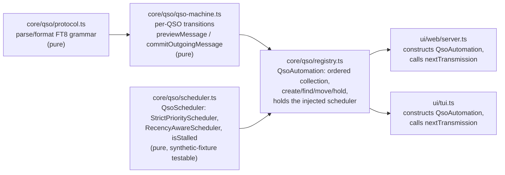

# QSO Controller — Scheduling and Modularity

## Goal Capsule

- **Objective:** Split `core/qso.ts`'s single-file grammar/state-machine/registry bundle into independently testable modules, and give the operator a real choice of how competing active QSOs are prioritized for transmission — today's "top of the list always wins" plus a recency-aware policy that lets a fresh reply on a lower-priority QSO transmit ahead of a leader that has gone silent, with a per-QSO manual pin as an escape hatch.
- **Authority:** Product Contract governs behavior. Planning Contract governs implementation. Where they conflict, the Product Contract wins and the conflict is surfaced, not resolved silently.
- **Execution profile:** Four units in dependency order — correctness fixes first (so the split doesn't carry a known bug forward), then the mechanical module split, then the new scheduler, then wiring it into the automation surface and both clients.
- **Stop conditions:** Stop and surface if any existing `test/ui-qso.test.ts` scenario changes behavior under the default (strict-priority) policy — this plan is additive to today's automation, not a behavior change to it.
- **Tail ownership:** Implementer runs the Verification Contract gates. This plan's module split is a prerequisite for `docs/rebuild-plan.md`'s W2 (`OperatorController` extraction), not a replacement for it — W2 still owns pulling scheduling/timing orchestration out of `ui/web/server.ts` and `ui/tui.ts` into `core/controller.ts`.

---

## Product Contract

### Summary

`core/qso.ts` today conflates four concerns in one file and one class: FT8 message grammar, per-QSO state transitions, the ordered collection of active QSOs, and the rule for which QSO transmits next. The transmit-selection rule is "first active QSO in list order with any resendable message," which means a top-priority QSO that has gone silent monopolizes every slot until it times out (5 attempts), even while a lower-priority QSO is actively exchanging fresh reports. This plan separates those four concerns into their own modules and adds a second, opt-in scheduling policy that lets a stalled leader be skipped in favor of a QSO that is actually making progress — while preserving a way for the operator to pin a specific QSO so it is never skipped.

### Problem Frame

An operator running several simultaneous QSOs (e.g. answering three callers off one CQ) orders them by priority — who they most want to work. Today that order is absolute: `QsoAutomation.nextTransmission` picks the first `active` QSO in the list whose current step has any message to send, and a QSO's message is resendable every slot regardless of whether anything new was heard from that station. A QSO that's waiting on a reply therefore looks identical, to the scheduler, to a QSO that just received one — both "have a message ready" — so the higher-priority row wins forever, even after the operator would rather let a responsive lower-priority contact through.

This is a real, common situation, not a rare edge case: FT8 pileups routinely have several stations answering in the same or adjacent slots, and stations regularly stop transmitting mid-exchange (QSB, interference, or they moved on). The fix is squarely a scheduling decision, not a change to the FT8 protocol handling itself — which is why it is designed as a separate, swappable component (`QsoScheduler`) from the state machine that already resolves *what* a ready QSO would say.

Separately, while reading the current implementation for this plan, two things surfaced that belong in the same pass because they sit on the same code path this plan is restructuring:

1. `handleDecode`'s cold-start guard excludes a bare `"73"` from spawning a new QSO when no existing QSO matches, but not `"rrr"`/`"rr73"` — a directed `RRR`/`RR73` with no matching QSO today creates a phantom QSO sitting at the final step with no grid and no report. This is a latent correctness bug that a scheduler-visibility change would otherwise paper over (a phantom QSO would just look like one more row competing for a slot).
2. `messageForQso` has a side effect — it writes `qso.sentReport` while formatting the outgoing message. `nextTransmission` currently calls it once, on the one QSO it already selected, so the side effect is harmless today. A scheduler that must inspect *readiness* across every active QSO to decide who transmits next would call it once per candidate, stamping `sentReport` on QSOs that don't even transmit this slot. This has to be fixed before the scheduler is introduced, not after.

### Key Decisions

**Two scheduling policies, chosen per session, not a single new default.** The operator described two situations they both consider correct: sometimes the top-priority QSO should transmit no matter what, and sometimes a fresher reply on a lower-priority QSO should be allowed to jump ahead of a leader that has gone quiet. These aren't reconcilable into one default — they're both real operator intents depending on the moment — so the policy is a session-level choice (`"strict"` | `"recency"`), not a replacement of today's behavior. `"strict"` remains the default, and is today's exact behavior made explicit rather than implicit.

**Staleness reuses `QsoRecord.attempts`; no new timestamp field.** `attempts[qso.step]` already counts how many times the current step's message has been (re)sent, and it already resets to `0`/`undefined` whenever a QSO advances to a new step on an incoming reply. That is precisely the "has this QSO gone silent since its last real progress" signal a recency-aware policy needs — a QSO whose step just advanced has `attempts[newStep]` at zero, indistinguishable in freshness terms from "just heard from." Introducing a parallel `lastAdvancedAt` field would duplicate state that can drift from `attempts`; reusing the existing counter keeps a single source of truth and keeps this a scheduling-layer decision only, not a `QsoRecord` shape change beyond the one genuinely new field (`held`, below).

**A held QSO is a pre-filter both policies share, not a third policy.** A per-QSO manual `held: boolean` flag lets the operator pin one contact — a rare DX station they never want bumped — regardless of which session-level policy is active. Both `StrictPriorityScheduler` and `RecencyAwareScheduler` check `ready.find(q => q.held)` first; if a held QSO is ready, it transmits, full stop. This reconciles "the leader should never move" (pin it) with "otherwise let freshness matter" (recency policy on everything else) without needing a third policy or a global mode that only half-applies.

**A stalled leader is skipped, never abandoned, by the recency policy.** If every ready QSO is stalled (`attempts[step] >= staleAfterAttempts` for all of them), the scheduler falls back to strict order rather than transmitting nothing. The existing `maxAttemptsPerStep` (5) is what actually ends a dead standard QSO (`timed_out`); the recency policy's job is only to let a responsive QSO go first while the leader is still alive, not to add a second timeout mechanism.

**The split is a precursor to `docs/rebuild-plan.md`'s W2, deliberately scoped narrower than it.** W2 extracts `OperatorController` — the scheduler-timer wiring, slot-clock integration, and survey/control-claim logic currently duplicated across `ui/web/server.ts` and `ui/tui.ts`. This plan only reorganizes `core/qso.ts` itself and adds the scheduler primitive `OperatorController` will eventually depend on. `ui/web/server.ts` and `ui/tui.ts` are touched here only at the two call sites that construct `QsoAutomation` and render QSO rows — not restructured. Trying to do both in one plan would conflate a scheduling-policy decision with an orchestration-extraction decision that has its own, larger scope already recorded in `docs/rebuild-plan.md`.

**Module boundary follows the four concerns, not file-size convenience.** `core/qso.ts` (785 lines) already implicitly separates into: pure grammar (`parseFt8Message`, `parseDirectedPayload`, callsign/grid predicates, `formatReport`), a pure per-QSO transition function (`advanceFromDirected`, `stepForIncomingPayload`, `messageForQso`, `stepRank`), an ordered collection with CRUD (`QsoAutomation`'s `qsos` array, `makeQso`/`insertQso`/`findQso`/`move`), and transmit selection (`nextTransmission`). Each becomes its own module so each can be unit-tested and swapped independently — the scheduler in particular needs to be testable with synthetic `QsoRecord[]` fixtures, without needing a live `QsoAutomation` instance or the FT8 grammar at all.

### Actors

- A1. Operator — orders active QSOs by priority, may pin one, chooses the session's scheduling policy.
- A2. Remote station — a real or simulated far-side FT8 operator; sends replies that may follow the standard sequence, skip ahead (e.g. reply to a CQ with a report instead of a grid), or arrive out of context (a stray `RRR` with no matching QSO).
- A3. Scheduler — the new subsystem deciding, among ready QSOs, which one transmits in the upcoming slot.

### Requirements

**Scheduler**

- R1. Given more than one `active` QSO with a ready outgoing message, exactly one is selected to transmit in the next slot, per the session's active policy.
- R2. Under the `"strict"` policy, the highest-priority (list-order) ready QSO always transmits — unchanged from today's behavior.
- R3. Under the `"recency"` policy, a ready QSO whose current step has been (re)sent `staleAfterAttempts` or more times without advancing is skipped in favor of the next non-stalled ready QSO in priority order. If no ready QSO is non-stalled, the highest-priority ready QSO transmits anyway.
- R4. A QSO with `held: true` that is ready transmits next regardless of which policy is active, ahead of every non-held QSO.
- R5. `staleAfterAttempts` has a sensible built-in default and is not hardcoded where it can't be reasoned about or tested at different values.
- R6. The session's scheduling policy is visible to and settable by the operator in both clients (TUI and web).
- R7. The operator can toggle `held` on an individual active QSO in both clients.

**Correctness fixes carried by this refactor**

- R8. A directed message with no matching existing QSO starts a new QSO only when its payload is `grid` or `report` — the two payload types that make sense as a QSO's first message. `rrr`, `rr73`, and `73` payloads with no matching QSO are ignored, matching today's existing bare-`73` behavior extended to the other two terminal/near-terminal payload types.
- R9. Evaluating whether a QSO is ready to transmit, or what it would send, never mutates QSO state (`sentReport` or otherwise). Mutation happens only when a message is actually selected and handed off for transmission.

**Modularity**

- R10. FT8 message grammar (parsing/formatting) has no dependency on QSO state or the scheduler.
- R11. The per-QSO state transition function has no dependency on the scheduler or the ordered collection, and no dependency on transport/timing code.
- R12. The ordered collection (creation, lookup, reordering, hold toggling) has no dependency on which scheduler policy is active — the scheduler is supplied to it, not the reverse.
- R13. The scheduler is unit-testable against synthetic `QsoRecord[]` fixtures with no `QsoAutomation` instance, no FT8 grammar, and no daemon/transport code involved.
- R14. Existing default-policy (`"strict"`) behavior — six-step sequence, skip-ahead tolerance, CQ auto-stop-on-reply, per-step max-attempts timeout, log entry shape — is unchanged; this plan is additive.

### Key Flows

- F1. Operator calls CQ, one station answers
  - **Trigger:** Operator sends `CQ`; a station replies with their grid (or, per existing skip-ahead handling, directly with a report).
  - **Actors:** A1, A2
  - **Steps:** CQ row is created and transmitted each slot until a directed reply arrives; the CQ row is stopped, a standard QSO is created at the step matching whatever payload was actually received, and the automation begins exchanging report → r-report → rr73 → 73.
  - **Outcome:** One completed QSO, logged.
  - **Covered by:** R2, R14 (unchanged happy path)

- F2. Operator replies to a CQ or calls a station directly
  - **Trigger:** Operator selects a decoded CQ, or types a callsign, and replies.
  - **Actors:** A1, A2
  - **Steps:** A standard QSO is created starting at `call-grid`; the automation sends grid, then advances on whatever payload type the station actually sends back (report, r-report, rrr, rr73, or 73 — monotonically, never regressing).
  - **Outcome:** One completed QSO, logged.
  - **Covered by:** R14 (unchanged happy path)

- F3. A stalled leader is skipped under the recency policy
  - **Trigger:** Operator has three active standard QSOs ordered 1/2/3, session policy is `"recency"`. QSO 1 has resent its current step `staleAfterAttempts` times with no reply; QSO 2 just advanced from a fresh decode.
  - **Actors:** A1, A2, A3
  - **Steps:** The scheduler evaluates readiness for all three; QSO 1 is stalled, QSO 2 is not; QSO 2 is selected for the next slot. QSO 1 remains `active` and un-touched — not abandoned, just skipped this cycle.
  - **Outcome:** QSO 2 transmits before QSO 1 catches up or times out on its own.
  - **Covered by:** R3

- F4. Operator pins a QSO
  - **Trigger:** Operator marks QSO 3 (a rare contact) as held, while session policy is `"recency"` and QSOs 1 and 2 are both ready and non-stalled.
  - **Actors:** A1, A3
  - **Steps:** The scheduler's pre-filter finds the held, ready QSO and selects it, bypassing both the strict list-order check and the staleness check.
  - **Outcome:** QSO 3 transmits next regardless of its priority position or staleness.
  - **Covered by:** R4

- F5. Non-standard skip-ahead reply
  - **Trigger:** Operator's CQ is answered directly with a signal report rather than a grid (a common abbreviated-exchange pattern).
  - **Actors:** A1, A2
  - **Steps:** `handleDecode` creates the QSO at the step the payload actually implies (`report` → next step `r-report`), not at a fixed `call-grid` starting step; the exchange proceeds from there.
  - **Outcome:** QSO completes correctly despite skipping the grid step.
  - **Covered by:** R14 (already-working behavior, protected by this plan's "no behavior change" stop condition)

- F6. Cold out-of-context acknowledgment is ignored
  - **Trigger:** A directed `RRR` or `RR73` arrives addressed to the operator, from a station with no existing matching QSO (e.g. a stray decode, or an ack meant for a QSO that already timed out and was abandoned).
  - **Actors:** A2
  - **Steps:** The cold-start guard rejects `rrr`/`rr73` (alongside the existing `73` rejection) as QSO-initiating payloads; no phantom QSO is created.
  - **Outcome:** No visible change to the operator — nothing appears that shouldn't.
  - **Covered by:** R8

### Acceptance Examples

- AE1. Recency policy lets a fresh reply jump a stalled leader
  - **Covers R3.**
  - **Given** `staleAfterAttempts = 2`, session policy `"recency"`, QSO A (priority 1, `attempts["call-grid"] = 2`) and QSO B (priority 2, `attempts["report"] = 0`), both ready,
  - **When** the scheduler selects the next transmission,
  - **Then** QSO B is selected.

- AE2. Strict policy ignores staleness
  - **Covers R2.**
  - **Given** the same fixture as AE1 but session policy `"strict"`,
  - **When** the scheduler selects the next transmission,
  - **Then** QSO A is selected, unchanged from today.

- AE3. All ready QSOs stalled falls back to priority order
  - **Covers R3.**
  - **Given** policy `"recency"`, two ready QSOs both at or above `staleAfterAttempts`,
  - **When** the scheduler selects,
  - **Then** the higher-priority (list-order-first) QSO is selected rather than returning no selection.

- AE4. Held QSO wins under either policy
  - **Covers R4.**
  - **Given** QSO C is `held: true` and ready, priority 3 (lowest), under both `"strict"` and `"recency"` policies with QSOs A and B ready and higher-priority,
  - **When** the scheduler selects,
  - **Then** QSO C is selected in both cases.

- AE5. Readiness evaluation is side-effect-free
  - **Covers R9.**
  - **Given** three ready QSOs at the `report` step (each with `lastDecodeSnr` set),
  - **When** the scheduler evaluates readiness for all three but selects only one,
  - **Then** `sentReport` is `null` on the two not selected, and set only on the one actually handed off for transmission.

- AE6. Cold RRR does not spawn a QSO
  - **Covers R8.**
  - **Given** no existing QSO matches the sender,
  - **When** a directed `RRR` (or `RR73`) addressed to us is decoded,
  - **Then** `handleDecode` returns no events and no QSO is created — matching today's existing behavior for a cold `73`.

### Success Criteria

- The default (`"strict"`) session behaves identically to today's automation on every existing `test/ui-qso.test.ts` scenario.
- A synthetic three-QSO fixture demonstrating the operator's described scenario (leader stalls, second-priority QSO has a fresh reply, recency policy selects it) passes as a scheduler unit test with no daemon, transport, or clock involved.
- `core/qso/scheduler.ts` has zero imports from `ui/`, `src/daemon/`, or `core/daemon-client.ts`.
- Both clients can toggle a QSO's held state and see the session's active policy, without either client computing scheduling decisions itself — that stays server-/registry-side, matching the existing pattern where `ui/web/server.ts` owns `QsoAutomation` and the browser only renders `ActiveQsoView`.

### Scope Boundaries

**Deferred for later**

- Persisting the held flag or chosen policy across a daemon/session restart. Today's automation state is already fully in-memory and cleared on session boundaries (`clearAutomationState`); this plan does not change that lifecycle.
- A per-QSO or per-station configurable `staleAfterAttempts` — this plan ships one session-wide value.
- Any UI beyond a minimal indicator/toggle for held state and a policy selector — visual/layout design for these controls is an implementation-time detail within U5, not specified here.

**Outside this effort**

- `docs/rebuild-plan.md`'s W2 (`OperatorController` extraction) — this plan's module split is a dependency for it, not an instance of it. The scheduler-timer/slot-clock wiring in `ui/web/server.ts` and `ui/tui.ts` stays where it is.
- Any change to the FT8 wire grammar, the six-step sequence itself, or `maxAttemptsPerStep`/timeout behavior.
- Multi-operator or shared-control scenarios (out of scope per `STRATEGY.md`).

### Dependencies / Assumptions

- `docs/rebuild-plan.md` W2 is unstarted (`core/controller.ts` does not exist yet as of this plan); this plan's module boundaries are chosen so W2 can depend on `core/qso/registry.ts` and `core/qso/scheduler.ts` directly rather than on a monolithic `core/qso.ts`.
- `test/ui-qso.test.ts` (303 lines) is the existing behavioral oracle for QSO automation and is the primary regression gate for R14.
- Both `ui/web/server.ts` and `ui/tui.ts` construct their own `QsoAutomation` instance today (no shared session state across clients, per `STRATEGY.md`'s "one radio, one operator" scope) — the scheduler/policy choice is therefore also per-client-instance until W2 changes that, which this plan does not attempt.

### Outstanding Questions

**Deferred to implementation**

- Exact default value for `staleAfterAttempts` (proposed default: 2 — one missed slot's grace before yielding, tunable at construction).
- Exact rendering of the held indicator and policy selector in `ui/tui.ts` (blessed) vs `ui/web/public/app.js` (browser) — left to implementer judgment within U5's approach.

---

## Planning Contract

### Key Technical Decisions

**KTD1. `core/qso.ts` splits into a `core/qso/` directory of four modules; nothing outside it changes import paths except the two construction call sites.** `core/qso/protocol.ts` (grammar), `core/qso/qso-machine.ts` (per-QSO transitions), `core/qso/registry.ts` (the `QsoAutomation` class, now scheduler-injected), `core/qso/scheduler.ts` (new). `core/qso/index.ts` re-exports the same public surface `core/qso.ts` exposes today (`QsoAutomation`, `parseFt8Message`, `messageForQso`, `formatReport`, `slotFromTimestamp`, `oppositeSlot`, `secondsUntilNextSlot`, `findOccupiedAf`, `suggestClearAf`, `renderOccupancyBar`, and the type exports), so `ui/tui.ts` and `ui/web/server.ts` change only their import path (`../core/qso.js` → `../core/qso/index.js`) with no other edits required by the split itself.

**KTD2. The scheduler is a strategy the registry holds, not a subclass or a mode flag on `QsoAutomation`.** `QsoAutomation` gains a constructor parameter `scheduler: QsoScheduler = new StrictPriorityScheduler()` (mirroring the existing `now: () => Date` injectable-clock pattern already in the class) and a `setScheduler(scheduler)` method for the policy toggle. `nextTransmission` changes from an inline `find` to: build the `ready` list, then delegate to `this.scheduler.selectNext(ready, this.schedulerContext)`.

**KTD3. `messageForQso` splits into a pure preview and an explicit commit step.** Today: `messageForQso(qso)` both computes the message *and* writes `qso.sentReport` for `report`/`r-report` steps. After this plan: `previewMessage(qso): string | null` is pure (computes the would-be message and, separately, the report value, without writing it), and `nextTransmission` — the one place that actually selects a QSO to transmit — calls a `commitOutgoingMessage(qso): string | null` that performs the same computation and writes `sentReport`. The scheduler and the `ready`-list build only ever call `previewMessage`. This is the mechanism behind R9/AE5.

**KTD4. Staleness is a pure function over `QsoRecord`, not scheduler-internal state.** `isStalled(qso: QsoRecord, staleAfterAttempts: number): boolean { return (qso.attempts[qso.step] ?? 0) >= staleAfterAttempts; }` lives in `core/qso/scheduler.ts` alongside the strategies, exported for testability, taking no dependency on the registry.

**KTD5. The cold-start guard becomes an explicit allow-list, not a growing exclude-list.** Today: `if (parsed.payload.type === "73") return [];` — a blocklist that silently needs a new line per newly-discovered terminal payload type (which is how the `rrr`/`rr73` gap happened). Replace with an allow-list matching R8's actual rule: `const qsoInitiatingPayloads = new Set(["grid", "report"]); if (!qsoInitiatingPayloads.has(parsed.payload.type)) return [];`. This is deliberately the inverse framing so a future new payload type fails closed (ignored) rather than open (spawns a QSO) by default.

**KTD6. Policy and hold are wire-visible via the smallest possible additions, reusing existing envelopes.** `ActiveQsoView` (`ui/web/protocol.ts`) gains `held: boolean`. `QsoAction` (same file) gains a `"toggleHold"` member, dispatched through the existing `{ cmd: "qso"; id; action }` command — no new command type. The session's scheduling policy is exposed as a new field on the existing session/status view-model (exact placement: alongside `SetupView` or wherever session-scoped, non-per-QSO settings already live in `ui/web/protocol.ts` — implementer's call in U5, not a new message type) with a corresponding `{ cmd: "setSchedulerPolicy"; policy: "strict" | "recency" }` command.

### High-Level Technical Design

`SCHED` has no arrow into `MACHINE` or `PROTO` — it only ever sees `QsoRecord[]` and calls `previewMessage`, never the parser or the transition logic directly. This is what makes R13 (scheduler tested against synthetic fixtures) hold: a test can construct `QsoRecord` objects by hand, with no decode, no `QsoAutomation`, no grammar involved.

### Assumptions

- `attempts[qso.step]` is reliably reset on step advance today (verified in `advanceFromDirected` and `confirmTransmission` — the former doesn't touch `attempts`, the latter increments it per-step and only after a real transmission, and a step change means the new step's key is unset) — this is what makes KTD4 safe to build on without a migration.
- Neither client currently persists `QsoAutomation` across a reconnect in a way that would need the new `scheduler`/`held` state migrated — `clearAutomationState` already wipes `automation.qsos` on session boundaries.

---

## Implementation Units

| U-ID | Title | Key files | Depends on |
|---|---|---|---|
| U1 | Purity and cold-start-guard fixes | `core/qso.ts`, `test/ui-qso.test.ts` | — |
| U2 | Split `core/qso.ts` into `core/qso/` modules | `core/qso/protocol.ts`, `core/qso/qso-machine.ts`, `core/qso/registry.ts`, `core/qso/index.ts`, `ui/tui.ts`, `ui/web/server.ts`, `test/ui-qso.test.ts` | U1 |
| U3 | `QsoScheduler` and the two policies | `core/qso/scheduler.ts`, `test/qso-scheduler.test.ts` | U2 |
| U4 | Wire the scheduler and held flag into the registry | `core/qso/registry.ts`, `test/ui-qso.test.ts` | U3 |
| U5 | Expose policy and hold in both clients | `ui/web/protocol.ts`, `ui/web/view-model.ts`, `ui/web/server.ts`, `ui/web/public/app.js`, `ui/tui.ts`, `test/web-view-model.test.ts` | U4 |

### U1. Purity and cold-start-guard fixes

- **Goal:** Land the two correctness fixes ahead of the module split, so the split doesn't carry a known bug and the scheduler doesn't inherit a side-effecting readiness check.
- **Requirements:** R8, R9
- **Dependencies:** none
- **Files:** `core/qso.ts`, `test/ui-qso.test.ts`
- **Approach:** Split `messageForQso` into a pure `previewMessage` (computes the message and, for `report`/`r-report` steps, the would-be report value, without assignment) and have `nextTransmission` — the only call site that should mutate — assign `qso.sentReport` after selecting. Replace the `payload.type === "73"` blocklist check in `handleDecode`'s cold-start branch with the allow-list from KTD5. Keep `QsoAutomation`'s public method signatures unchanged; this unit only changes internal purity and the guard condition.
- **Patterns to follow:** The existing injectable-clock pattern (`now: () => Date` in the constructor) for how this codebase already separates "pure computation" from "when a side effect commits."
- **Test scenarios:**
  - Calling the readiness/preview function on a QSO at the `report` step twice does not change `qso.sentReport`.
  - `nextTransmission` still sets `sentReport` on the QSO it actually selects, matching today's externally-visible behavior.
  - A directed `RRR` with no matching QSO produces no events and creates no QSO.
  - A directed `RR73` with no matching QSO produces no events and creates no QSO.
  - A directed `73` with no matching QSO still produces no events (regression check — behavior must be unchanged, only the mechanism changes from blocklist to allow-list).
  - A directed `grid` or `report` with no matching QSO still creates a new QSO exactly as today (regression check on the allow-list's positive side).
- **Verification:** `npm test` green, including new scenarios above; no existing `test/ui-qso.test.ts` assertion changes.

### U2. Split `core/qso.ts` into `core/qso/` modules

- **Goal:** Mechanical extraction into the four modules from KTD1, with no behavior change.
- **Requirements:** R10, R11, R12, R14
- **Dependencies:** U1
- **Files:** `core/qso/protocol.ts`, `core/qso/qso-machine.ts`, `core/qso/registry.ts`, `core/qso/index.ts`, `ui/tui.ts`, `ui/web/server.ts`, `test/ui-qso.test.ts`
- **Approach:** Move `parseFt8Message`, `parseDirectedPayload`, `isCallsign`, `isGrid`, `formatReport`, `normalizeToken`, `normalizeMessage` into `protocol.ts`. Move `previewMessage`/`commitOutgoingMessage` (from U1), `stepForIncomingPayload`, `stepRank`, `updateReportsFromPayload`, `payloadGrid`, and the standalone slot helpers (`slotFromTimestamp`, `oppositeSlot`, `secondsUntilNextSlot`) into `qso-machine.ts` — these are the pure per-QSO/per-message functions with no collection state. Move the `QsoAutomation` class, `findOccupiedAf`, `suggestClearAf`, `renderOccupancyBar` (registry/collection-adjacent utilities operating on `DecodeRecord[]`/`QsoRecord[]`) into `registry.ts`. `index.ts` re-exports the full existing public surface so `core/qso.ts`'s current external contract is preserved at one import path. Delete `core/qso.ts`; update the two import sites (`ui/tui.ts:23`, `ui/web/server.ts:23`) to `../core/qso/index.js` / `../../core/qso/index.js`.
- **Patterns to follow:** `core/` is already the shared, framework-agnostic layer per `docs/rebuild-plan.md` §2 — this unit deepens that layout rather than introducing a new one. `test/ui-qso.test.ts`'s existing import block is the map of the public surface `index.ts` must preserve.
- **Test scenarios:**
  - Every existing `test/ui-qso.test.ts` test passes unmodified against the new import path.
  - `core/qso/protocol.ts` has zero imports from `core/qso/registry.ts` or `core/qso/scheduler.ts`.
  - `core/qso/qso-machine.ts` has zero imports from `core/qso/registry.ts`.
  - `npm run build` and `npm run typecheck` both clean with no lingering reference to a deleted `core/qso.ts` path anywhere in `src/` or `ui/`.
- **Verification:** `npm test`, `npm run build`, `npm run typecheck` all green; `grep -rn "core/qso\.js"` (the old single-file import) returns no matches outside this plan's own history.

### U3. `QsoScheduler` and the two policies

- **Goal:** A scheduler primitive, testable in complete isolation, implementing R1–R5.
- **Requirements:** R1, R2, R3, R4, R5, R13
- **Dependencies:** U2
- **Files:** `core/qso/scheduler.ts`, `test/qso-scheduler.test.ts`
- **Approach:** Define `QsoScheduler` (`selectNext(ready: QsoRecord[], ctx: SchedulerContext): QsoRecord | null`), `SchedulerContext` (`{ staleAfterAttempts: number }`), `isStalled` (KTD4), `StrictPriorityScheduler`, `RecencyAwareScheduler`. Both strategies apply the held pre-filter (KTD2/KTD3 area — held check happens once, likely factored into a shared `selectHeld(ready)` helper both strategies call first, to avoid duplicating the pre-filter logic). `RecencyAwareScheduler.selectNext` filters `ready` to non-stalled, returns the first (priority order) if any, else falls back to `ready[0]`. Export a default `staleAfterAttempts` constant (proposed: 2) for callers that don't specify one.
- **Patterns to follow:** `core/slot-clock.ts`'s style of a small, pure, exhaustively-tested primitive with no side effects and no I/O — the closest existing precedent in this codebase for a component this plan wants the scheduler to resemble.
- **Test scenarios:**
  - Covers AE1. `staleAfterAttempts = 2`, leader stalled at 2, second QSO fresh (0 attempts on its step) — `RecencyAwareScheduler` selects the second.
  - Covers AE2. Same fixture, `StrictPriorityScheduler` — selects the leader.
  - Covers AE3. All ready QSOs stalled — `RecencyAwareScheduler` falls back to priority-order-first rather than returning `null`.
  - Covers AE4. A held QSO ready but lowest priority — both schedulers select it, under both a leader-fresh and a leader-stalled fixture.
  - An empty `ready` list returns `null` from both schedulers.
  - A single ready QSO returns it regardless of policy or staleness.
  - `isStalled` returns `false` when `attempts[step]` is `undefined` (a QSO that just advanced and has never resent its current step).
  - `isStalled` is exactly at-threshold inclusive: `attempts[step] === staleAfterAttempts` counts as stalled.
- **Verification:** `npm test` covers the new suite; the suite constructs `QsoRecord` fixtures directly with no `QsoAutomation`, no decode, no daemon/transport import anywhere in the test file.

### U4. Wire the scheduler and held flag into the registry

- **Goal:** `QsoAutomation` (in `core/qso/registry.ts`) actually uses the scheduler for `nextTransmission`, and exposes hold/policy control.
- **Requirements:** R6 (partial — registry-side), R7 (partial — registry-side), R9 (integration), R14
- **Dependencies:** U3
- **Files:** `core/qso/registry.ts`, `test/ui-qso.test.ts`
- **Approach:** Add `held: boolean` to `QsoRecord` (default `false` in `makeQso`). Add `QsoAutomation` constructor param `scheduler: QsoScheduler = new StrictPriorityScheduler()` and `schedulerContext: SchedulerContext = { staleAfterAttempts: defaultStaleAfterAttempts }`, plus `setScheduler(scheduler)` and `setStaleAfterAttempts(n)` for runtime policy switching. Add `toggleHold(id): QsoRecord | null` alongside the existing `resume`/`complete`/`abandon` operator-action methods. Rewrite `nextTransmission` to build `ready` via `previewMessage` (never `commitOutgoingMessage`) and delegate to `this.scheduler.selectNext(ready, this.schedulerContext)`, then call `commitOutgoingMessage` only on the selected QSO.
- **Patterns to follow:** `resume`/`complete`/`abandon`/`resetAttempts` in the current `QsoAutomation` — `toggleHold` should read and update `updatedAt`/return the QSO the same way.
- **Test scenarios:**
  - Default-constructed `QsoAutomation` (no scheduler argument) behaves identically to today on every existing test — regression gate for R14.
  - `setScheduler(new RecencyAwareScheduler())` changes `nextTransmission`'s pick on a fixture matching AE1, using the registry's real `QsoRecord`s (not hand-built fixtures) created via `createReplyToCall`/`handleDecode`, closing the gap between U3's synthetic-fixture tests and real registry-produced records.
  - `toggleHold` flips the flag and `nextTransmission` reflects it on the next call.
  - `toggleHold` on a nonexistent id returns `null` and is a no-op.
  - `nextTransmission` calls `commitOutgoingMessage` (verifiable via `sentReport` being set) on exactly the selected QSO, and `previewMessage`-only (no `sentReport` mutation) on every other ready QSO evaluated during selection.
- **Verification:** `npm test` green, including full existing `test/ui-qso.test.ts` suite with zero behavioral diffs under the default scheduler.

### U5. Expose policy and hold in both clients

- **Goal:** An operator can see and change the session's scheduling policy, and pin/unpin an individual QSO, from both the web and TUI clients.
- **Requirements:** R6, R7
- **Dependencies:** U4
- **Files:** `ui/web/protocol.ts`, `ui/web/view-model.ts`, `ui/web/server.ts`, `ui/web/public/app.js`, `ui/tui.ts`, `test/web-view-model.test.ts`
- **Approach:** Add `held: boolean` to `ActiveQsoView` and `"toggleHold"` to `QsoAction`, wired through the existing `{ cmd: "qso"; id; action }` envelope to `automation.toggleHold(id)` (KTD6). Add a session-scoped policy field to the relevant existing view-model type and a `{ cmd: "setSchedulerPolicy"; policy: "strict" | "recency" }` command dispatched to `automation.setScheduler(...)`. `ui/web/public/app.js` renders a held indicator per QSO row (clickable, consistent with existing row-action patterns like the reply double-click) and a policy toggle somewhere in session-level controls. `ui/tui.ts` gains a keybinding (documented alongside the existing `r`/`c`/`u`/`d` QSO-list keys) for hold-toggle on the selected row, and a policy indicator/toggle in an existing status area.
- **Patterns to follow:** `ui/web/view-model.ts`'s existing mapping from `QsoRecord` to `ActiveQsoView` (where `priority: index + 1` is set) is the exact spot `held` joins. `ui/tui.ts`'s existing `qsoList.key(["c"], callCq)` / `automation.move(qso.id, delta)` wiring for the reorder keys is the direct precedent for the new hold key.
- **Test scenarios:**
  - `ActiveQsoView` mapping carries `held` through unchanged from `QsoRecord.held`.
  - A `toggleHold` command round-trips: view-model reflects the flip after the command is applied.
  - A `setSchedulerPolicy` command changes which scheduler `automation` is using (assert via a subsequent `nextTransmission` pick on a fixture, mirroring U4's registry-level test).
  - An unrecognized policy value is rejected (logged, not silently defaulted) — consistent with the existing "fail loudly" convention this codebase uses for unrecognized engine selection (`docs/plans/2026-07-13-...`, U6).
- **Verification:** `npm test` and `npm run typecheck` both green. No headless UI assertion is required — this unit is UI-surface wiring, consistent with how `docs/rebuild-plan.md` already treats `ui/tui.ts` as typecheck-only-verified.

---

## Verification Contract

| Gate | Command | Applies to | Done signal |
|---|---|---|---|
| Unit and integration tests | `npm test` | U1–U5 | All suites green, including existing `test/ui-qso.test.ts` with zero behavioral diffs under the default policy |
| Daemon/core build | `npm run build` | U2 | `tsc` clean over `src/` + `core/` |
| Client types | `npm run typecheck` | U2, U5 | `tsc` clean over `core/ + ui/` — the only gate `ui/tui.ts`'s change gets |
| Import boundary check | `grep -rn "from \"\.\./core/qso\.js\"\|from \"\.\./\.\./core/qso\.js\"` `ui/` `src/` | U2 | No matches (old single-file import path fully retired) |

No hardware regression gate applies — this plan touches no driver, transport, or CAT code; it is entirely within `core/qso*` and the two clients' QSO-list rendering.

## Definition of Done

**Global**

- The Verification Contract gates pass.
- The default (`"strict"`) scheduling policy is behaviorally identical to today's `QsoAutomation.nextTransmission` on every pre-existing test.
- `core/qso/scheduler.ts` is tested with zero dependency on the FT8 grammar, the registry, or any client/transport code.
- The cold-start guard rejects `rrr`/`rr73`/`73` uniformly (allow-list, not a growing blocklist).
- `messageForQso`'s former side effect no longer fires during readiness evaluation.

**Per unit**

- U1: the allow-list regression scenarios (grid/report still create; rrr/rr73/73 still don't) all pass, and preview/commit purity is directly asserted.
- U2: `core/qso.ts` no longer exists; every symbol it exported is reachable from `core/qso/index.ts`; both client import sites updated.
- U3: all eight scheduler test scenarios pass against hand-built `QsoRecord` fixtures with no other module imported besides `core/qso/scheduler.ts` and its own types.
- U4: `nextTransmission`'s default behavior is unchanged; `setScheduler`/`toggleHold` are exercised against registry-produced (not hand-built) `QsoRecord`s.
- U5: both clients can read and (for hold) write the new state through their existing command/view-model plumbing, with no new message type introduced beyond the one documented `setSchedulerPolicy` command.

---

## Sources / Research

- `core/qso.ts` — the full current implementation; `nextTransmission` (line 253), `handleDecode`'s cold-start guard (line 219), `messageForQso`'s `sentReport` side effect (lines 553–567), `attempts` bookkeeping (`confirmTransmission`, lines 276–309) — the basis for KTD4's staleness reuse.
- `docs/rebuild-plan.md` — W2 (`OperatorController` extraction, unstarted as of this plan) is the eventual consumer of `core/qso/registry.ts` and `core/qso/scheduler.ts`; this plan's Scope Boundaries defer to it explicitly rather than re-scoping it.
- `docs/ui-owned-ft8-qso-automation-implementation-plan.md` — original v1 scheduler note ("top eligible row wins... do not implement non-standard FT8 message variants in v1"), confirming today's strict-priority-only behavior was an explicit, named scope cut rather than an oversight.
- `test/ui-qso.test.ts` — the existing 303-line behavioral oracle for R14's regression guarantee.
- `ui/web/protocol.ts` — `ActiveQsoView` (line 100), `QsoAction` (line 155), `CommandMessage` (line 165) — the existing wire shapes U5 extends per KTD6.
- `ui/web/view-model.ts` — line 205, `priority: index + 1`, the exact site `held` joins the `QsoRecord → ActiveQsoView` mapping.
- `ui/tui.ts` — lines 173, 348, 517, 543, 572, 729, 750, 753, 804, 808 — existing QSO-list keybinding and row-rendering call sites U5's hold key follows.
- `EveryInc/compound-engineering-plugin`, `skills/ce-plan/SKILL.md` — the planning workflow and artifact structure (Product Contract / Planning Contract / Implementation Units / Verification Contract / Definition of Done) this document follows, matching the `ce-unified-plan/v1` contract already used by `docs/plans/2026-07-12-001-feat-engine-backend-plan.md` and `docs/plans/2026-07-13-001-feat-simulated-engine-demo-mode-plan.md`.
