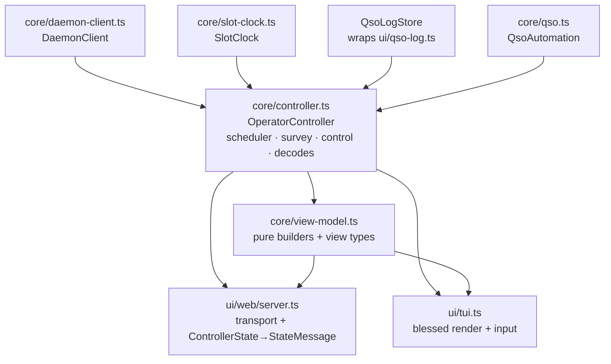
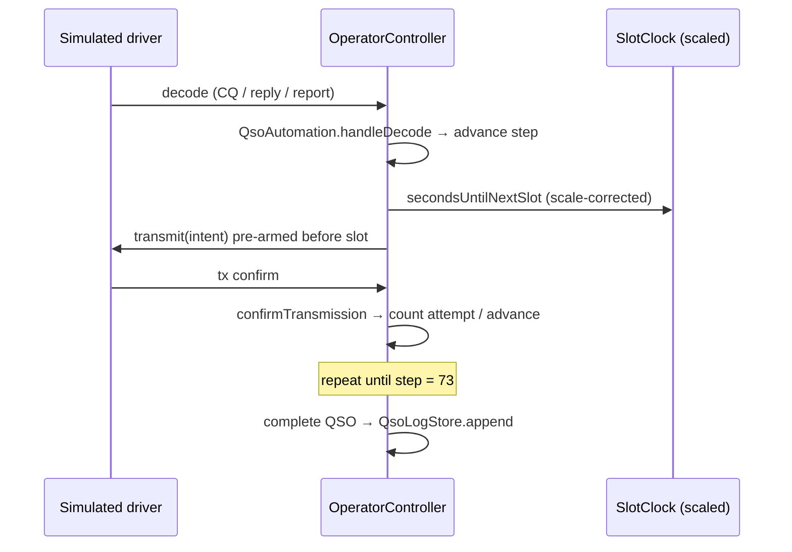

# QSO Automation Engine (OperatorController Extraction) - Plan

## Goal Capsule

- **Objective:** Extract the duplicated QSO orchestration out of the two clients into one
  headless engine, `core/controller.ts` (`OperatorController`), that both the web and TUI
  clients drive. This is workstream **W2** of `docs/rebuild-plan.md`; W1 (core/ foundation)
  and W4 (EngineDriver seam) are done, so W2 is the remaining rebuild step.
- **Authority:** The Product Contract governs behavior; the Planning Contract governs
  implementation. Where they conflict, the Product Contract wins and the conflict is
  surfaced, not resolved silently. This is an internal change — the daemon↔client wire
  protocol and FT8 domain semantics (AF 200–3000 Hz, even/odd slots, FT8/FT4, snr/dt/af)
  are the stable public seam and do not change.
- **Product Contract preservation:** Product Contract unchanged. This run added the Planning
  Contract, Implementation Units, Verification Contract, and Definition of Done, and resolved
  Outstanding Questions OQ1–OQ3 into planning decisions (see Key Technical Decisions).
- **Execution profile:** Web-first. Build the engine, port the web server's orchestration
  onto it, land the headless full-QSO proof, then adopt the TUI last — proving the engine
  before the second large client is touched.
- **Stop conditions:** Stop and surface if porting the web orchestration cannot preserve the
  existing web behavior without a Product Contract change, or if the headless full-QSO proof
  cannot complete at scaled time without a wire-protocol change.
- **Tail ownership:** Implementer runs the Verification Contract gates. This refactor is
  fully reachable headless (simulated driver) — no real-hardware regression is required to
  land it, though a live-rig smoke before the next user-facing ship remains the operator's.

---

## Product Contract

### Summary

Today the slot-aligned TX scheduler, survey, control-claim state, decode buffer, dial-freq
tracking, and worked-call/logging side-effects live twice — once in `ui/tui.ts` (1571 lines,
~96 automation touchpoints) and once in `ui/web/server.ts` (1169 lines, ~90). The pure QSO
state machine (`core/qso.ts`) was already extracted in W1. W2 lifts the orchestration around
it into a single `core/controller.ts` so both clients become thin: web reduces to transport
+ state mapping, the TUI to blessed render + input dispatch. The engine is proven end-to-end
by a headless test that drives a full simulated QSO to completion at scaled time.

### Problem Frame

The rebuild review found QSO orchestration duplicated across the TUI and web clients and
already drifting (finding #4). Every feature shipped since W1 — demo mode and the published
slot clock on the current branch — has been paid for twice and has widened that drift: the
TUI tracks TX intent as `manualOverridePending`, while the web client evolved a superset
(`txEnabled` / `haltTx` / `controlClaimPending`). The two clients can now behave differently
in the same situation, and the TUI's orchestration logic (~250 lines) is untestable because
it is embedded in a blessed script. Extracting one engine both clients drive is what stops
the drift and makes the automation logic testable.

### Actors

- **A1. Operator** — drives the engine through either client (web or TUI); must see the same
  behavior regardless of which client they use.
- **A2. Cloud agent** — verifies the engine headlessly in a container with no radio, using
  the simulated driver, and must be able to prove a full QSO completes.
- **A3. Both reference clients** — web and TUI, reduced to rendering + input, sharing one
  engine and one view-model.

### Requirements

**R1 — One engine, both clients.** `core/controller.ts` owns the scheduler, survey,
control-claim, decode buffer, dial-freq, and worked-call/logging orchestration, wrapping the
existing `core/qso.ts`. After W2, no orchestration logic remains in `ui/web/server.ts` or
`ui/tui.ts`; both drive the controller through injected dependencies.

**R2 — Sequenced web-first, TUI follows.** Execution order within W2:

1. Build `core/controller.ts`, porting the web server's orchestration (the reference of
   truth) and refreshing the stale interface stub in `docs/rebuild-plan.md` §3.3 to carry
   what demo mode and the slot clock added since it was written.
2. Reduce `ui/web/server.ts` to transport + `ControllerState → StateMessage` mapping. Move
   `ui/web/view-model.ts` → `core/view-model.ts` (W1's explicitly deferred item), UI-agnostic
   so the TUI can render from it too.
3. Land the done bar (R4) — the integration proof — against the extracted engine before the
   second client is touched.
4. Reduce `ui/tui.ts` to blessed render + input dispatch, reconciling its drifted behavior
   onto the web's.

**R3 — Behavior converges to web; the TUI changes.** This is not a pure behavior-preserving
refactor. Unifying two clients into one engine forces one behavior, and the web client's
superset control model wins. The TUI's drifted behaviors (notably `manualOverridePending`
vs the web's `txEnabled` / `haltTx` / `controlClaimPending`) are reconciled onto the web's,
which is an intended, observable change to the TUI.

**R4 — Done means a headless full-QSO proof, plus unit coverage.** W2 is finished only when:
- Unit tests cover the previously-untestable logic — scheduler timing with an injected clock,
  survey, control-claim, and QSO event/logging.
- An automated integration test drives `OperatorController` + the simulated driver through a
  complete QSO (CQ → … → 73) to completion, **at scaled time**, headless, asserted in CI.
- All existing gates stay green: `npm test`, `npm run build`, `npm run typecheck`,
  `npm run smoke`, `npm run smoke:ui`.

**R5 — Scheduler derives time from the published slot clock, scale factor included.** The
controller's scheduler must schedule automated transmits against the daemon's published slot
clock (epoch, duration, **and scale factor**), not a real-time timer. This is the load-bearing
consequence of the scaled-time proof in R4: if the engine fires on real 15-second boundaries
while the daemon runs slots at, e.g., 20×, no simulated QSO ever completes. The old stub's
injected `now()` is insufficient on its own — the engine consumes the slot-clock triple.

**R6 — Transport-abstract; daemon-promotion stays a relocation.** All dependencies
(`DaemonClient`, clock, logger, QSO-log store) are injected, so the engine runs identically
inside a client process today or inside the daemon later (the deferred option B). No code path
assumes it lives client-side.

**R7 — Demo-mode integrity survives the extraction.** Demo-mode labeling and the reserved
demo identity carry through the engine unchanged: demo must remain unmistakably labeled in
every client, and the reserved identity must never leak into persisted session config. See
`CONCEPTS.md` (Demo mode, Reserved demo identity).

### Non-Goals

- **No daemon promotion.** The engine stays client-side; the daemon remains QSO-unaware
  (rebuild plan option B, deferred). R6 only keeps that door open.
- **No new QSO automation behavior.** W2 moves and consolidates existing orchestration; it
  does not add station-selection strategy, auto-CQ tactics, multi-QSO handling, or survey
  automation beyond what exists today.
- **No wire-protocol or FT8-semantic changes.** The public daemon↔client contract is the
  stable seam.
- **Not W4 or W5.** The EngineDriver seam (W4) is done; security hardening (W5) stays
  low-priority and out of scope here.

### Success Criteria

- No orchestration logic remains in `ui/tui.ts` or `ui/web/server.ts`; both drive one
  `core/controller.ts`.
- `ui/web/view-model.ts` has moved to `core/view-model.ts` and is UI-agnostic.
- The headless full-QSO integration proof runs green in CI at scaled time; unit coverage of
  scheduler/survey/control/logging is in place.
- Web and TUI produce the same behavior for the same operator action (drift closed).
- All existing gates stay green.

### Outstanding Questions (resolved in planning)

- **OQ1 — Refreshed `ControllerState` shape.** Resolved: `ControllerState` mirrors today's
  web-server state, plus a `station.demo` flag; scheduler/survey/cycle fields continue to
  derive from the injected `SlotClock`. See KTD2, U1.
- **OQ2 — Integration-proof entry point.** Resolved: the proof drives the controller
  **directly** against the simulated driver (UI-agnostic), landing before the TUI work. See
  KTD5, U5.
- **OQ3 — Control-state reconciliation detail.** Resolved: web's `controlHeld` /
  `controlMine` / `controlClaimPending` + `txEnabled` / `haltTx` is canonical; the TUI's
  `manualOverridePending` and `ensureControl` auto-claim fold into it. See KTD1, U6.

---

## Planning Contract

### Key Technical Decisions

**KTD1 — Port the web server's orchestration; do not merge two implementations.** The web
server (`ui/web/server.ts`) is the more-evolved, reference-of-truth copy. The controller is
built by lifting its orchestration verbatim, then having the TUI adopt it. The TUI's drifted
control model (`manualOverridePending`) is discarded, not reconciled field-by-field —
resolving finding #4 and R3/OQ3. Rationale: a field-by-field merge would re-introduce the
drift the extraction exists to kill.

**KTD2 — `ControllerState` mirrors the web server's current state, plus `station.demo`.** The
§3.3 stub predates demo mode and the slot clock. The controller's state carries what the web
server already tracks — station (`call`, `grid`, `dialFreqHz`, `catConnected`,
`sessionActive`, `controlHeld`, `controlMine`, `demo`), tx card, survey, af, qsos (calling-cq
/ active / completed), decodes, and the slot-clock-derived cycle. Scheduling and survey timing
already flow through the injected `SlotClock` (`requireClock()` today), so R5 is preserved by
the port rather than newly built.

**KTD3 — Dependencies are injected; `qso-log.ts` is wrapped, not relocated.** The controller
takes `DaemonClient`, a clock accessor, a logger sink, and a `QsoLogStore` (`append` /
`readAll`) — all injected, satisfying R6 (transport-abstract, daemon-promotable). The concrete
`QsoLogStore` wraps the existing `appendQsoLog` / `readQsoLog` in `ui/qso-log.ts`; physically
moving that file into `core/` is deferred (see Scope Boundaries) because the seam does not
require it.

**KTD4 — `core/view-model.ts` renders from `ControllerState`; browser view types move with
it.** The pure builders in `ui/web/view-model.ts` (`buildRosters`, `buildActiveQsoView`,
`deriveTxCard`, `buildCycleView`, `cycleParity`, `annotateDecode`, `senderOf`, `gridFrom`,
`latestSlotAfs`) already depend only on `core/qso.ts` and `core/slot-clock.ts` — their sole
web coupling is importing the view types (`DecodeView`, `ActiveQsoView`, `CycleView`, etc.)
from `ui/web/protocol.ts`. Those view types move into `core/view-model.ts`; `ui/web/protocol.ts`
re-exports/aliases them for the browser wire (`StateMessage` stays web-owned). The TUI then
renders from the same core builders, which also collapses the `senderOf` / `gridFrom`
duplication (finding #7) as a side effect rather than as separate cleanup.

**KTD5 — The integration proof drives the controller directly at scaled time.** The R4 proof
instantiates `OperatorController` with the simulated driver's `DaemonClient` and a scaled
`SlotClock`, and asserts a full QSO reaches `complete` with a log entry — no web or TUI
process in the loop. Rationale (OQ2): a UI-agnostic proof lands before the TUI adoption (U6)
and guards the engine itself, which is the asset both clients share.

### High-Level Technical Design

Component shape after extraction — one engine, two thin clients, all deps injected:

The R4 headless proof, at scaled time, exercises the scheduler→driver→confirm loop end to end:

### Implementation Units

#### U1. Scaffold `core/controller.ts` — interface, `ControllerState`, injected deps

- **Goal:** Establish the engine skeleton: the `OperatorController` interface, the
  `ControllerState` shape, the injected dependency set, and the `onChange` emitter — no
  orchestration behavior yet.
- **Requirements:** R1, R6; resolves OQ1.
- **Dependencies:** none.
- **Files:** `core/controller.ts` (new); `test/controller.test.ts` (new).
- **Approach:** Define `OperatorControllerDeps` (`client: DaemonClient`, `log: QsoLogStore`,
  `clock` accessor, `onLog` sink, `token?`, `now?`) and `ControllerState` per KTD2 (station
  incl. `demo`, tx, survey, af, qsos, decodes, cycle). Implement construction, `state`
  getter, `onChange(listener) → unsubscribe`, and `start()` / `dispose()` lifecycle stubs.
  Operator-action method signatures (`setIdentity`, `setAf`, `setSlot`, `callCq`, `stopCq`,
  `replyToCall`, `qsoAction`, `survey`, `setTxEnabled`, `haltTx`, `startSession`,
  `stopSession`, `releaseControl`) are declared and no-op/throw until U2.
- **Patterns to follow:** the §3.3 stub in `docs/rebuild-plan.md`, refreshed per KTD2; the
  `DaemonClient` event/emitter style in `core/daemon-client.ts`.
- **Test scenarios:**
  - `onChange` listener fires on state mutation and stops after its unsubscribe is called.
  - `dispose()` clears timers and unsubscribes from the injected client (no emissions after).
  - Initial `ControllerState` has `station.demo === false` and empty qso/decode collections.
- **Verification:** `core/controller.ts` type-checks against the injected deps; the skeleton
  tests pass; no client imports it yet.

#### U2. Port the web server's orchestration into the controller

- **Goal:** Move the automation engine — scheduler, survey, control-claim, tx-enable, decode
  buffer, dial-freq, QSO event handling and logging, and the daemon-client wiring — out of
  `ui/web/server.ts` and into `core/controller.ts`, preserving web behavior exactly.
- **Requirements:** R1, R3, R5, R7; KTD1, KTD2, KTD3.
- **Dependencies:** U1.
- **Files:** `core/controller.ts`; `test/controller.test.ts`.
- **Approach:** Port `automation` (QsoAutomation), `scheduleAutomation` / `sendAutomatedTx` /
  `clearAutomationTimer` / `clearAutomationState`, `startSurvey` / `finishSurvey` and survey
  state, the control model (`controlHeld` / `controlMine` / `controlClaimPending`, the
  claim-on-demand path), `txEnabled` / `haltTx` / `setTxEnabled`, `updateTxState`,
  `currentTxSlot` / `currentAfOrNull`, `handleQsoEvents` / `logCompletedQso`, and the
  `client.on(...)` handlers for `status` / `decode` / `tx` / `tx_update` / `log` /
  `daemonError` / `config` / `audio_devices`. Scheduling stays on the injected `SlotClock`
  (R5) exactly as the web server does today via `requireClock()`. Demo labeling flows into
  `station.demo` from the engine-kind/status signal (R7). Every mutation routes through the
  `onChange` emitter instead of `broadcastState()`.
- **Execution note:** Port incrementally with the unit tests below landing alongside each
  slice (scheduler, then survey, then control, then logging) — this is the logic that was
  untestable in-place, so tests are the proof the port is faithful.
- **Patterns to follow:** `ui/web/server.ts` lines ~362–525 (scheduler + survey), ~396–410
  (`updateTxState`), ~540–563 (control claim), ~733–747 (`haltTx` / `setTxEnabled`),
  ~315–360 (QSO events + logging).
- **Test scenarios:**
  - Scheduler (injected clock): with an active QSO and valid AF, an automated `transmit` is
    pre-armed ~2s before the eligible slot; inside the pre-arm window it sends immediately.
  - Scheduler gates: no transmit while `!sessionActive`, `surveyActive`, `!txEnabled`, or
    `latestTxState === "active"`.
  - Attempts: a step's attempt count increments only on a daemon `tx` confirm, not on send;
    the step times out after 5 confirmed attempts and the QSO stays in the active list.
  - Survey: `startSurvey` holds TX for one receive cycle of the TX parity and re-schedules on
    `finishSurvey`; survey is refused with a logged warning when no slot clock is published.
  - Control: a state-changing action claims control when not held, guarded by
    `controlClaimPending`; releasing control resets the flags.
  - QSO logging: a completed standard QSO with a real `theirCall` appends one `QsoLogEntry`
    via the injected `QsoLogStore`; a stopped CQ row logs nothing.
  - Demo: `station.demo` is true under the simulated engine and false otherwise.
- **Verification:** the ported unit tests pass; behavior matches the web server's current
  observable behavior for each ported path.

#### U3. Relocate the view-model to `core/`, decoupled from the browser protocol

- **Goal:** Move `ui/web/view-model.ts` → `core/view-model.ts` so it renders from
  `ControllerState` / core types and both clients can use it (W1's deferred item).
- **Requirements:** R1; KTD4. Advances Success Criterion "view-model has moved to core".
- **Dependencies:** U1.
- **Files:** `core/view-model.ts` (new, moved); `ui/web/view-model.ts` (removed);
  `ui/web/protocol.ts` (re-export/alias view types); `test/web-view-model.test.ts` →
  `test/view-model.test.ts` (moved); `core/protocol.ts` or `core/view-model.ts` (home for the
  moved view types).
- **Approach:** Move the pure builders and the view types they return (`DecodeView`,
  `RosterEntryView`, `ActiveQsoView`, `CompletedQsoView`, `CycleView`, `NowView`,
  `StationView` fields) into `core/view-model.ts`. Keep `StateMessage` / `CommandMessage`
  web-owned in `ui/web/protocol.ts`, re-exporting the moved view types so the browser wire is
  unchanged. Builders take `ControllerState` (or its sub-shapes) as input rather than
  web-server locals.
- **Patterns to follow:** existing `ui/web/view-model.ts` builder signatures; keep pure — no
  I/O, no mutation of `QsoRecord`.
- **Test scenarios:**
  - Every existing `web-view-model` test passes unchanged after the move (behavior parity).
  - `annotateDecode` / `buildRosters` / `buildActiveQsoView` produce identical output from a
    `ControllerState` fixture as they did from the old web-server inputs.
  - `core/view-model.ts` imports nothing from `ui/`.
- **Verification:** `npm run typecheck` passes for both tsconfigs; the browser bundle sees no
  contract change; view-model tests green.

#### U4. Reduce `ui/web/server.ts` to transport + state mapping

- **Goal:** Shrink the web server to: instantiate the controller, subscribe `onChange`, map
  `ControllerState → StateMessage` via `core/view-model.ts`, and dispatch browser
  `CommandMessage`s to controller methods.
- **Requirements:** R1; Success Criterion "no orchestration remains in server.ts".
- **Dependencies:** U2, U3.
- **Files:** `ui/web/server.ts`; `test/web-server.test.ts`.
- **Approach:** Delete the orchestration now living in the controller. The server owns only
  the http/static server, the browser WS bridge, controller construction with concrete deps
  (real `DaemonClient`, `QsoLogStore` over `ui/qso-log.ts`), and the `ControllerState →
  StateMessage` projection. The headless self-test harness (`waitUntil` control-claim path)
  drives controller methods rather than internal locals.
- **Test scenarios:**
  - A browser `CommandMessage` (`callCq`, `setAf`, `haltTx`, `qsoAction`, `releaseControl`)
    invokes the matching controller method exactly once.
  - A controller `onChange` emission produces a `StateMessage` broadcast to connected browser
    sockets.
  - The existing web integration tests (session start, demo start, control claim) pass with
    the controller underneath.
- **Verification:** `test/web-server.test.ts` green; no scheduler/survey/automation symbols
  remain in `ui/web/server.ts` (grep check in Verification Contract).

#### U5. Headless full-QSO integration proof + controller done-bar coverage

- **Goal:** Prove the engine end-to-end: the controller, driven by the simulated driver at
  scaled time, completes a full QSO and logs it — the R4 done bar.
- **Requirements:** R4, R5; KTD5, resolves OQ2.
- **Dependencies:** U2 (drives the controller directly; sequenced after U4 per R2).
- **Files:** `test/controller-integration.test.ts` (new).
- **Approach:** Instantiate `OperatorController` with a `DaemonClient` bound to the simulated
  driver and a scaled `SlotClock`, start a simulated session, call `callCq` (or
  `replyToCall`), and advance virtual time. Assert the QSO walks `cq → … → 73`, reaches
  `complete`, and produces exactly one `QsoLogEntry` through an in-memory `QsoLogStore`.
  Assert it completes in bounded wall time because the scheduler honors the scale factor (R5)
  — a real-time scheduler would hang the test, which is the regression this proof guards.
- **Execution note:** Start from a failing integration test asserting completion, then confirm
  the ported scheduler drives it green at scale — this is the contract the whole extraction
  serves.
- **Patterns to follow:** `test/simulated-driver.test.ts` and `test/demo-mode.test.ts` for
  wiring the simulated driver and scaled clock; `test/slot-clock.test.ts` for scaled-time
  assertions.
- **Test scenarios:**
  - Covers R4. Reply-to-CQ: a simulated station's CQ → controller completes a standard QSO to
    `73` and logs one entry, headless, at ≥10× scale, within a bounded wall-clock budget.
  - Calling CQ: controller calls CQ, a simulated station answers, the CQ row stops and a
    standard QSO completes and logs.
  - Scale integrity: at 20× scale the QSO completes; a real-time (`scale = 1`) scheduler over
    the same script would exceed the test's wall budget (guards R5).
  - No log entry is written for an abandoned or stopped-CQ QSO.
- **Verification:** `test/controller-integration.test.ts` green in CI; the run demonstrably
  completes faster than real-time slot cadence would allow.

#### U6. Reduce `ui/tui.ts` to render + input; adopt the controller

- **Goal:** Shrink the TUI to blessed rendering of `ControllerState` + input dispatch to
  controller methods, folding its drifted behavior onto the web's canonical model.
- **Requirements:** R1, R3; KTD1, KTD4, resolves OQ3.
- **Dependencies:** U3, U4, U5.
- **Files:** `ui/tui.ts`; `ui/tui-state.ts` (if orchestration-coupled); `test/tui-state.test.ts`.
- **Approach:** Instantiate the controller, render from `core/view-model.ts`, and route key/
  mouse handlers to controller methods. Remove `manualOverridePending`, `pendingAutomationTx`,
  the local scheduler/survey state, `ensureControl`, and the duplicated `senderOf` / `gridFrom`
  (now from the shared view-model). TX-enable / halt / control-claim behavior comes from the
  controller — the TUI adopts web's model (R3). Preserve TUI-only affordances (band log,
  status-bar clock segment) as render concerns.
- **Test scenarios:**
  - Covers R3. A TUI TX action drives the controller's `txEnabled` / `haltTx` path, not the
    removed `manualOverridePending` (behavior now matches web).
  - `test/tui-state.test.ts` state persistence still round-trips after the reduction.
  - The TUI renders a full `ControllerState` fixture (active QSOs, survey, demo label) without
    reaching into engine internals.
  - Demo label is unmistakably shown in the TUI status bar (R7).
- **Verification:** no scheduler/survey/automation symbols remain in `ui/tui.ts` (grep check);
  `npm run smoke` (TUI non-crash) passes; behavior parity with web spot-checked.

### Verification Contract

- **Gates (all must stay green):** `npm test`, `npm run build`, `npm run typecheck`,
  `npm run smoke`, `npm run smoke:ui`.
- **New coverage:** controller unit tests (scheduler with injected clock, survey,
  control-claim, QSO event/logging — U2) and the headless full-QSO integration proof at scaled
  time (U5).
- **Structural check:** after U4 and U6, a grep for orchestration symbols
  (`scheduleAutomation`, `startSurvey`, `QsoAutomation`, `manualOverridePending`,
  `automationTimer`) returns nothing in `ui/web/server.ts` or `ui/tui.ts`.
- **Isolation check:** `core/view-model.ts` and `core/controller.ts` import nothing from
  `ui/`.
- **Parity check:** the same operator action produces the same behavior in web and TUI (the
  drift the extraction closes).

### Definition of Done

- R1–R7 satisfied: one `core/controller.ts` engine, both clients thin and driving it,
  view-model in `core/`, demo integrity preserved, deps injected, scheduler on the slot clock.
- The headless full-QSO proof is green in CI at scaled time; controller unit coverage is in
  place.
- All Verification Contract gates and checks pass.
- No orchestration logic remains in `ui/web/server.ts` or `ui/tui.ts`; web and TUI behavior
  match.

---

## Scope Boundaries

### Deferred to Follow-Up Work

- Physically relocating `ui/qso-log.ts` into `core/` — the controller injects a `QsoLogStore`
  over its existing helpers (KTD3), so the move is not required by the seam.
- Any `senderOf` / `gridFrom` dedup beyond what the view-model move (U3/KTD4) collapses
  naturally.

### Out of Scope (product non-goals)

- Promoting the engine into the daemon (rebuild plan option B); new QSO automation behavior;
  wire-protocol or FT8-semantic changes; W4 and W5 work. See Product Contract Non-Goals.

---

## References

- `docs/rebuild-plan.md` — W2 definition, §3.3 `OperatorController` interface stub, findings
  #2/#3/#4/#7/#8/#10 that W2 closes.
- `core/qso.ts` — the pure QSO state machine the engine wraps (already extracted in W1).
- `core/slot-clock.ts`, `docs/plans/2026-07-13-001-feat-simulated-engine-demo-mode-plan.md` —
  the slot-clock contract and simulated driver the R4 proof and R5 constraint depend on.
- `ui/web/server.ts`, `ui/web/view-model.ts` — the reference-of-truth orchestration and pure
  builders being ported and relocated.
- `CONCEPTS.md` — Session, Engine driver, Demo mode, Slot clock, Reserved demo identity.
