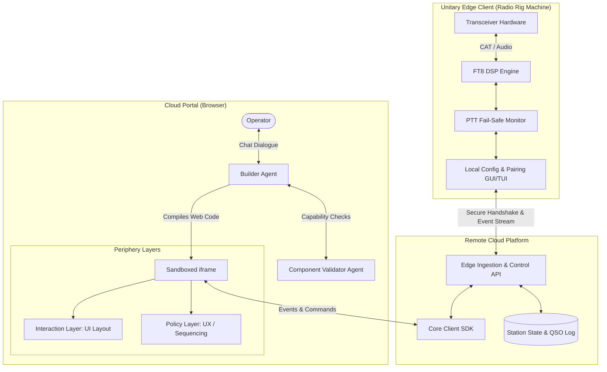

# Common Core, Custom UI/UX (Stable Core, Infinite Periphery) - Plan

## Goal Capsule

- **Objective:** Enable any FT8 operator to run a minimal, rock-solid edge client on their radio rig while creating, customizing, and running their own operating policies and web interfaces in the cloud via agent dialogue.
- **Means:** Split Digi-Dx into an invariant unitary edge radio client (CAT, audio, DSP encode/decode, local pairing) and a remote cloud service with an agent builder that writes sandboxed HTML/JS/React components and policies validated against core capabilities (KTD1, KTD2, KTD4, KTD5).
- **Product Authority:** The Product Contract governs product behavior, scope boundaries, and acceptance criteria; the Planning Contract (`ce-plan`) governs implementation. Where they conflict, the Product Contract wins.
- **Product Contract preservation:** Product Contract unchanged.
- **Open Blockers:** None.

---

## Product Contract

### Summary

Rebuild Digi-Dx around the "Stable core, infinite periphery" paradigm. The system separates an invariant, minimal edge client (radio control, soundcard audio, FT8 DSP encode/decode) from an unbounded, operator-customizable cloud periphery (Policy layer automation and Interaction layer UI) created through a dual builder/validator agent chat interface.

### Problem Frame

Amateur radio digital modes like FT8 operate on strict 15-second cycles where operators must rapidly inspect decodes, prioritize stations, and schedule transmissions before the transmit window opens. Existing software packages such as WSJT-X and JTDX bundle radio control, DSP, business logic, and user interface into monolithic desktop applications.

This monolithic coupling forces every operator into rigid, decades-old interface patterns:
- Incoming decodes stream in flat, unranked text feeds that obscure station value.
- Responders to a CQ cannot be automatically staged into a dedicated priority queue for deliberate contact sequencing.
- Visual highlighting, alert criteria, and contact automation rules cannot be customized without modifying and recompiling C++/Qt source code.

Operators want FT8 automation and presentation tailored to their specific operating goals (DX chasing, contest efficiency, grid hunting) without sacrificing the rock-solid reliability required for physical transmitter control.

### Key Decisions

- **Unitary Edge Client for Radio & DSP:** `(session-settled: user-directed — chosen over streaming raw audio to cloud: keeps soundcard I/O, CAT/PTT, and FT8 encode/decode local to minimize WAN bandwidth and latency)`. Governs R1, R2, R3, R4.
- **Sandboxed Web Code Generation for Periphery:** `(session-settled: user-directed — chosen over Declarative Widget & Policy Catalog: gives operators unconstrained layout and styling freedom in an iframe sandbox)`. Governs R10, R11.
- **Cloud-Hosted Policy Execution for Pilot:** `(session-settled: user-approved — chosen over edge-synchronized policy execution: keeps the edge client minimal and architecture simple for the pilot while accepting WAN slot-timing risk)`. Governs R6, R8, R10.
- **Dual-Agent Builder and Validator Collaboration:** `(session-settled: user-directed — chosen over single unverified builder agent: prevents generated UIs from hallucinating non-existent core radio capabilities)`. Governs R12, R13, R14.
- **Stock-First Starting Points with Blank-Slate Option:** `(session-settled: user-directed — chosen over mandatory blank slate: allows operators to make immediate contacts on day one while retaining conversational customization)`. Governs R15, R16.

### Visualizations



### Actors

- A1. **FT8 Operator:** Licensed amateur radio operator operating their station remotely through the cloud portal.
- A2. **Unitary Edge Client:** Local application running on the machine attached to the transceiver, executing soundcard audio DSP, radio CAT/PTT, and pairing.
- A3. **Cloud Portal Service:** Remote platform ingesting edge telemetry, persisting logs and station history, and serving web assets.
- A4. **Builder Agent:** Conversational AI agent that guides the operator through creating and customizing UI/UX and writes sandboxed web code.
- A5. **Component Validator Agent:** Internal verification agent that cross-checks builder-generated actions against core API capabilities.

### Key Flows

- F1. **Edge-to-Cloud Pairing Handshake**
  - **Trigger:** Operator launches the edge client on a radio-connected PC and accesses the cloud portal.
  - **Actors:** A1, A2, A3
  - **Steps:** Edge client generates a pairing credential; operator enters credential into cloud portal; edge and cloud establish authenticated bidirectional control stream; edge client status switches to paired.
  - **Covered by:** R3, R6

- F2. **Blank-Slate Periphery Construction**
  - **Trigger:** Operator starts from an empty dashboard in the cloud portal and opens the builder chat.
  - **Actors:** A1, A4, A5
  - **Steps:** Operator describes desired operating interface (e.g. "I want a priority queue of stations answering my CQ ranked by distance, and a clean transmit sequencer"); builder drafts component code; validator inspects code against core SDK capabilities; validator approves or suggests adjustments; portal renders live interface inside the sandbox iframe.
  - **Covered by:** R10, R11, R12, R13, R14

- F3. **Customizing Stock Periphery via Agent Side Panel**
  - **Trigger:** Operator loads the default stock FT8 UI and clicks "Customize with Agent".
  - **Actors:** A1, A4, A5
  - **Steps:** Operator requests a modification (e.g. "Highlight any new grid square in gold and auto-respond to the furthest station"); builder updates the policy rules; validator confirms parameter validity; sandbox updates in place without restarting the session.
  - **Covered by:** R13, R15, R16

- F4. **Live Transmit Control Loop with Fail-Safe**
  - **Trigger:** An incoming decode matches active policy criteria, or operator triggers manual transmit in the UI.
  - **Actors:** A1, A2, A3
  - **Steps:** Sandboxed policy emits transmit command; cloud control API relays command to edge client; edge client verifies slot alignment and asserts PTT; audio keys transceiver. If cloud connection drops, edge client immediately drops PTT.
  - **Covered by:** R1, R4, R6, R11

### Requirements

#### Unitary Edge Client

- R1. The edge client manages radio control via CAT and PTT, captures and renders soundcard audio, and executes local FT8 modulation and demodulation.
- R2. The edge client provides a minimal local GUI and TUI restricted to audio device selection, CAT serial configuration, diagnostics, and cloud pairing.
- R3. The edge client establishes an authenticated, encrypted bidirectional connection to the cloud portal service.
- R4. The edge client immediately halts transmission and releases PTT if the cloud control stream heartbeat disconnects mid-session.

#### Cloud Service & Data Platform

- R5. The cloud service ingests decode streams, transmit telemetry, and radio status from connected edge clients into persistent storage.
- R6. The cloud service exposes a real-time control stream that routes operator inputs and policy commands down to the edge client API.
- R7. The cloud service enforces single-operator exclusivity, permitting only one active controlling session per radio station at a time.

#### Periphery Architecture (Policy & Interaction Layers)

- R8. The periphery architecture cleanly decouples the Policy layer (sequencing, prioritization, auto-response rules) from the Interaction layer (UI presentation).
- R9. The system supports running multiple alternative Interaction layer layouts over the same underlying Policy layer.
- R10. The cloud portal executes custom Policy and Interaction code inside an isolated browser iframe sandbox with no access to external network endpoints.
- R11. Sandboxed periphery code communicates with the radio and station data exclusively through an injected core client SDK.

#### Builder & Validator Multi-Agent System

- R12. The cloud portal provides an interactive builder agent interface capable of generating complete custom UI and UX from blank-slate chat prompts.
- R13. The builder agent coordinates with a component validator agent that verifies all requested triggers, actions, and data subscriptions against the core client SDK specification.
- R14. When a user requests an unsupported capability, the validator agent rejects the invalid binding and generates comparable alternative suggestions supported by the core.
- R15. The cloud portal provides pre-built stock Policy layers and stock Interaction layers capable of full out-of-the-box FT8 operation.
- R16. Stock setups provide an in-app agent side panel allowing operators to conversationally customize existing policy rules and UI components.

### Acceptance Examples

- AE1. **Edge Client Communication Loss During Transmit**
  - **Covers:** R4
  - **Given:** Edge client is actively transmitting an FT8 message on a 15-second cycle keyed via CAT PTT.
  - **When:** The WAN connection between the edge client and cloud service drops.
  - **Then:** Edge client detects heartbeat timeout within 500ms, drops PTT immediately, and logs a connection-drop safety abort.

- AE2. **Component Validator Rejects Unsupported Capability**
  - **Covers:** R13, R14
  - **Given:** Operator is chatting with the builder agent to build a custom contest dashboard.
  - **When:** Operator requests "automatically rotate my directional beam antenna to 180 degrees when VK stations are heard".
  - **Then:** Validator agent flags that rotator control is not in the core API capability set, builder explains rotator control is unavailable, and builder suggests alerting the operator visually instead.

- AE3. **Decoupled Policy Driving Alternate UI Layouts**
  - **Covers:** R8, R9
  - **Given:** Operator has configured a custom Policy layer that prioritizes CQ callers by DXCC distance and queues the top 5 stations.
  - **When:** Operator switches the interface layout from a two-column desktop view to a single-column mobile view.
  - **Then:** The visual layout adapts to the mobile screen while the caller queue order and auto-sequencing rules remain identical.

- AE4. **Modifying Stock Setup via Agent Side Panel**
  - **Covers:** R15, R16
  - **Given:** Operator is running the stock FT8 operating dashboard.
  - **When:** Operator opens the agent panel and types "Add an audio beep whenever someone sends 73 to me".
  - **Then:** Builder generates the incremental event hook, validator confirms audio notification capability, and the active stock interface reloads with the beep enabled without losing session state.

### Success Criteria

- **Zero Unverified Core Invocations:** 100% of periphery UI components and policy routines generated by the builder agent are verified by the validator agent against the core SDK before mounting.
- **Fail-Safe Disconnect Guarantee:** Transceiver PTT is guaranteed to de-assert within 500ms of any edge-to-cloud transport interruption.
- **First QSO from Blank Slate:** A new operator starting with only a radio-paired edge client can prompt the builder agent in chat and reach a completed FT8 QSO within 5 minutes.
- **Decoupled Swappability:** Switching between two distinct Interaction layer layouts against an active Policy layer causes zero disruption to ongoing QSO state or caller queue ordering.

### Scope Boundaries

#### Deferred for Later

- Sub-second edge-synchronized policy execution (pushing compiled policy rules to the edge daemon for local real-time slot evaluation).
- Multi-operator collaborative or shared station control.
- Native mobile edge client binaries (pilot focuses on desktop/SBC OS: Linux, macOS, Windows).
- Public community marketplace for browsing and sharing user-generated UI/UX templates.

#### Outside This Product's Identity

- General-purpose web application or dashboard builder unassociated with amateur radio.
- Non-FT8 digital modes (e.g. JS8Call, WSPR, SSTV) during initial pilot.
- Direct raw network egress or arbitrary third-party API fetch inside the sandboxed iframe.

### Dependencies / Assumptions

- **Edge Radio Environment:** Local machine running Node/TypeScript with access to a transceiver via serial/CAT and an audio soundcard interface.
- **Cloud Latency Assumption:** For the pilot, cloud-to-edge network latency is assumed to be within acceptable bounds (<500ms roundtrip) for 15-second FT8 slot boundaries; edge policy execution is deferred.
- **LLM Availability:** The cloud portal requires access to a frontier LLM provider to power the builder and validator agents.

### Outstanding Questions

#### Resolve Before Planning

- None.

#### Deferred to Planning

- Specific framing protocol for the edge-to-cloud bidirectional stream (WebSocket over TLS vs gRPC stream vs WebTransport).
- Concrete pairing ceremony format (ephemeral 6-digit numeric PIN vs time-limited pairing token vs QR code).
- Sandboxed iframe messaging protocol (JSON-RPC over `postMessage` vs custom event bus).

### Sources / Research

- `STRATEGY.md:18-23`: Product spine is the stable daemon<->client contract enabling swappable UIs and agent/vibe-coded interfaces.
- `STRATEGY.md:27-31`: Target operator wants an open, hackable FT8 stack without writing code themselves.
- `docs/rebuild-plan.md:18-26`: `OperatorController` was designed transport-abstract with injected dependencies for easy relocation between client and daemon.
- `core/protocol.ts:1-209`: Current wire contract specifying `SessionConfig`, `DaemonCommand`, `TxIntent`, and slot clock.
- `src/daemon/websocket.ts:152-168`: Single-controller claim pattern and token validation.
- `docs/solutions/logic-errors/demo-live-session-transition-leftover-state.md:1-104`: Rigorous cleanup across session and disconnect boundaries, preventing stuck transmitter keys or leaked demo states.

---

## Planning Contract

### Key Technical Decisions

- KTD1. **Transport-Abstract Core SDK Extraction:** `(session-settled: user-directed — chosen over monolithic daemon-internal types: exposes a clean client-facing API that works locally or over remote WebSocket)`. Promotes `core/protocol.ts` and `core/controller.ts` into a unified client package (`@digi-dx/core-client`). Governs R11, R13.
- KTD2. **Bidirectional WebSocket over TLS with 500ms Heartbeat Watchdog:** `(session-settled: user-directed — chosen over gRPC or QUIC: eliminates complex native C networking dependencies on edge SBCs and ensures hardware fail-safe PTT release within 500ms)`. Governs R3, R4, R6.
- KTD3. **Ephemeral 6-Digit Code Pairing Handshake:** `(session-settled: user-directed — chosen over manual TLS certificate provisioning: allows instant, secure pairing between the local edge GUI/TUI and cloud portal)`. Governs R2, R3, R7.
- KTD4. **Sandboxed iframe Runtime with postMessage RPC Bridge:** `(session-settled: user-directed — chosen over Declarative Widget Catalog: gives operators true creative UI/UX freedom in an iframe sandbox while preventing raw network egress)`. Governs R8, R9, R10, R11.
- KTD5. **Dual-Agent Builder & Validator System:** `(session-settled: user-directed — chosen over single unverified builder agent: builder translates user chat into web components while validator statically verifies API calls against core SDK schemas)`. Governs R12, R13, R14.
- KTD6. **Stock Reference UI and Policy Bundle:** `(session-settled: user-directed — chosen over blank-slate-only runtime: ships complete stock FT8 components so operators can start operating immediately)`. Governs R15, R16.

### High-Level Technical Design

```mermaid
sequenceDiagram
  autonumber
  participant Rig as Transceiver Hardware
  participant Edge as Unitary Edge Client
  participant Cloud as Cloud Gateway & Store
  participant Portal as Browser Portal
  participant Sandbox as Sandboxed iframe
  participant Agent as Builder/Validator Agents

  Note over Edge,Cloud: Milestone 1: Pairing & Ingestion
  Edge->>Edge: Generate 6-digit ephemeral pairing code
  Edge->>Portal: Operator enters pairing code in web portal
  Portal->>Cloud: Claim station pairing with code
  Cloud->>Edge: Issue session auth token & open secure stream
  Edge->>Cloud: Stream decodes, slot clock, CAT status

  Note over Portal,Agent: Milestone 2: Periphery Generation
  Portal->>Agent: Operator chats: "Prioritize DX and auto-respond"
  Agent->>Agent: Builder drafts Policy & UI code; Validator verifies against Core SDK
  Agent->>Portal: Approved component bundle
  Portal->>Sandbox: Mount bundle into isolated iframe (postMessage bridge)

  Note over Sandbox,Rig: Milestone 3: Live Operating Loop
  Cloud->>Sandbox: Telemetry stream (decodes, clock) relayed via Core SDK
  Sandbox->>Sandbox: Policy evaluates priority queue; triggers TX
  Sandbox->>Cloud: CoreSDK.transmit({af, slot, message})
  Cloud->>Edge: Remote command: transmit({af, slot, message})
  Edge->>Rig: Assert CAT PTT & output modulated audio

  Note over Edge,Cloud: Fail-Safe Guard
  Cloud-xEdge: Connection drop detected (heartbeat timeout >500ms)
  Edge->>Rig: Immediate PTT de-assert (Emergency watchdog abort)
```

### Output Structure

```text
digi-dx/
├── core/
│   ├── protocol.ts             # Shared wire types & command schemas
│   ├── slot-clock.ts           # Published slot timing arithmetic
│   ├── qso.ts                  # FT8 message parser & contact state machine
│   └── client/                 # @digi-dx/core-client SDK
│       ├── index.ts            # Client interface & event subscriptions
│       ├── bridge.ts           # WebSocket / postMessage transport adapter
│       └── validator.ts        # Capability schema specification for agents
├── src/
│   ├── edge/                   # Unitary Edge Client
│   │   ├── index.ts            # Edge entrypoint & service bootstrap
│   │   ├── watchdog.ts         # Hardware PTT fail-safe monitor (<500ms timeout)
│   │   ├── pairing.ts          # Ephemeral credential exchange & handshake
│   │   ├── engine.ts           # Radio CAT & soundcard DSP manager
│   │   └── ui/                 # Minimal local setup TUI & GUI
│   │       ├── tui.ts          # Blessed hardware setup & pairing screen
│   │       └── gui.ts          # Lightweight local web/GUI pairing view
│   ├── cloud/                  # Remote Cloud Platform
│   │   ├── index.ts            # Cloud gateway entrypoint
│   │   ├── gateway.ts          # Edge WebSocket stream ingestion & command relay
│   │   ├── session.ts          # Single-operator exclusivity manager
│   │   └── store.ts            # Station telemetry, decode history, & QSO persistence
│   └── portal/                 # Cloud Web Portal & Periphery Runtime
│       ├── index.ts            # Web portal server & static asset host
│       ├── public/             # Portal frontend shell
│       ├── sandbox/            # Sandboxed iframe host & postMessage RPC bridge
│       ├── stock/              # Stock FT8 Policy & Interaction layers
│       │   ├── policy.ts       # Stock contact prioritization & sequencer
│       │   └── ui.ts           # Stock operational dashboard & waterfall
│       └── agents/             # Multi-agent builder service
│           ├── builder.ts      # UI/UX code generation agent
│           ├── validator.ts    # Core capability verification agent
│           └── orchestrator.ts # Two-agent consensus & feedback loop
└── test/
    ├── core-client.test.ts
    ├── edge-watchdog.test.ts
    ├── edge-pairing.test.ts
    ├── cloud-gateway.test.ts
    ├── sandbox-bridge.test.ts
    ├── stock-periphery.test.ts
    └── builder-validator.test.ts
```

### System-Wide Impact

- **Security & Sandboxing:** Custom UI and Policy code executes in a browser iframe with `sandbox="allow-scripts"` and a strict Content Security Policy (`default-src 'none'; script-src 'unsafe-inline'`). Code has zero direct network access and interacts with the radio solely through the typed `postMessage` RPC bridge.
- **Hardware Fail-Safe:** The edge client maintains an active hardware watchdog timer. If an edge-to-cloud heartbeat packet is not acknowledged within 500ms, the watchdog forcibly drops PTT and purges active transmit buffers to protect radio amplifiers.
- **Single-Operator Exclusivity:** The cloud gateway enforces mutual exclusion per station identity. A new control session must explicitly preempt or wait for the existing session to release control.

### Implementation Constraints

- Strict TypeScript (`NodeNext` module resolution, strict mode, zero `any` in core SDK interfaces).
- Edge daemon must run on Node 20 with zero native GUI or cloud dependencies to preserve compatibility with Raspberry Pi / SBC radio setups.
- Browser portal and sandboxed periphery must operate entirely within standard modern browser primitives (no custom browser extensions required).

---

## Implementation Units

### U1. Core Client SDK & Protocol Promotion

- **Goal:** Promote `core/protocol.ts` and `core/controller.ts` into a unified, transport-abstract `@digi-dx/core-client` SDK that exposes typed telemetry streams, slot clocks, and control commands across local and remote boundaries.
- **Requirements:** R1, R11, R13.
- **Dependencies:** None.
- **Files:**
  - Create: `core/client/index.ts`
  - Create: `core/client/bridge.ts`
  - Create: `core/client/schema.ts`
  - Modify: `core/protocol.ts`
  - Test: `test/core-client.test.ts`
- **Approach:**
  - Define `CoreClient` interface extending typed EventEmitter with events: `decode`, `status`, `slotClock`, `txState`, and `error`.
  - Expose client commands: `setIdentity`, `setDialFreq`, `callCq`, `replyToCall`, `transmit`, `haltTx`, and `releaseControl`.
  - Implement `WebSocketBridge` adapting the wire protocol into `CoreClient`.
  - Export JSON capability schema (`core/client/schema.ts`) defining allowed method signatures and event shapes for the validator agent (KTD1).
- **Test scenarios:**
  - Happy path: `CoreClient` instantiates over a mock transport, subscribes to decodes, and receives parsed FT8 decode events.
  - Command emission: Calling `transmit({ af: 1200, slot: "even", message: "CQ K1ABC FN42" })` serializes a valid `transmit` payload over the transport.
  - Schema verification: Validator schema accurately flags supported vs unsupported method names and payload types.
- **Verification:** `npm test test/core-client.test.ts` passes with 100% type safety and contract coverage.

### U2. Edge Daemon Headless Refactor & Fail-Safe Watchdog

- **Goal:** Refactor the edge daemon into a lean, headless radio controller with an autonomous PTT hardware watchdog that immediately aborts transmission if connection to the cloud control stream drops.
- **Requirements:** R1, R4. Covers AE1.
- **Dependencies:** U1.
- **Files:**
  - Create: `src/edge/watchdog.ts`
  - Modify: `src/daemon/engine.ts`
  - Modify: `src/daemon/websocket.ts`
  - Test: `test/edge-watchdog.test.ts`
- **Approach:**
  - Implement `PttWatchdog` in `src/edge/watchdog.ts` with a 500ms sliding heartbeat timer.
  - Connect watchdog directly to the physical `EngineDriver` PTT de-assert command.
  - Update `src/daemon/engine.ts` to require periodic watchdog petting from the incoming remote control stream (KTD2).
  - On heartbeat expiration, assert physical PTT off, clear transmit buffers, and emit an emergency abort log.
- **Execution note:** Start with an integration test proving PTT de-assertion upon simulated stream silence.
- **Patterns to follow:** `docs/solutions/logic-errors/demo-live-session-transition-leftover-state.md` for clean boundary state teardown.
- **Test scenarios:**
  - Covers AE1. Active transmission drops PTT within 500ms when heartbeat is interrupted.
  - Normal operation: Periodic heartbeat keeping PTT active through full 12.6s transmission window without false watchdog abort.
  - Clean shutdown: Calling `stopSession` safely disarms watchdog and resets driver to idle.
- **Verification:** `npm test test/edge-watchdog.test.ts` verifies deterministic PTT release within 500ms.

### U3. Edge Pairing Service & Local Config TUI/GUI

- **Goal:** Provide a minimal local pairing generator and setup interface on the edge machine allowing operators to configure soundcard/CAT settings and generate an ephemeral pairing code for cloud connection.
- **Requirements:** R2, R3. Covers F1.
- **Dependencies:** U2.
- **Files:**
  - Create: `src/edge/pairing.ts`
  - Create: `src/edge/ui/tui.ts`
  - Create: `src/edge/ui/gui.ts`
  - Test: `test/edge-pairing.test.ts`
- **Approach:**
  - Implement ephemeral pairing code generator in `src/edge/pairing.ts` (6-digit PIN with 5-minute expiry) (KTD3).
  - Build minimal blessed TUI and lightweight local HTTP GUI restricted exclusively to: soundcard selection, CAT serial port configuration, and pairing code display.
  - Expose local status endpoint confirming when the pairing code has been claimed by the cloud portal.
- **Test scenarios:**
  - Pairing generation: Edge daemon generates a cryptographic 6-digit pairing token that expires after 300 seconds.
  - Claim handshake: Receiving an authenticated claim from the cloud gateway marks the edge client paired and stores the session auth token.
  - Setup isolation: Local UI allows selecting audio devices and serial ports without exposing QSO automation or cloud logic.
- **Verification:** `npm test test/edge-pairing.test.ts` confirms pairing token lifecycle and credential exchange.

### U4. Cloud Gateway & Station Telemetry Store

- **Goal:** Build the remote cloud backend service responsible for station pairing, single-operator exclusivity, decode and QSO persistence, and authenticated bidirectional command routing.
- **Requirements:** R5, R6, R7. Covers F1, F4.
- **Dependencies:** U1, U3.
- **Files:**
  - Create: `src/cloud/gateway.ts`
  - Create: `src/cloud/session.ts`
  - Create: `src/cloud/store.ts`
  - Test: `test/cloud-gateway.test.ts`
- **Approach:**
  - Implement WebSocket server in `src/cloud/gateway.ts` accepting connections from both edge daemons and browser portals.
  - Implement pairing claim API: operator enters the 6-digit code in web portal; gateway matches pending edge connection and exchanges permanent session keys.
  - Implement single-operator exclusivity in `src/cloud/session.ts`: allow only one controlling portal connection per station; reject or enqueue secondary viewers.
  - Persist station decodes, operational telemetry, and completed QSO logs to structured JSON/SQLite store (`src/cloud/store.ts`).
- **Test scenarios:**
  - Pairing flow: Gateway pairs edge client and web client using valid 6-digit code and rejects expired/invalid codes.
  - Exclusivity guard: Second operator attempting to claim control receives `CONTROL_UNAVAILABLE` while first operator is active.
  - Data persistence: Streamed decodes and completed QSOs are persisted to store and retrieved upon web reconnect.
- **Verification:** `npm test test/cloud-gateway.test.ts` passes with full pairing and multi-client routing tests.

### U5. Sandboxed Periphery Runtime Bridge

- **Goal:** Create an isolated browser iframe sandbox runtime with strict CSP and a postMessage RPC bridge connected to `@digi-dx/core-client`, enabling untrusted custom web components to interact with the station safely.
- **Requirements:** R8, R9, R10, R11. Covers AE3.
- **Dependencies:** U1, U4.
- **Files:**
  - Create: `src/portal/sandbox/bridge.ts`
  - Create: `src/portal/sandbox/runtime.html`
  - Test: `test/sandbox-bridge.test.ts`
- **Approach:**
  - Author `runtime.html` with iframe sandbox flags `sandbox="allow-scripts"` and strict CSP disallowing external fetch/network connections (KTD4).
  - Implement `postMessage` RPC bridge in `bridge.ts`: listens for parent portal messages and dispatches them into an injected window-scoped `window.digiDx` CoreClient proxy.
  - Enforce policy and UI separation: support mounting a Policy script that runs headless automation rules and emits state events consumed by the active Interaction UI layout.
- **Test scenarios:**
  - Sandboxed execution: Custom component inside iframe receives decode events via `window.digiDx.on('decode', ...)` over `postMessage`.
  - Network isolation: Iframe script attempting `window.fetch('https://evil.com')` is blocked by CSP policy.
  - Layout swappability: Covers AE3. Switching Interaction UI layout retains the active Policy instance and preserves caller queue state.
- **Verification:** `npm test test/sandbox-bridge.test.ts` validates bidirectional message proxying and security boundaries.

### U6. Stock Policy and Interaction Layers

- **Goal:** Ship pre-built, robust stock FT8 Policy and Interaction layers that provide out-of-the-box CQ calling, priority caller queueing, distance ranking, and full QSO sequencing.
- **Requirements:** R15, R16. Covers F3, AE4.
- **Dependencies:** U5.
- **Files:**
  - Create: `src/portal/stock/policy.ts`
  - Create: `src/portal/stock/ui.ts`
  - Test: `test/stock-periphery.test.ts`
- **Approach:**
  - Implement `StockPolicy`: tracks incoming CQ decodes, ranks callers by DXCC distance and new grid status, stages callers into an explicit queue, and manages automatic FT8 QSO state machine (KTD6).
  - Implement `StockUI`: modern responsive dashboard displaying active slot countdown, waterfall/audio monitor, caller queue list, current QSO progress card, and session log.
  - Wire configuration hooks so parameters (e.g. auto-reply distance threshold, audio alerts) can be modified dynamically via agent side panel.
- **Test scenarios:**
  - Stock automation: Stock policy receives CQ response decode, adds station to caller queue, and arms transmit for next slot.
  - State update: Covers AE4. Modifying alert parameters dynamically updates runtime behavior without tearing down active QSO state.
- **Verification:** `npm test test/stock-periphery.test.ts` passes with automated simulated QSO progression.

### U7. Dual-Agent Builder & Component Validator Orchestrator

- **Goal:** Build the browser-based chat builder service featuring a dual-agent loop: a Builder Agent that translates operator requests into web code, and a Component Validator Agent that inspects AST and API calls against core capabilities before mounting.
- **Requirements:** R12, R13, R14, R16. Covers F2, F3, AE2.
- **Dependencies:** U1, U5, U6.
- **Files:**
  - Create: `src/portal/agents/builder.ts`
  - Create: `src/portal/agents/validator.ts`
  - Create: `src/portal/agents/orchestrator.ts`
  - Create: `src/portal/public/builder-panel.ts`
  - Test: `test/builder-validator.test.ts`
- **Approach:**
  - Build `ComponentValidator` (`src/portal/agents/validator.ts`): parses generated JavaScript/TypeScript AST, verifies all calls against `@digi-dx/core-client/schema.ts`, and checks for prohibited globals (e.g. `fetch`, `XMLHttpRequest`, `WebSocket`) (KTD5).
  - Build `BuilderAgent` (`src/portal/agents/builder.ts`): prompts LLM with user requirements, current stock code, and capability schema to generate new or modified Policy and UI code.
  - Implement `AgentOrchestrator` (`src/portal/agents/orchestrator.ts`): runs consensus loop between builder and validator. If validator detects unsupported calls (e.g. rotator control per AE2), builder is reprompted with the rejection details to offer supported alternatives.
  - Build UI chat side panel (`builder-panel.ts`) embedding the conversation in the portal.
- **Test scenarios:**
  - Blank-slate creation: Covers F2. Operator requests a custom CQ queue UI; builder generates code; validator approves; sandbox mounts successfully.
  - Capability rejection: Covers AE2. Operator requests rotator control; validator rejects call as outside core SDK schema; builder explains limitation and proposes visual alert alternative.
  - Sandboxed mounting: Validated code loads cleanly into U5 sandbox runtime without runtime exceptions.
- **Verification:** `npm test test/builder-validator.test.ts` verifies AST validation, consensus loop, and schema rejection mechanics.

---

## Verification Contract

### Test Suite Execution

Run unit, integration, and contract verification across all subsystems:

```bash
# Run complete test suite
npm test

# Run strict typechecking across daemon, cloud, and portal
npm run typecheck

# Verify build compilation
npm run build

# Run headless simulated end-to-end QSO verification
npm run smoke
```

### Quality Gates

- **Watchdog Timing Gate:** Unit tests in `test/edge-watchdog.test.ts` must enforce that simulated heartbeat loss trips the watchdog in $\le 500\text{ms}$ under all execution profiles.
- **Security Boundary Gate:** Tests in `test/sandbox-bridge.test.ts` must prove that sandboxed iframe code cannot make network requests or escape `postMessage` isolation.
- **Validator AST Gate:** Tests in `test/builder-validator.test.ts` must prove that 100% of generated API calls are verified against `core/client/schema.ts` before sandbox deployment.

---

## Definition of Done

### Global Completion Criteria

- All 16 Product Requirements (`R1`–`R16`) and 4 Acceptance Examples (`AE1`–`AE4`) have corresponding automated test coverage.
- The unitary edge client runs headlessly on Linux/macOS with audio DSP, CAT control, and pairing support.
- The cloud platform successfully establishes pairing via 6-digit codes, manages telemetry streaming, and persists QSO logs.
- The browser portal mounts custom Policy and Interaction code inside a secure iframe sandbox.
- The dual builder/validator agent loop conversationally generates and validates custom FT8 operating interfaces from chat.
- All temporary, experimental, or dead-end code from rebuild development has been removed.

### Per-Unit Completion Criteria

- **U1:** `@digi-dx/core-client` package passes all contract tests and exports full capability schema.
- **U2:** Hardware PTT watchdog releases transmitter within 500ms of simulated connection termination.
- **U3:** Local pairing TUI/GUI successfully displays ephemeral PIN and manages handshake state.
- **U4:** Cloud gateway persists decodes and enforces single-operator control exclusivity.
- **U5:** Sandboxed iframe runtime mounts and communicates exclusively via `postMessage` RPC bridge.
- **U6:** Stock Policy and UI components execute a complete simulated QSO out of the box.
- **U7:** Dual-agent orchestrator validates AST, rejects unsupported capabilities, and mounts approved code.
